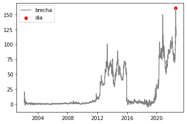
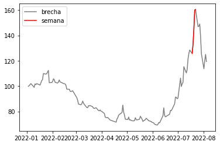
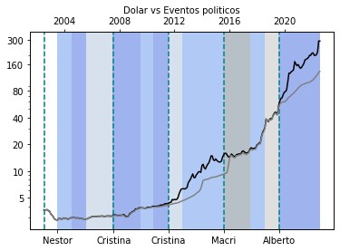
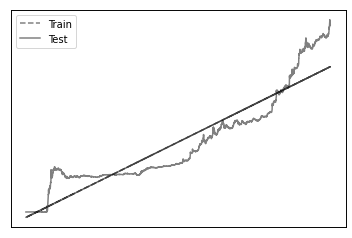
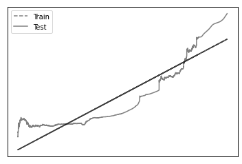
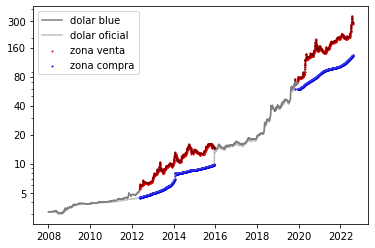

## HENRY PI1
### Reporte


```python
# Detectar modulos locales
import sys
sys.path.append('../')
```

**Nota**:\
    Voy a dejar el link de github para cada funcion que cree para resolver los ejercicos\
\
**Recomendacion**:\
    Para entender que hace cada funcion o clase, me tome el trabajo de documentalas todas**
    
con el siguiente metodo aplicado a las funciones se podran leer o su editor de codigo ya vendra incluido con esta caracteristica


```python
from src.docs import test_docs
print(test_docs.__doc__)
```

    
        Documentacion.
        Esto es una prueba, intenta con otras funciones
    
        >>> func().__doc__
        


### En la realizacion del proyecto se utilizo la siguiente API
### [estadisticasbcra](https://estadisticasbcra.com/)
\
**Para llamar a esta y traerme todos los datos, cree un objeto llamado API() que interactua de forma asyncronica**\
[link del codigo](https://github.com/hackcheek/API_BCRA/blob/main/src/api.py)


```python
from src.api import API
from src.dtypes import Endpoints


points: list[Endpoints] = [
    "usd",
    "usd_of",
    "var_usd_vs_usd_of",
    "inflacion_mensual_oficial",
    "var_usd_anual",
    "var_usd_of_anual",
    "milestones",
]


api = API()
test = api.jupyter_query(*points)
```


```python
test
```


    [[{'d': '2000-05-24', 'v': 1.0005},
      {'d': '2000-05-25', 'v': 1.0005},
      {'d': '2000-05-26', 'v': 1.0004},
      {'d': '2000-05-29', 'v': 1.0007},
      {'d': '2000-05-30', 'v': 1.0009},
      {'d': '2000-05-31', 'v': 1.001},
      {'d': '2000-06-01', 'v': 1.0007},
      {'d': '2000-06-02', 'v': 1.0011},
      {'d': '2000-06-05', 'v': 1.0011},
      {'d': '2000-06-06', 'v': 1.001},
      {'d': '2000-06-07', 'v': 1},
      {'d': '2000-06-08', 'v': 0.9998},
      {'d': '2000-06-12', 'v': 0.9998},
      {'d': '2000-06-13', 'v': 0.9996},
      {'d': '2000-06-14', 'v': 0.9999},
      {'d': '2000-06-15', 'v': 0.9988},
      {'d': '2000-06-16', 'v': 0.9988},
      {'d': '2000-06-19', 'v': 0.9988},
      {'d': '2000-06-20', 'v': 0.9994},
      {'d': '2000-06-21', 'v': 0.9996},
      {'d': '2000-06-22', 'v': 0.9991},
      {'d': '2000-06-23', 'v': 0.9985},
      {'d': '2000-06-26', 'v': 0.999},
      {'d': '2000-06-27', 'v': 0.9994},
      {'d': '2000-06-28', 'v': 0.999},
      {'d': '2000-06-29', 'v': 0.9987},
      {'d': '2000-06-30', 'v': 0.9985},
      {'d': '2000-07-03', 'v': 0.9981},
      {'d': '2000-07-04', 'v': 0.9981},
      {'d': '2000-07-05', 'v': 0.9975},
      {'d': '2000-07-06', 'v': 0.9975},
      {'d': '2000-07-07', 'v': 0.9981},
      {'d': '2000-07-10', 'v': 0.999},
      {'d': '2000-07-11', 'v': 0.9988},
      {'d': '2000-07-12', 'v': 0.999},
      {'d': '2000-07-13', 'v': 0.9986},
      {'d': '2000-07-14', 'v': 0.998},
      {'d': '2000-07-17', 'v': 0.998},
      {'d': '2000-07-18', 'v': 0.9985},
      {'d': '2000-07-19', 'v': 0.9987},
      {'d': '2000-07-20', 'v': 0.9983},
      {'d': '2000-07-21', 'v': 0.9982},
      {'d': '2000-07-24', 'v': 0.9986},
      {'d': '2000-07-25', 'v': 0.999},
      {'d': '2000-07-26', 'v': 0.9987},
      {'d': '2000-07-27', 'v': 0.9988},
      {'d': '2000-07-28', 'v': 0.999},
      {'d': '2000-07-31', 'v': 0.9991},
      {'d': '2000-08-01', 'v': 0.999},
      {'d': '2000-08-02', 'v': 0.9991},
      {'d': '2000-08-03', 'v': 0.9993},
      {'d': '2000-08-04', 'v': 0.9985},
      {'d': '2000-08-07', 'v': 0.9986},
      {'d': '2000-08-08', 'v': 0.9991},
      {'d': '2000-08-09', 'v': 0.999},
      {'d': '2000-08-10', 'v': 0.999},
      {'d': '2000-08-11', 'v': 0.9989},
      {'d': '2000-08-14', 'v': 0.9988},
      {'d': '2000-08-15', 'v': 0.999},
      {'d': '2000-08-16', 'v': 0.999},
      {'d': '2000-08-17', 'v': 0.999},
      {'d': '2000-08-18', 'v': 0.999},
      {'d': '2000-08-21', 'v': 0.999},
      {'d': '2000-08-22', 'v': 0.9992},
      {'d': '2000-08-23', 'v': 0.9993},
      {'d': '2000-08-24', 'v': 0.9996},
      {'d': '2000-08-25', 'v': 0.9993},
      {'d': '2000-08-28', 'v': 0.9995},
      {'d': '2000-08-29', 'v': 0.9989},
      {'d': '2000-08-30', 'v': 0.9992},
      {'d': '2000-08-31', 'v': 0.9987},
      {'d': '2000-09-01', 'v': 0.998},
      {'d': '2000-09-04', 'v': 0.9989},
      {'d': '2000-09-05', 'v': 0.9985},
      {'d': '2000-09-06', 'v': 0.998},
      {'d': '2000-09-07', 'v': 0.9987},
      {'d': '2000-09-08', 'v': 0.9982},
      {'d': '2000-09-11', 'v': 0.9987},
      {'d': '2000-09-12', 'v': 0.9988},
      {'d': '2000-09-13', 'v': 0.999},
      {'d': '2000-09-14', 'v': 0.9987},
      {'d': '2000-09-15', 'v': 0.9992},
      {'d': '2000-09-18', 'v': 0.9986},
      {'d': '2000-09-19', 'v': 0.9986},
      {'d': '2000-09-20', 'v': 0.9992},
      {'d': '2000-09-21', 'v': 0.999},
      {'d': '2000-09-22', 'v': 0.9996},
      {'d': '2000-09-25', 'v': 0.9994},
      {'d': '2000-09-26', 'v': 0.9992},
      {'d': '2000-09-27', 'v': 0.9994},
      {'d': '2000-09-28', 'v': 0.9988},
      {'d': '2000-09-29', 'v': 0.9989},
      {'d': '2000-10-02', 'v': 0.9985},
      {'d': '2000-10-03', 'v': 0.9982},
      {'d': '2000-10-04', 'v': 0.9995},
      {'d': '2000-10-05', 'v': 0.9988},
      {'d': '2000-10-06', 'v': 0.9991},
      {'d': '2000-10-09', 'v': 0.9993},
      {'d': '2000-10-10', 'v': 0.9995},
      {'d': '2000-10-11', 'v': 0.9996},
      {'d': '2000-10-12', 'v': 0.9995},
      {'d': '2000-10-13', 'v': 0.9996},
      {'d': '2000-10-16', 'v': 0.9996},
      {'d': '2000-10-17', 'v': 0.9995},
      {'d': '2000-10-18', 'v': 1.0001},
      {'d': '2000-10-19', 'v': 0.9998},
      {'d': '2000-10-20', 'v': 1.0001},
      {'d': '2000-10-23', 'v': 0.9997},
      {'d': '2000-10-24', 'v': 0.9995},
      {'d': '2000-10-25', 'v': 1.0002},
      {'d': '2000-10-26', 'v': 1.0001},
      {'d': '2000-10-27', 'v': 1.0001},
      {'d': '2000-10-30', 'v': 1.0005},
      {'d': '2000-10-31', 'v': 1},
      {'d': '2000-11-01', 'v': 0.9995},
      {'d': '2000-11-02', 'v': 0.9996},
      {'d': '2000-11-03', 'v': 0.9996},
      {'d': '2000-11-06', 'v': 0.9996},
      {'d': '2000-11-07', 'v': 0.9998},
      {'d': '2000-11-08', 'v': 0.9997},
      {'d': '2000-11-09', 'v': 0.9995},
      {'d': '2000-11-10', 'v': 1.0001},
      {'d': '2000-11-13', 'v': 1.0001},
      {'d': '2000-11-14', 'v': 1.0001},
      {'d': '2000-11-15', 'v': 0.9994},
      {'d': '2000-11-16', 'v': 0.9991},
      {'d': '2000-11-17', 'v': 0.9997},
      {'d': '2000-11-20', 'v': 0.9999},
      {'d': '2000-11-21', 'v': 0.9996},
      {'d': '2000-11-22', 'v': 0.9997},
      {'d': '2000-11-23', 'v': 0.9999},
      {'d': '2000-11-27', 'v': 1.0002},
      {'d': '2000-11-28', 'v': 1.0006},
      {'d': '2000-11-29', 'v': 1.0002},
      {'d': '2000-11-30', 'v': 1.0005},
      {'d': '2000-12-01', 'v': 0.9995},
      {'d': '2000-12-04', 'v': 0.9996},
      {'d': '2000-12-05', 'v': 0.9996},
      {'d': '2000-12-06', 'v': 0.9997},
      {'d': '2000-12-07', 'v': 1.0001},
      {'d': '2000-12-08', 'v': 1.0001},
      {'d': '2000-12-11', 'v': 1.0003},
      {'d': '2000-12-12', 'v': 1.0005},
      {'d': '2000-12-13', 'v': 1.0001},
      {'d': '2000-12-14', 'v': 1.0003},
      {'d': '2000-12-15', 'v': 1},
      {'d': '2000-12-18', 'v': 1.0006},
      {'d': '2000-12-19', 'v': 1.0005},
      {'d': '2000-12-20', 'v': 1.0002},
      {'d': '2000-12-21', 'v': 1.0002},
      {'d': '2000-12-22', 'v': 1.0009},
      {'d': '2000-12-25', 'v': 1.0009},
      {'d': '2000-12-26', 'v': 1.0011},
      {'d': '2000-12-27', 'v': 1.003},
      {'d': '2000-12-28', 'v': 1.0015},
      {'d': '2000-12-29', 'v': 1.0015},
      {'d': '2001-01-02', 'v': 1.0012},
      {'d': '2001-01-03', 'v': 0.9996},
      {'d': '2001-01-04', 'v': 0.999},
      {'d': '2001-01-05', 'v': 0.9987},
      {'d': '2001-01-08', 'v': 0.9986},
      {'d': '2001-01-09', 'v': 0.999},
      {'d': '2001-01-10', 'v': 0.9989},
      {'d': '2001-01-11', 'v': 0.9994},
      {'d': '2001-01-12', 'v': 0.999},
      {'d': '2001-01-15', 'v': 0.9994},
      {'d': '2001-01-16', 'v': 0.9993},
      {'d': '2001-01-17', 'v': 0.9992},
      {'d': '2001-01-18', 'v': 0.9989},
      {'d': '2001-01-19', 'v': 0.9987},
      {'d': '2001-01-22', 'v': 0.9988},
      {'d': '2001-01-23', 'v': 0.999},
      {'d': '2001-01-24', 'v': 0.999},
      {'d': '2001-01-25', 'v': 0.9986},
      {'d': '2001-01-26', 'v': 0.9987},
      {'d': '2001-01-29', 'v': 0.9996},
      {'d': '2001-01-30', 'v': 0.9996},
      {'d': '2001-01-31', 'v': 0.9993},
      {'d': '2001-02-01', 'v': 0.999},
      {'d': '2001-02-02', 'v': 0.999},
      {'d': '2001-02-05', 'v': 0.9987},
      {'d': '2001-02-06', 'v': 0.999},
      {'d': '2001-02-07', 'v': 0.9991},
      {'d': '2001-02-08', 'v': 0.999},
      {'d': '2001-02-09', 'v': 0.9992},
      {'d': '2001-02-12', 'v': 0.9983},
      {'d': '2001-02-13', 'v': 0.999},
      {'d': '2001-02-14', 'v': 0.998},
      {'d': '2001-02-15', 'v': 0.9985},
      {'d': '2001-02-16', 'v': 0.9975},
      {'d': '2001-02-19', 'v': 0.9992},
      {'d': '2001-02-20', 'v': 0.9994},
      {'d': '2001-02-21', 'v': 0.9995},
      {'d': '2001-02-22', 'v': 0.9996},
      {'d': '2001-02-23', 'v': 0.9994},
      {'d': '2001-02-26', 'v': 0.9993},
      {'d': '2001-02-27', 'v': 0.9994},
      {'d': '2001-02-28', 'v': 0.9997},
      {'d': '2001-03-01', 'v': 1.0003},
      {'d': '2001-03-02', 'v': 1.0005},
      {'d': '2001-03-05', 'v': 1.0006},
      {'d': '2001-03-06', 'v': 1.0012},
      {'d': '2001-03-07', 'v': 1.0012},
      {'d': '2001-03-08', 'v': 1.0011},
      {'d': '2001-03-09', 'v': 1.0015},
      {'d': '2001-03-12', 'v': 1.0022},
      {'d': '2001-03-13', 'v': 1.0015},
      {'d': '2001-03-14', 'v': 1.003},
      {'d': '2001-03-15', 'v': 1.0035},
      {'d': '2001-03-16', 'v': 1.008},
      {'d': '2001-03-19', 'v': 1.012},
      {'d': '2001-03-20', 'v': 1.012},
      {'d': '2001-03-21', 'v': 1.009},
      {'d': '2001-03-22', 'v': 1.0055},
      {'d': '2001-03-23', 'v': 1.005},
      {'d': '2001-03-26', 'v': 1.002},
      {'d': '2001-03-27', 'v': 1.003},
      {'d': '2001-03-28', 'v': 1.002},
      {'d': '2001-03-29', 'v': 0.9998},
      {'d': '2001-03-30', 'v': 1.002},
      {'d': '2001-04-02', 'v': 1.002},
      {'d': '2001-04-03', 'v': 1},
      {'d': '2001-04-04', 'v': 0.998},
      {'d': '2001-04-05', 'v': 0.999},
      {'d': '2001-04-06', 'v': 0.9987},
      {'d': '2001-04-09', 'v': 1},
      {'d': '2001-04-10', 'v': 0.9987},
      {'d': '2001-04-11', 'v': 0.9985},
      {'d': '2001-04-12', 'v': 0.9985},
      {'d': '2001-04-13', 'v': 0.9985},
      {'d': '2001-04-16', 'v': 0.999},
      {'d': '2001-04-17', 'v': 0.9995},
      {'d': '2001-04-18', 'v': 0.9995},
      {'d': '2001-04-19', 'v': 1},
      {'d': '2001-04-20', 'v': 1.0002},
      {'d': '2001-04-23', 'v': 1.003},
      {'d': '2001-04-24', 'v': 1.0018},
      {'d': '2001-04-25', 'v': 1.002},
      {'d': '2001-04-26', 'v': 1.0005},
      {'d': '2001-04-27', 'v': 1},
      {'d': '2001-04-30', 'v': 1.0002},
      {'d': '2001-05-01', 'v': 1.0002},
      {'d': '2001-05-02', 'v': 0.9996},
      {'d': '2001-05-03', 'v': 0.9998},
      {'d': '2001-05-04', 'v': 0.9997},
      {'d': '2001-05-07', 'v': 0.998},
      {'d': '2001-05-08', 'v': 0.998},
      {'d': '2001-05-09', 'v': 0.9975},
      {'d': '2001-05-10', 'v': 0.998},
      {'d': '2001-05-11', 'v': 0.998},
      {'d': '2001-05-14', 'v': 0.999},
      {'d': '2001-05-15', 'v': 0.9995},
      {'d': '2001-05-16', 'v': 1.0002},
      {'d': '2001-05-17', 'v': 1.0002},
      {'d': '2001-05-18', 'v': 0.9996},
      {'d': '2001-05-21', 'v': 1},
      {'d': '2001-05-22', 'v': 0.9985},
      {'d': '2001-05-23', 'v': 0.999},
      {'d': '2001-05-24', 'v': 0.9992},
      {'d': '2001-05-25', 'v': 0.9992},
      {'d': '2001-05-28', 'v': 1.0001},
      {'d': '2001-05-29', 'v': 0.9998},
      {'d': '2001-05-30', 'v': 1},
      {'d': '2001-05-31', 'v': 0.9995},
      {'d': '2001-06-01', 'v': 0.9995},
      {'d': '2001-06-04', 'v': 0.9988},
      {'d': '2001-06-05', 'v': 0.9994},
      {'d': '2001-06-06', 'v': 1.0002},
      {'d': '2001-06-07', 'v': 0.9997},
      {'d': '2001-06-08', 'v': 0.9997},
      {'d': '2001-06-11', 'v': 0.9985},
      {'d': '2001-06-12', 'v': 0.9974},
      {'d': '2001-06-13', 'v': 0.999},
      {'d': '2001-06-14', 'v': 0.9994},
      {'d': '2001-06-15', 'v': 0.9992},
      {'d': '2001-06-18', 'v': 0.9992},
      {'d': '2001-06-19', 'v': 1.0004},
      {'d': '2001-06-20', 'v': 1.0006},
      {'d': '2001-06-21', 'v': 1.001},
      {'d': '2001-06-22', 'v': 1.0011},
      {'d': '2001-06-25', 'v': 1.0012},
      {'d': '2001-06-26', 'v': 1.0007},
      {'d': '2001-06-27', 'v': 1.0002},
      {'d': '2001-06-28', 'v': 1.0003},
      {'d': '2001-06-29', 'v': 1.0011},
      {'d': '2001-07-02', 'v': 1.0006},
      {'d': '2001-07-03', 'v': 1.0002},
      {'d': '2001-07-04', 'v': 1.003},
      {'d': '2001-07-05', 'v': 1.003},
      {'d': '2001-07-06', 'v': 1.006},
      {'d': '2001-07-09', 'v': 1.006},
      {'d': '2001-07-10', 'v': 1.005},
      {'d': '2001-07-11', 'v': 1.016},
      {'d': '2001-07-12', 'v': 1.035},
      {'d': '2001-07-13', 'v': 1.02},
      {'d': '2001-07-16', 'v': 1.003},
      {'d': '2001-07-17', 'v': 0.9992},
      {'d': '2001-07-18', 'v': 1.008},
      {'d': '2001-07-19', 'v': 1.0001},
      {'d': '2001-07-20', 'v': 1.0035},
      {'d': '2001-07-23', 'v': 1.003},
      {'d': '2001-07-24', 'v': 1.0032},
      {'d': '2001-07-25', 'v': 1.0035},
      {'d': '2001-07-26', 'v': 1.004},
      {'d': '2001-07-27', 'v': 1.009},
      {'d': '2001-07-30', 'v': 1.004},
      {'d': '2001-07-31', 'v': 1.005},
      {'d': '2001-08-01', 'v': 1.004},
      {'d': '2001-08-02', 'v': 1.003},
      {'d': '2001-08-03', 'v': 1.0025},
      {'d': '2001-08-06', 'v': 1.0015},
      {'d': '2001-08-07', 'v': 1},
      {'d': '2001-08-08', 'v': 1.0003},
      {'d': '2001-08-09', 'v': 1},
      {'d': '2001-08-10', 'v': 1.0005},
      {'d': '2001-08-13', 'v': 1.0003},
      {'d': '2001-08-14', 'v': 1.001},
      {'d': '2001-08-15', 'v': 1.0015},
      {'d': '2001-08-16', 'v': 1.001},
      {'d': '2001-08-17', 'v': 1.005},
      {'d': '2001-08-20', 'v': 1.005},
      {'d': '2001-08-21', 'v': 1.004},
      {'d': '2001-08-22', 'v': 1.001},
      {'d': '2001-08-23', 'v': 0.999},
      {'d': '2001-08-24', 'v': 0.9985},
      {'d': '2001-08-27', 'v': 0.999},
      {'d': '2001-08-28', 'v': 0.9983},
      {'d': '2001-08-29', 'v': 0.9985},
      {'d': '2001-08-30', 'v': 0.999},
      {'d': '2001-08-31', 'v': 0.9975},
      {'d': '2001-09-03', 'v': 0.9975},
      {'d': '2001-09-04', 'v': 0.997},
      {'d': '2001-09-05', 'v': 0.9973},
      {'d': '2001-09-06', 'v': 0.9965},
      {'d': '2001-09-07', 'v': 0.998},
      {'d': '2001-09-10', 'v': 0.999},
      {'d': '2001-09-12', 'v': 1.002},
      {'d': '2001-09-13', 'v': 0.9995},
      {'d': '2001-09-14', 'v': 0.9995},
      {'d': '2001-09-17', 'v': 0.998},
      {'d': '2001-09-18', 'v': 0.9995},
      {'d': '2001-09-19', 'v': 0.999},
      {'d': '2001-09-20', 'v': 1},
      {'d': '2001-09-21', 'v': 1.0005},
      {'d': '2001-09-24', 'v': 1.0015},
      {'d': '2001-09-25', 'v': 0.9995},
      {'d': '2001-09-26', 'v': 1.0003},
      {'d': '2001-09-27', 'v': 1},
      {'d': '2001-09-28', 'v': 0.999},
      {'d': '2001-10-01', 'v': 0.9985},
      {'d': '2001-10-02', 'v': 0.9995},
      {'d': '2001-10-03', 'v': 1},
      {'d': '2001-10-04', 'v': 1.006},
      {'d': '2001-10-05', 'v': 1.006},
      {'d': '2001-10-08', 'v': 1.006},
      {'d': '2001-10-09', 'v': 1.004},
      {'d': '2001-10-10', 'v': 1.0035},
      {'d': '2001-10-11', 'v': 1.0015},
      {'d': '2001-10-12', 'v': 1.003},
      {'d': '2001-10-15', 'v': 1.001},
      {'d': '2001-10-16', 'v': 1.0005},
      {'d': '2001-10-17', 'v': 1.001},
      {'d': '2001-10-18', 'v': 1.001},
      {'d': '2001-10-19', 'v': 1.001},
      {'d': '2001-10-22', 'v': 1.0005},
      {'d': '2001-10-23', 'v': 1.0015},
      {'d': '2001-10-24', 'v': 1.002},
      {'d': '2001-10-25', 'v': 1.003},
      {'d': '2001-10-26', 'v': 1.0045},
      {'d': '2001-10-29', 'v': 1.0045},
      {'d': '2001-10-30', 'v': 1.005},
      {'d': '2001-10-31', 'v': 1.003},
      {'d': '2001-11-01', 'v': 1.005},
      {'d': '2001-11-02', 'v': 1.009},
      {'d': '2001-11-05', 'v': 1.002},
      {'d': '2001-11-06', 'v': 1.002},
      {'d': '2001-11-07', 'v': 1},
      {'d': '2001-11-08', 'v': 0.9977},
      {'d': '2001-11-09', 'v': 1.0005},
      {'d': '2001-11-12', 'v': 1},
      {'d': '2001-11-13', 'v': 1.0003},
      {'d': '2001-11-14', 'v': 1.0013},
      {'d': '2001-11-15', 'v': 1.002},
      {'d': '2001-11-16', 'v': 1.0015},
      {'d': '2001-11-19', 'v': 1.0007},
      {'d': '2001-11-20', 'v': 1.0025},
      {'d': '2001-11-21', 'v': 1.0025},
      {'d': '2001-11-22', 'v': 1.0035},
      {'d': '2001-11-23', 'v': 1.003},
      {'d': '2001-11-26', 'v': 1.003},
      {'d': '2001-11-27', 'v': 1.0025},
      {'d': '2001-11-28', 'v': 1.0015},
      {'d': '2001-11-29', 'v': 1.0025},
      {'d': '2001-11-30', 'v': 1.04},
      {'d': '2001-12-03', 'v': 1.01},
      {'d': '2001-12-04', 'v': 1.009},
      {'d': '2001-12-05', 'v': 1.01},
      {'d': '2001-12-07', 'v': 1.2},
      {'d': '2001-12-10', 'v': 1.06},
      {'d': '2001-12-11', 'v': 1.07},
      {'d': '2001-12-12', 'v': 1.04},
      {'d': '2001-12-13', 'v': 1.05},
      {'d': '2001-12-14', 'v': 1.06},
      {'d': '2001-12-17', 'v': 1.06},
      {'d': '2001-12-18', 'v': 1.05},
      {'d': '2001-12-19', 'v': 1.05},
      {'d': '2002-01-11', 'v': 1.7},
      {'d': '2002-01-14', 'v': 1.68},
      {'d': '2002-01-15', 'v': 1.95},
      {'d': '2002-01-16', 'v': 1.87},
      {'d': '2002-01-17', 'v': 1.97},
      {'d': '2002-01-18', 'v': 1.95},
      {'d': '2002-01-21', 'v': 1.8},
      {'d': '2002-01-22', 'v': 1.85},
      {'d': '2002-01-23', 'v': 1.77},
      {'d': '2002-01-24', 'v': 1.78},
      {'d': '2002-01-25', 'v': 1.78},
      {'d': '2002-01-28', 'v': 1.83},
      {'d': '2002-01-29', 'v': 1.8},
      {'d': '2002-01-30', 'v': 1.95},
      {'d': '2002-01-31', 'v': 1.95},
      {'d': '2002-02-01', 'v': 2.05},
      {'d': '2002-02-04', 'v': 2.05},
      {'d': '2002-02-05', 'v': 2.05},
      {'d': '2002-02-06', 'v': 2.05},
      {'d': '2002-02-07', 'v': 2.05},
      {'d': '2002-02-08', 'v': 2.05},
      {'d': '2002-02-11', 'v': 2.03},
      {'d': '2002-02-12', 'v': 1.98},
      {'d': '2002-02-13', 'v': 1.98},
      {'d': '2002-02-14', 'v': 1.99},
      {'d': '2002-02-15', 'v': 2.07},
      {'d': '2002-02-18', 'v': 2.08},
      {'d': '2002-02-19', 'v': 2.12},
      {'d': '2002-02-20', 'v': 2.2},
      {'d': '2002-02-21', 'v': 2.06},
      {'d': '2002-02-22', 'v': 2.11},
      {'d': '2002-02-25', 'v': 2.16},
      {'d': '2002-02-26', 'v': 2.17},
      {'d': '2002-02-27', 'v': 2.22},
      {'d': '2002-02-28', 'v': 2.19},
      {'d': '2002-03-01', 'v': 2.2},
      {'d': '2002-03-04', 'v': 2.12},
      {'d': '2002-03-05', 'v': 2.12},
      {'d': '2002-03-06', 'v': 2.14},
      {'d': '2002-03-07', 'v': 2.22},
      {'d': '2002-03-08', 'v': 2.27},
      {'d': '2002-03-11', 'v': 2.32},
      {'d': '2002-03-12', 'v': 2.43},
      {'d': '2002-03-13', 'v': 2.42},
      {'d': '2002-03-14', 'v': 2.46},
      {'d': '2002-03-15', 'v': 2.45},
      {'d': '2002-03-18', 'v': 2.44},
      {'d': '2002-03-19', 'v': 2.46},
      {'d': '2002-03-20', 'v': 2.54},
      {'d': '2002-03-21', 'v': 2.55},
      {'d': '2002-03-22', 'v': 3.1},
      {'d': '2002-03-25', 'v': 3.6},
      {'d': '2002-03-26', 'v': 3.1},
      {'d': '2002-03-27', 'v': 3.05},
      {'d': '2002-03-28', 'v': 3.05},
      {'d': '2002-03-29', 'v': 3.05},
      {'d': '2002-04-01', 'v': 3.05},
      {'d': '2002-04-02', 'v': 2.93},
      {'d': '2002-04-03', 'v': 2.97},
      {'d': '2002-04-04', 'v': 2.84},
      {'d': '2002-04-05', 'v': 2.82},
      {'d': '2002-04-08', 'v': 2.79},
      {'d': '2002-04-09', 'v': 2.8},
      {'d': '2002-04-10', 'v': 2.8},
      {'d': '2002-04-11', 'v': 2.84},
      {'d': '2002-04-12', 'v': 2.98},
      {'d': '2002-04-15', 'v': 2.95},
      {'d': '2002-04-16', 'v': 2.82},
      {'d': '2002-04-17', 'v': 2.89},
      {'d': '2002-04-18', 'v': 3.15},
      {'d': '2002-04-19', 'v': 3.21},
      {'d': '2002-04-22', 'v': 3.21},
      {'d': '2002-04-23', 'v': 3.21},
      {'d': '2002-04-24', 'v': 3.21},
      {'d': '2002-04-25', 'v': 3.21},
      {'d': '2002-04-26', 'v': 3.21},
      {'d': '2002-04-29', 'v': 2.95},
      {'d': '2002-04-30', 'v': 3.03},
      {'d': '2002-05-01', 'v': 3.03},
      {'d': '2002-05-02', 'v': 3.15},
      {'d': '2002-05-03', 'v': 3.2},
      {'d': '2002-05-06', 'v': 3.21},
      {'d': '2002-05-07', 'v': 3.23},
      {'d': '2002-05-08', 'v': 3.25},
      {'d': '2002-05-09', 'v': 3.22},
      {'d': '2002-05-10', 'v': 3.31},
      {'d': '2002-05-13', 'v': 3.3},
      {'d': '2002-05-14', 'v': 3.3},
      {'d': '2002-05-15', 'v': 3.27},
      {'d': '2002-05-16', 'v': 3.28},
      {'d': '2002-05-17', 'v': 3.42},
      {'d': '2002-05-20', 'v': 3.57},
      {'d': '2002-05-21', 'v': 3.5},
      {'d': '2002-05-22', 'v': 3.52},
      {'d': '2002-05-23', 'v': 3.49},
      {'d': '2002-05-24', 'v': 3.57},
      {'d': '2002-05-27', 'v': 3.54},
      {'d': '2002-05-28', 'v': 3.54},
      {'d': '2002-05-29', 'v': 3.62},
      {'d': '2002-05-30', 'v': 3.65},
      {'d': '2002-05-31', 'v': 3.62},
      {'d': '2002-06-03', 'v': 3.65},
      {'d': '2002-06-04', 'v': 3.66},
      {'d': '2002-06-05', 'v': 3.67},
      {'d': '2002-06-06', 'v': 3.7},
      {'d': '2002-06-07', 'v': 3.71},
      {'d': '2002-06-10', 'v': 3.55},
      {'d': '2002-06-11', 'v': 3.54},
      {'d': '2002-06-12', 'v': 3.53},
      {'d': '2002-06-13', 'v': 3.55},
      {'d': '2002-06-14', 'v': 3.62},
      {'d': '2002-06-17', 'v': 3.62},
      {'d': '2002-06-18', 'v': 3.58},
      {'d': '2002-06-19', 'v': 3.64},
      {'d': '2002-06-20', 'v': 3.67},
      {'d': '2002-06-21', 'v': 3.75},
      {'d': '2002-06-24', 'v': 3.83},
      {'d': '2002-06-25', 'v': 3.93},
      {'d': '2002-06-26', 'v': 3.91},
      {'d': '2002-06-27', 'v': 3.87},
      {'d': '2002-06-28', 'v': 3.92},
      {'d': '2002-07-01', 'v': 3.83},
      {'d': '2002-07-02', 'v': 3.7},
      {'d': '2002-07-03', 'v': 3.64},
      {'d': '2002-07-04', 'v': 3.6},
      {'d': '2002-07-05', 'v': 3.64},
      {'d': '2002-07-08', 'v': 3.59},
      {'d': '2002-07-09', 'v': 3.59},
      {'d': '2002-07-10', 'v': 3.59},
      {'d': '2002-07-11', 'v': 3.62},
      {'d': '2002-07-12', 'v': 3.63},
      {'d': '2002-07-15', 'v': 3.63},
      {'d': '2002-07-16', 'v': 3.6},
      {'d': '2002-07-17', 'v': 3.58},
      {'d': '2002-07-18', 'v': 3.61},
      {'d': '2002-07-19', 'v': 3.62},
      {'d': '2002-07-22', 'v': 3.63},
      {'d': '2002-07-23', 'v': 3.68},
      {'d': '2002-07-24', 'v': 3.66},
      {'d': '2002-07-25', 'v': 3.66},
      {'d': '2002-07-26', 'v': 3.68},
      {'d': '2002-07-29', 'v': 3.67},
      {'d': '2002-07-30', 'v': 3.67},
      {'d': '2002-07-31', 'v': 3.73},
      {'d': '2002-08-01', 'v': 3.65},
      {'d': '2002-08-02', 'v': 3.65},
      {'d': '2002-08-05', 'v': 3.63},
      {'d': '2002-08-06', 'v': 3.63},
      {'d': '2002-08-07', 'v': 3.63},
      {'d': '2002-08-08', 'v': 3.63},
      {'d': '2002-08-09', 'v': 3.63},
      {'d': '2002-08-12', 'v': 3.62},
      {'d': '2002-08-13', 'v': 3.61},
      {'d': '2002-08-14', 'v': 3.63},
      {'d': '2002-08-15', 'v': 3.63},
      {'d': '2002-08-16', 'v': 3.64},
      {'d': '2002-08-19', 'v': 3.64},
      {'d': '2002-08-20', 'v': 3.62},
      {'d': '2002-08-21', 'v': 3.6},
      {'d': '2002-08-22', 'v': 3.58},
      {'d': '2002-08-23', 'v': 3.62},
      {'d': '2002-08-26', 'v': 3.64},
      {'d': '2002-08-27', 'v': 3.63},
      {'d': '2002-08-28', 'v': 3.62},
      {'d': '2002-08-29', 'v': 3.63},
      {'d': '2002-08-30', 'v': 3.64},
      {'d': '2002-09-02', 'v': 3.62},
      {'d': '2002-09-03', 'v': 3.63},
      {'d': '2002-09-04', 'v': 3.66},
      {'d': '2002-09-05', 'v': 3.63},
      {'d': '2002-09-06', 'v': 3.63},
      {'d': '2002-09-09', 'v': 3.65},
      {'d': '2002-09-10', 'v': 3.64},
      {'d': '2002-09-11', 'v': 3.63},
      {'d': '2002-09-12', 'v': 3.66},
      {'d': '2002-09-13', 'v': 3.67},
      {'d': '2002-09-16', 'v': 3.66},
      {'d': '2002-09-17', 'v': 3.65},
      {'d': '2002-09-18', 'v': 3.65},
      {'d': '2002-09-19', 'v': 3.69},
      {'d': '2002-09-20', 'v': 3.68},
      {'d': '2002-09-23', 'v': 3.68},
      {'d': '2002-09-24', 'v': 3.69},
      {'d': '2002-09-25', 'v': 3.71},
      {'d': '2002-09-26', 'v': 3.71},
      {'d': '2002-09-27', 'v': 3.76},
      {'d': '2002-09-30', 'v': 3.75},
      {'d': '2002-10-01', 'v': 3.75},
      {'d': '2002-10-02', 'v': 3.77},
      {'d': '2002-10-03', 'v': 3.78},
      {'d': '2002-10-04', 'v': 3.76},
      {'d': '2002-10-07', 'v': 3.76},
      {'d': '2002-10-08', 'v': 3.75},
      {'d': '2002-10-09', 'v': 3.74},
      {'d': '2002-10-10', 'v': 3.72},
      {'d': '2002-10-11', 'v': 3.73},
      {'d': '2002-10-14', 'v': 3.73},
      {'d': '2002-10-15', 'v': 3.69},
      {'d': '2002-10-16', 'v': 3.63},
      {'d': '2002-10-17', 'v': 3.61},
      {'d': '2002-10-18', 'v': 3.64},
      {'d': '2002-10-21', 'v': 3.64},
      {'d': '2002-10-22', 'v': 3.64},
      {'d': '2002-10-23', 'v': 3.63},
      {'d': '2002-10-24', 'v': 3.63},
      {'d': '2002-10-25', 'v': 3.63},
      {'d': '2002-10-28', 'v': 3.61},
      {'d': '2002-10-29', 'v': 3.59},
      {'d': '2002-10-30', 'v': 3.55},
      {'d': '2002-10-31', 'v': 3.53},
      {'d': '2002-11-01', 'v': 3.55},
      {'d': '2002-11-04', 'v': 3.58},
      {'d': '2002-11-05', 'v': 3.57},
      {'d': '2002-11-06', 'v': 3.57},
      {'d': '2002-11-07', 'v': 3.56},
      {'d': '2002-11-08', 'v': 3.57},
      {'d': '2002-11-11', 'v': 3.57},
      {'d': '2002-11-12', 'v': 3.56},
      {'d': '2002-11-13', 'v': 3.55},
      {'d': '2002-11-14', 'v': 3.59},
      {'d': '2002-11-15', 'v': 3.59},
      {'d': '2002-11-18', 'v': 3.56},
      {'d': '2002-11-19', 'v': 3.55},
      {'d': '2002-11-20', 'v': 3.55},
      {'d': '2002-11-21', 'v': 3.56},
      {'d': '2002-11-22', 'v': 3.56},
      {'d': '2002-11-25', 'v': 3.55},
      {'d': '2002-11-26', 'v': 3.54},
      {'d': '2002-11-27', 'v': 3.53},
      {'d': '2002-11-28', 'v': 3.6},
      {'d': '2002-11-29', 'v': 3.66},
      {'d': '2002-12-02', 'v': 3.62},
      {'d': '2002-12-03', 'v': 3.58},
      {'d': '2002-12-04', 'v': 3.57},
      {'d': '2002-12-05', 'v': 3.58},
      {'d': '2002-12-06', 'v': 3.59},
      {'d': '2002-12-09', 'v': 3.57},
      {'d': '2002-12-10', 'v': 3.55},
      {'d': '2002-12-11', 'v': 3.53},
      {'d': '2002-12-12', 'v': 3.53},
      {'d': '2002-12-13', 'v': 3.56},
      {'d': '2002-12-16', 'v': 3.56},
      {'d': '2002-12-17', 'v': 3.57},
      {'d': '2002-12-18', 'v': 3.54},
      {'d': '2002-12-19', 'v': 3.51},
      {'d': '2002-12-20', 'v': 3.51},
      {'d': '2002-12-23', 'v': 3.48},
      {'d': '2002-12-24', 'v': 3.46},
      {'d': '2002-12-25', 'v': 3.46},
      {'d': '2002-12-26', 'v': 3.42},
      {'d': '2002-12-27', 'v': 3.42},
      {'d': '2002-12-30', 'v': 3.38},
      {'d': '2002-12-31', 'v': 3.37},
      {'d': '2003-01-02', 'v': 3.37},
      {'d': '2003-01-03', 'v': 3.35},
      {'d': '2003-01-06', 'v': 3.33},
      {'d': '2003-01-07', 'v': 3.28},
      {'d': '2003-01-08', 'v': 3.32},
      {'d': '2003-01-09', 'v': 3.35},
      {'d': '2003-01-10', 'v': 3.38},
      {'d': '2003-01-13', 'v': 3.34},
      {'d': '2003-01-14', 'v': 3.29},
      {'d': '2003-01-15', 'v': 3.27},
      {'d': '2003-01-16', 'v': 3.28},
      {'d': '2003-01-17', 'v': 3.26},
      {'d': '2003-01-20', 'v': 3.19},
      {'d': '2003-01-21', 'v': 3.11},
      {'d': '2003-01-22', 'v': 3.15},
      {'d': '2003-01-23', 'v': 3.16},
      {'d': '2003-01-24', 'v': 3.25},
      {'d': '2003-01-27', 'v': 3.34},
      {'d': '2003-01-28', 'v': 3.34},
      {'d': '2003-01-29', 'v': 3.32},
      {'d': '2003-01-30', 'v': 3.28},
      {'d': '2003-01-31', 'v': 3.23},
      {'d': '2003-02-03', 'v': 3.21},
      {'d': '2003-02-04', 'v': 3.18},
      {'d': '2003-02-05', 'v': 3.18},
      {'d': '2003-02-06', 'v': 3.18},
      {'d': '2003-02-07', 'v': 3.18},
      {'d': '2003-02-10', 'v': 3.16},
      {'d': '2003-02-11', 'v': 3.12},
      {'d': '2003-02-12', 'v': 3.13},
      {'d': '2003-02-13', 'v': 3.17},
      {'d': '2003-02-14', 'v': 3.18},
      {'d': '2003-02-17', 'v': 3.15},
      {'d': '2003-02-18', 'v': 3.2},
      {'d': '2003-02-19', 'v': 3.22},
      {'d': '2003-02-20', 'v': 3.23},
      {'d': '2003-02-21', 'v': 3.2},
      {'d': '2003-02-24', 'v': 3.18},
      {'d': '2003-02-25', 'v': 3.17},
      {'d': '2003-02-26', 'v': 3.18},
      {'d': '2003-02-27', 'v': 3.21},
      {'d': '2003-02-28', 'v': 3.2},
      {'d': '2003-03-03', 'v': 3.22},
      {'d': '2003-03-04', 'v': 3.2},
      {'d': '2003-03-05', 'v': 3.2},
      {'d': '2003-03-06', 'v': 3.2},
      {'d': '2003-03-07', 'v': 3.18},
      {'d': '2003-03-10', 'v': 3.16},
      {'d': '2003-03-11', 'v': 3.16},
      {'d': '2003-03-12', 'v': 3.14},
      {'d': '2003-03-13', 'v': 3.14},
      {'d': '2003-03-14', 'v': 3.14},
      {'d': '2003-03-17', 'v': 3.12},
      {'d': '2003-03-18', 'v': 3.08},
      {'d': '2003-03-19', 'v': 3.04},
      {'d': '2003-03-20', 'v': 3.06},
      {'d': '2003-03-21', 'v': 3.04},
      {'d': '2003-03-24', 'v': 2.99},
      {'d': '2003-03-25', 'v': 2.96},
      {'d': '2003-03-26', 'v': 2.9},
      {'d': '2003-03-27', 'v': 2.9},
      {'d': '2003-03-28', 'v': 2.99},
      {'d': '2003-03-31', 'v': 2.99},
      {'d': '2003-04-01', 'v': 2.99},
      {'d': '2003-04-02', 'v': 2.93},
      {'d': '2003-04-03', 'v': 2.93},
      {'d': '2003-04-04', 'v': 2.92},
      {'d': '2003-04-07', 'v': 2.92},
      {'d': '2003-04-08', 'v': 2.93},
      {'d': '2003-04-09', 'v': 2.93},
      {'d': '2003-04-10', 'v': 2.9},
      {'d': '2003-04-11', 'v': 2.9},
      {'d': '2003-04-14', 'v': 2.95},
      {'d': '2003-04-15', 'v': 2.96},
      {'d': '2003-04-16', 'v': 2.94},
      {'d': '2003-04-17', 'v': 2.94},
      {'d': '2003-04-18', 'v': 2.94},
      {'d': '2003-04-21', 'v': 2.9},
      {'d': '2003-04-22', 'v': 2.87},
      {'d': '2003-04-23', 'v': 2.87},
      {'d': '2003-04-24', 'v': 2.89},
      {'d': '2003-04-25', 'v': 2.87},
      {'d': '2003-04-28', 'v': 2.87},
      {'d': '2003-04-29', 'v': 2.86},
      {'d': '2003-04-30', 'v': 2.83},
      {'d': '2003-05-01', 'v': 2.83},
      {'d': '2003-05-02', 'v': 2.8},
      {'d': '2003-05-05', 'v': 2.81},
      {'d': '2003-05-06', 'v': 2.81},
      {'d': '2003-05-07', 'v': 2.81},
      {'d': '2003-05-08', 'v': 2.77},
      {'d': '2003-05-09', 'v': 2.78},
      {'d': '2003-05-12', 'v': 2.77},
      {'d': '2003-05-13', 'v': 2.78},
      {'d': '2003-05-14', 'v': 2.8},
      {'d': '2003-05-15', 'v': 2.86},
      {'d': '2003-05-16', 'v': 2.94},
      {'d': '2003-05-19', 'v': 2.9},
      {'d': '2003-05-20', 'v': 2.87},
      {'d': '2003-05-21', 'v': 2.86},
      {'d': '2003-05-22', 'v': 2.91},
      {'d': '2003-05-23', 'v': 2.9},
      {'d': '2003-05-26', 'v': 2.88},
      {'d': '2003-05-27', 'v': 2.88},
      {'d': '2003-05-28', 'v': 2.88},
      {'d': '2003-05-29', 'v': 2.88},
      {'d': '2003-05-30', 'v': 2.87},
      {'d': '2003-06-02', 'v': 2.85},
      {'d': '2003-06-03', 'v': 2.84},
      {'d': '2003-06-04', 'v': 2.84},
      {'d': '2003-06-05', 'v': 2.84},
      {'d': '2003-06-06', 'v': 2.83},
      {'d': '2003-06-09', 'v': 2.81},
      {'d': '2003-06-10', 'v': 2.81},
      {'d': '2003-06-11', 'v': 2.84},
      {'d': '2003-06-12', 'v': 2.84},
      {'d': '2003-06-13', 'v': 2.82},
      {'d': '2003-06-16', 'v': 2.82},
      {'d': '2003-06-17', 'v': 2.81},
      {'d': '2003-06-18', 'v': 2.8},
      {'d': '2003-06-19', 'v': 2.81},
      {'d': '2003-06-20', 'v': 2.81},
      {'d': '2003-06-23', 'v': 2.79},
      {'d': '2003-06-24', 'v': 2.78},
      {'d': '2003-06-25', 'v': 2.78},
      {'d': '2003-06-26', 'v': 2.81},
      {'d': '2003-06-27', 'v': 2.81},
      {'d': '2003-06-30', 'v': 2.79},
      {'d': '2003-07-01', 'v': 2.8},
      {'d': '2003-07-02', 'v': 2.8},
      {'d': '2003-07-03', 'v': 2.8},
      {'d': '2003-07-04', 'v': 2.8},
      {'d': '2003-07-07', 'v': 2.79},
      {'d': '2003-07-08', 'v': 2.78},
      {'d': '2003-07-09', 'v': 2.78},
      {'d': '2003-07-10', 'v': 2.78},
      {'d': '2003-07-11', 'v': 2.77},
      {'d': '2003-07-14', 'v': 2.78},
      {'d': '2003-07-15', 'v': 2.78},
      {'d': '2003-07-16', 'v': 2.78},
      {'d': '2003-07-17', 'v': 2.8},
      {'d': '2003-07-18', 'v': 2.81},
      {'d': '2003-07-21', 'v': 2.79},
      {'d': '2003-07-22', 'v': 2.79},
      {'d': '2003-07-23', 'v': 2.79},
      {'d': '2003-07-24', 'v': 2.82},
      {'d': '2003-07-25', 'v': 2.82},
      {'d': '2003-07-28', 'v': 2.83},
      {'d': '2003-07-29', 'v': 2.85},
      {'d': '2003-07-30', 'v': 2.91},
      {'d': '2003-07-31', 'v': 2.92},
      {'d': '2003-08-01', 'v': 2.94},
      {'d': '2003-08-04', 'v': 2.96},
      {'d': '2003-08-05', 'v': 2.93},
      {'d': '2003-08-06', 'v': 2.94},
      {'d': '2003-08-07', 'v': 2.93},
      {'d': '2003-08-08', 'v': 2.93},
      {'d': '2003-08-11', 'v': 2.92},
      {'d': '2003-08-12', 'v': 2.9},
      {'d': '2003-08-13', 'v': 2.89},
      {'d': '2003-08-14', 'v': 2.91},
      {'d': '2003-08-15', 'v': 2.9},
      {'d': '2003-08-18', 'v': 2.9},
      {'d': '2003-08-19', 'v': 2.9},
      {'d': '2003-08-20', 'v': 2.92},
      {'d': '2003-08-21', 'v': 2.96},
      {'d': '2003-08-22', 'v': 2.95},
      {'d': '2003-08-25', 'v': 2.93},
      {'d': '2003-08-26', 'v': 2.94},
      {'d': '2003-08-27', 'v': 2.97},
      {'d': '2003-08-28', 'v': 2.95},
      {'d': '2003-08-29', 'v': 2.96},
      {'d': '2003-09-01', 'v': 2.96},
      {'d': '2003-09-02', 'v': 2.98},
      {'d': '2003-09-03', 'v': 2.98},
      {'d': '2003-09-04', 'v': 2.97},
      {'d': '2003-09-05', 'v': 2.94},
      {'d': '2003-09-08', 'v': 2.96},
      {'d': '2003-09-09', 'v': 2.97},
      {'d': '2003-09-10', 'v': 2.945},
      {'d': '2003-09-11', 'v': 2.91},
      {'d': '2003-09-12', 'v': 2.91},
      {'d': '2003-09-15', 'v': 2.905},
      {'d': '2003-09-16', 'v': 2.905},
      {'d': '2003-09-17', 'v': 2.92},
      {'d': '2003-09-18', 'v': 2.92},
      {'d': '2003-09-19', 'v': 2.92},
      {'d': '2003-09-22', 'v': 2.92},
      {'d': '2003-09-23', 'v': 2.91},
      {'d': '2003-09-24', 'v': 2.905},
      {'d': '2003-09-25', 'v': 2.905},
      {'d': '2003-09-26', 'v': 2.91},
      {'d': '2003-09-29', 'v': 2.915},
      {'d': '2003-09-30', 'v': 2.92},
      {'d': '2003-10-01', 'v': 2.91},
      {'d': '2003-10-02', 'v': 2.905},
      {'d': '2003-10-03', 'v': 2.9},
      {'d': '2003-10-06', 'v': 2.875},
      {'d': '2003-10-07', 'v': 2.885},
      {'d': '2003-10-08', 'v': 2.875},
      {'d': '2003-10-09', 'v': 2.86},
      {'d': '2003-10-10', 'v': 2.855},
      {'d': '2003-10-13', 'v': 2.855},
      {'d': '2003-10-14', 'v': 2.85},
      {'d': '2003-10-15', 'v': 2.855},
      {'d': '2003-10-16', 'v': 2.86},
      {'d': '2003-10-17', 'v': 2.855},
      {'d': '2003-10-20', 'v': 2.855},
      {'d': '2003-10-21', 'v': 2.855},
      {'d': '2003-10-22', 'v': 2.855},
      {'d': '2003-10-23', 'v': 2.855},
      {'d': '2003-10-24', 'v': 2.85},
      {'d': '2003-10-27', 'v': 2.85},
      {'d': '2003-10-28', 'v': 2.86},
      {'d': '2003-10-29', 'v': 2.865},
      {'d': '2003-10-30', 'v': 2.875},
      {'d': '2003-10-31', 'v': 2.87},
      {'d': '2003-11-03', 'v': 2.86},
      {'d': '2003-11-04', 'v': 2.86},
      {'d': '2003-11-05', 'v': 2.86},
      {'d': '2003-11-06', 'v': 2.86},
      {'d': '2003-11-07', 'v': 2.85},
      {'d': '2003-11-10', 'v': 2.855},
      {'d': '2003-11-11', 'v': 2.86},
      {'d': '2003-11-12', 'v': 2.855},
      {'d': '2003-11-13', 'v': 2.865},
      {'d': '2003-11-14', 'v': 2.87},
      {'d': '2003-11-17', 'v': 2.87},
      {'d': '2003-11-18', 'v': 2.86},
      {'d': '2003-11-19', 'v': 2.875},
      {'d': '2003-11-20', 'v': 2.885},
      {'d': '2003-11-21', 'v': 2.89},
      {'d': '2003-11-24', 'v': 2.895},
      {'d': '2003-11-25', 'v': 2.92},
      {'d': '2003-11-26', 'v': 2.98},
      {'d': '2003-11-27', 'v': 2.96},
      {'d': '2003-11-28', 'v': 2.97},
      {'d': '2003-12-01', 'v': 2.96},
      {'d': '2003-12-02', 'v': 2.97},
      {'d': '2003-12-03', 'v': 2.965},
      {'d': '2003-12-04', 'v': 2.965},
      {'d': '2003-12-05', 'v': 2.97},
      {'d': '2003-12-08', 'v': 2.97},
      {'d': '2003-12-09', 'v': 2.945},
      {'d': '2003-12-10', 'v': 2.94},
      {'d': '2003-12-11', 'v': 2.955},
      {'d': '2003-12-12', 'v': 2.96},
      {'d': '2003-12-15', 'v': 2.96},
      {'d': '2003-12-16', 'v': 2.97},
      {'d': '2003-12-17', 'v': 2.965},
      {'d': '2003-12-18', 'v': 2.97},
      {'d': '2003-12-19', 'v': 2.97},
      {'d': '2003-12-22', 'v': 2.965},
      {'d': '2003-12-23', 'v': 2.96},
      {'d': '2003-12-24', 'v': 2.96},
      {'d': '2003-12-25', 'v': 2.96},
      {'d': '2003-12-26', 'v': 2.97},
      {'d': '2003-12-29', 'v': 2.96},
      {'d': '2003-12-30', 'v': 2.955},
      {'d': '2003-12-31', 'v': 2.96},
      {'d': '2004-01-01', 'v': 2.96},
      {'d': '2004-01-02', 'v': 2.95},
      {'d': '2004-01-05', 'v': 2.915},
      {'d': '2004-01-06', 'v': 2.905},
      {'d': '2004-01-07', 'v': 2.915},
      {'d': '2004-01-08', 'v': 2.915},
      {'d': '2004-01-09', 'v': 2.91},
      {'d': '2004-01-12', 'v': 2.88},
      {'d': '2004-01-13', 'v': 2.89},
      {'d': '2004-01-14', 'v': 2.91},
      {'d': '2004-01-15', 'v': 2.89},
      {'d': '2004-01-16', 'v': 2.905},
      {'d': '2004-01-19', 'v': 2.9},
      {'d': '2004-01-20', 'v': 2.9},
      {'d': '2004-01-21', 'v': 2.92},
      {'d': '2004-01-22', 'v': 2.91},
      {'d': '2004-01-23', 'v': 2.915},
      {'d': '2004-01-26', 'v': 2.915},
      {'d': '2004-01-27', 'v': 2.915},
      {'d': '2004-01-28', 'v': 2.92},
      {'d': '2004-01-29', 'v': 2.94},
      {'d': '2004-01-30', 'v': 2.92},
      {'d': '2004-02-02', 'v': 2.92},
      {'d': '2004-02-03', 'v': 2.93},
      {'d': '2004-02-04', 'v': 2.93},
      {'d': '2004-02-05', 'v': 2.95},
      {'d': '2004-02-06', 'v': 2.955},
      {'d': '2004-02-09', 'v': 2.935},
      {'d': '2004-02-10', 'v': 2.94},
      {'d': '2004-02-11', 'v': 2.945},
      {'d': '2004-02-12', 'v': 2.935},
      {'d': '2004-02-13', 'v': 2.925},
      {'d': '2004-02-16', 'v': 2.925},
      {'d': '2004-02-17', 'v': 2.935},
      {'d': '2004-02-18', 'v': 2.94},
      {'d': '2004-02-19', 'v': 2.945},
      {'d': '2004-02-20', 'v': 2.945},
      {'d': '2004-02-23', 'v': 2.935},
      {'d': '2004-02-24', 'v': 2.93},
      {'d': '2004-02-25', 'v': 2.935},
      {'d': '2004-02-26', 'v': 2.94},
      {'d': '2004-02-27', 'v': 2.93},
      {'d': '2004-03-01', 'v': 2.92},
      {'d': '2004-03-02', 'v': 2.925},
      {'d': '2004-03-03', 'v': 2.92},
      {'d': '2004-03-04', 'v': 2.93},
      {'d': '2004-03-05', 'v': 2.935},
      {'d': '2004-03-08', 'v': 2.94},
      {'d': '2004-03-09', 'v': 2.925},
      {'d': '2004-03-10', 'v': 2.925},
      {'d': '2004-03-11', 'v': 2.925},
      {'d': '2004-03-12', 'v': 2.93},
      {'d': '2004-03-15', 'v': 2.925},
      {'d': '2004-03-16', 'v': 2.92},
      {'d': '2004-03-17', 'v': 2.91},
      {'d': '2004-03-18', 'v': 2.905},
      {'d': '2004-03-19', 'v': 2.905},
      {'d': '2004-03-22', 'v': 2.885},
      {'d': '2004-03-23', 'v': 2.895},
      {'d': '2004-03-24', 'v': 2.895},
      {'d': '2004-03-25', 'v': 2.9},
      {'d': '2004-03-26', 'v': 2.9},
      {'d': '2004-03-29', 'v': 2.895},
      {'d': '2004-03-30', 'v': 2.88},
      {'d': '2004-03-31', 'v': 2.87},
      {'d': '2004-04-01', 'v': 2.865},
      {'d': '2004-04-02', 'v': 2.865},
      {'d': '2004-04-05', 'v': 2.865},
      {'d': '2004-04-06', 'v': 2.845},
      {'d': '2004-04-07', 'v': 2.815},
      {'d': '2004-04-08', 'v': 2.815},
      {'d': '2004-04-09', 'v': 2.815},
      {'d': '2004-04-12', 'v': 2.825},
      {'d': '2004-04-13', 'v': 2.825},
      {'d': '2004-04-14', 'v': 2.825},
      {'d': '2004-04-15', 'v': 2.83},
      {'d': '2004-04-16', 'v': 2.83},
      {'d': '2004-04-19', 'v': 2.835},
      {'d': '2004-04-20', 'v': 2.84},
      {'d': '2004-04-21', 'v': 2.855},
      {'d': '2004-04-22', 'v': 2.875},
      ...],
     [{'d': '2002-03-04', 'v': 2.01},
      {'d': '2002-03-05', 'v': 1.99},
      {'d': '2002-03-06', 'v': 2.05},
      {'d': '2002-03-07', 'v': 2.14},
      {'d': '2002-03-08', 'v': 2.2},
      {'d': '2002-03-11', 'v': 2.25},
      {'d': '2002-03-12', 'v': 2.37},
      {'d': '2002-03-13', 'v': 2.33},
      {'d': '2002-03-14', 'v': 2.37},
      {'d': '2002-03-15', 'v': 2.34},
      {'d': '2002-03-18', 'v': 2.32},
      {'d': '2002-03-19', 'v': 2.38},
      {'d': '2002-03-20', 'v': 2.43},
      {'d': '2002-03-21', 'v': 2.39},
      {'d': '2002-03-22', 'v': 2.57},
      {'d': '2002-03-25', 'v': 3.21},
      {'d': '2002-03-26', 'v': 2.99},
      {'d': '2002-03-27', 'v': 2.85},
      {'d': '2002-04-02', 'v': 2.89},
      {'d': '2002-04-03', 'v': 2.9},
      {'d': '2002-04-04', 'v': 2.8},
      {'d': '2002-04-05', 'v': 2.67},
      {'d': '2002-04-08', 'v': 2.7},
      {'d': '2002-04-09', 'v': 2.75},
      {'d': '2002-04-10', 'v': 2.77},
      {'d': '2002-04-11', 'v': 2.79},
      {'d': '2002-04-12', 'v': 2.86},
      {'d': '2002-04-15', 'v': 2.92},
      {'d': '2002-04-16', 'v': 2.85},
      {'d': '2002-04-17', 'v': 2.81},
      {'d': '2002-04-18', 'v': 2.91},
      {'d': '2002-04-19', 'v': 3.12},
      {'d': '2002-04-29', 'v': 3.02},
      {'d': '2002-04-30', 'v': 2.92},
      {'d': '2002-05-02', 'v': 3.04},
      {'d': '2002-05-03', 'v': 3.16},
      {'d': '2002-05-06', 'v': 3.16},
      {'d': '2002-05-07', 'v': 3.17},
      {'d': '2002-05-08', 'v': 3.19},
      {'d': '2002-05-09', 'v': 3.18},
      {'d': '2002-05-10', 'v': 3.18},
      {'d': '2002-05-13', 'v': 3.27},
      {'d': '2002-05-14', 'v': 3.26},
      {'d': '2002-05-15', 'v': 3.23},
      {'d': '2002-05-16', 'v': 3.22},
      {'d': '2002-05-17', 'v': 3.33},
      {'d': '2002-05-20', 'v': 3.52},
      {'d': '2002-05-21', 'v': 3.49},
      {'d': '2002-05-22', 'v': 3.42},
      {'d': '2002-05-23', 'v': 3.39},
      {'d': '2002-05-24', 'v': 3.43},
      {'d': '2002-05-27', 'v': 3.45},
      {'d': '2002-05-28', 'v': 3.45},
      {'d': '2002-05-29', 'v': 3.54},
      {'d': '2002-05-30', 'v': 3.59},
      {'d': '2002-05-31', 'v': 3.58},
      {'d': '2002-06-03', 'v': 3.59},
      {'d': '2002-06-04', 'v': 3.61},
      {'d': '2002-06-05', 'v': 3.63},
      {'d': '2002-06-06', 'v': 3.64},
      {'d': '2002-06-07', 'v': 3.63},
      {'d': '2002-06-10', 'v': 3.53},
      {'d': '2002-06-11', 'v': 3.46},
      {'d': '2002-06-12', 'v': 3.45},
      {'d': '2002-06-13', 'v': 3.47},
      {'d': '2002-06-14', 'v': 3.5},
      {'d': '2002-06-18', 'v': 3.51},
      {'d': '2002-06-19', 'v': 3.54},
      {'d': '2002-06-20', 'v': 3.58},
      {'d': '2002-06-21', 'v': 3.64},
      {'d': '2002-06-24', 'v': 3.71},
      {'d': '2002-06-25', 'v': 3.85},
      {'d': '2002-06-26', 'v': 3.87},
      {'d': '2002-06-27', 'v': 3.81},
      {'d': '2002-06-28', 'v': 3.8},
      {'d': '2002-07-01', 'v': 3.79},
      {'d': '2002-07-02', 'v': 3.69},
      {'d': '2002-07-03', 'v': 3.58},
      {'d': '2002-07-04', 'v': 3.56},
      {'d': '2002-07-05', 'v': 3.57},
      {'d': '2002-07-08', 'v': 3.53},
      {'d': '2002-07-10', 'v': 3.53},
      {'d': '2002-07-11', 'v': 3.56},
      {'d': '2002-07-12', 'v': 3.59},
      {'d': '2002-07-15', 'v': 3.59},
      {'d': '2002-07-16', 'v': 3.59},
      {'d': '2002-07-17', 'v': 3.5},
      {'d': '2002-07-18', 'v': 3.54},
      {'d': '2002-07-19', 'v': 3.58},
      {'d': '2002-07-22', 'v': 3.6},
      {'d': '2002-07-23', 'v': 3.64},
      {'d': '2002-07-24', 'v': 3.65},
      {'d': '2002-07-25', 'v': 3.63},
      {'d': '2002-07-26', 'v': 3.66},
      {'d': '2002-07-29', 'v': 3.65},
      {'d': '2002-07-30', 'v': 3.65},
      {'d': '2002-07-31', 'v': 3.7},
      {'d': '2002-08-01', 'v': 3.63},
      {'d': '2002-08-02', 'v': 3.62},
      {'d': '2002-08-05', 'v': 3.62},
      {'d': '2002-08-06', 'v': 3.62},
      {'d': '2002-08-07', 'v': 3.63},
      {'d': '2002-08-08', 'v': 3.64},
      {'d': '2002-08-09', 'v': 3.64},
      {'d': '2002-08-12', 'v': 3.62},
      {'d': '2002-08-13', 'v': 3.61},
      {'d': '2002-08-14', 'v': 3.63},
      {'d': '2002-08-15', 'v': 3.64},
      {'d': '2002-08-16', 'v': 3.64},
      {'d': '2002-08-20', 'v': 3.63},
      {'d': '2002-08-21', 'v': 3.6},
      {'d': '2002-08-22', 'v': 3.58},
      {'d': '2002-08-23', 'v': 3.6},
      {'d': '2002-08-26', 'v': 3.62},
      {'d': '2002-08-27', 'v': 3.63},
      {'d': '2002-08-28', 'v': 3.61},
      {'d': '2002-08-29', 'v': 3.61},
      {'d': '2002-08-30', 'v': 3.63},
      {'d': '2002-09-02', 'v': 3.63},
      {'d': '2002-09-03', 'v': 3.63},
      {'d': '2002-09-04', 'v': 3.64},
      {'d': '2002-09-05', 'v': 3.62},
      {'d': '2002-09-06', 'v': 3.61},
      {'d': '2002-09-09', 'v': 3.61},
      {'d': '2002-09-10', 'v': 3.62},
      {'d': '2002-09-11', 'v': 3.61},
      {'d': '2002-09-12', 'v': 3.62},
      {'d': '2002-09-13', 'v': 3.63},
      {'d': '2002-09-16', 'v': 3.64},
      {'d': '2002-09-17', 'v': 3.63},
      {'d': '2002-09-18', 'v': 3.63},
      {'d': '2002-09-19', 'v': 3.65},
      {'d': '2002-09-20', 'v': 3.66},
      {'d': '2002-09-23', 'v': 3.65},
      {'d': '2002-09-24', 'v': 3.66},
      {'d': '2002-09-25', 'v': 3.67},
      {'d': '2002-09-26', 'v': 3.67},
      {'d': '2002-09-27', 'v': 3.7},
      {'d': '2002-09-30', 'v': 3.73},
      {'d': '2002-10-01', 'v': 3.74},
      {'d': '2002-10-02', 'v': 3.76},
      {'d': '2002-10-03', 'v': 3.75},
      {'d': '2002-10-04', 'v': 3.74},
      {'d': '2002-10-07', 'v': 3.76},
      {'d': '2002-10-08', 'v': 3.74},
      {'d': '2002-10-09', 'v': 3.72},
      {'d': '2002-10-10', 'v': 3.69},
      {'d': '2002-10-11', 'v': 3.71},
      {'d': '2002-10-15', 'v': 3.68},
      {'d': '2002-10-16', 'v': 3.61},
      {'d': '2002-10-17', 'v': 3.57},
      {'d': '2002-10-18', 'v': 3.59},
      {'d': '2002-10-21', 'v': 3.61},
      {'d': '2002-10-22', 'v': 3.62},
      {'d': '2002-10-23', 'v': 3.6},
      {'d': '2002-10-24', 'v': 3.6},
      {'d': '2002-10-25', 'v': 3.61},
      {'d': '2002-10-28', 'v': 3.59},
      {'d': '2002-10-29', 'v': 3.58},
      {'d': '2002-10-30', 'v': 3.55},
      {'d': '2002-10-31', 'v': 3.52},
      {'d': '2002-11-01', 'v': 3.52},
      {'d': '2002-11-04', 'v': 3.54},
      {'d': '2002-11-05', 'v': 3.54},
      {'d': '2002-11-07', 'v': 3.54},
      {'d': '2002-11-08', 'v': 3.53},
      {'d': '2002-11-11', 'v': 3.54},
      {'d': '2002-11-12', 'v': 3.53},
      {'d': '2002-11-13', 'v': 3.53},
      {'d': '2002-11-14', 'v': 3.54},
      {'d': '2002-11-15', 'v': 3.53},
      {'d': '2002-11-18', 'v': 3.53},
      {'d': '2002-11-19', 'v': 3.51},
      {'d': '2002-11-20', 'v': 3.51},
      {'d': '2002-11-21', 'v': 3.51},
      {'d': '2002-11-22', 'v': 3.5},
      {'d': '2002-11-25', 'v': 3.5},
      {'d': '2002-11-26', 'v': 3.48},
      {'d': '2002-11-27', 'v': 3.49},
      {'d': '2002-11-28', 'v': 3.54},
      {'d': '2002-11-29', 'v': 3.6},
      {'d': '2002-12-02', 'v': 3.59},
      {'d': '2002-12-03', 'v': 3.54},
      {'d': '2002-12-04', 'v': 3.53},
      {'d': '2002-12-05', 'v': 3.52},
      {'d': '2002-12-06', 'v': 3.53},
      {'d': '2002-12-09', 'v': 3.53},
      {'d': '2002-12-10', 'v': 3.53},
      {'d': '2002-12-11', 'v': 3.51},
      {'d': '2002-12-12', 'v': 3.5},
      {'d': '2002-12-13', 'v': 3.51},
      {'d': '2002-12-16', 'v': 3.54},
      {'d': '2002-12-17', 'v': 3.54},
      {'d': '2002-12-18', 'v': 3.51},
      {'d': '2002-12-19', 'v': 3.48},
      {'d': '2002-12-20', 'v': 3.47},
      {'d': '2002-12-23', 'v': 3.47},
      {'d': '2002-12-24', 'v': 3.45},
      {'d': '2002-12-26', 'v': 3.41},
      {'d': '2002-12-27', 'v': 3.4},
      {'d': '2002-12-30', 'v': 3.39},
      {'d': '2002-12-31', 'v': 3.36},
      {'d': '2003-01-02', 'v': 3.36},
      {'d': '2003-01-03', 'v': 3.33},
      {'d': '2003-01-06', 'v': 3.33},
      {'d': '2003-01-07', 'v': 3.29},
      {'d': '2003-01-08', 'v': 3.29},
      {'d': '2003-01-09', 'v': 3.31},
      {'d': '2003-01-10', 'v': 3.35},
      {'d': '2003-01-13', 'v': 3.35},
      {'d': '2003-01-14', 'v': 3.3},
      {'d': '2003-01-15', 'v': 3.23},
      {'d': '2003-01-16', 'v': 3.24},
      {'d': '2003-01-17', 'v': 3.24},
      {'d': '2003-01-20', 'v': 3.19},
      {'d': '2003-01-21', 'v': 3.13},
      {'d': '2003-01-22', 'v': 3.06},
      {'d': '2003-01-23', 'v': 3.12},
      {'d': '2003-01-24', 'v': 3.17},
      {'d': '2003-01-27', 'v': 3.26},
      {'d': '2003-01-28', 'v': 3.34},
      {'d': '2003-01-29', 'v': 3.34},
      {'d': '2003-01-30', 'v': 3.24},
      {'d': '2003-01-31', 'v': 3.18},
      {'d': '2003-02-03', 'v': 3.2},
      {'d': '2003-02-04', 'v': 3.16},
      {'d': '2003-02-05', 'v': 3.15},
      {'d': '2003-02-06', 'v': 3.15},
      {'d': '2003-02-07', 'v': 3.15},
      {'d': '2003-02-10', 'v': 3.15},
      {'d': '2003-02-11', 'v': 3.1},
      {'d': '2003-02-12', 'v': 3.08},
      {'d': '2003-02-13', 'v': 3.12},
      {'d': '2003-02-14', 'v': 3.19},
      {'d': '2003-02-17', 'v': 3.16},
      {'d': '2003-02-18', 'v': 3.16},
      {'d': '2003-02-19', 'v': 3.18},
      {'d': '2003-02-20', 'v': 3.23},
      {'d': '2003-02-21', 'v': 3.2},
      {'d': '2003-02-24', 'v': 3.18},
      {'d': '2003-02-25', 'v': 3.15},
      {'d': '2003-02-26', 'v': 3.16},
      {'d': '2003-02-27', 'v': 3.18},
      {'d': '2003-02-28', 'v': 3.2},
      {'d': '2003-03-03', 'v': 3.22},
      {'d': '2003-03-04', 'v': 3.2},
      {'d': '2003-03-05', 'v': 3.17},
      {'d': '2003-03-06', 'v': 3.18},
      {'d': '2003-03-07', 'v': 3.17},
      {'d': '2003-03-10', 'v': 3.15},
      {'d': '2003-03-11', 'v': 3.14},
      {'d': '2003-03-12', 'v': 3.11},
      {'d': '2003-03-13', 'v': 3.11},
      {'d': '2003-03-14', 'v': 3.12},
      {'d': '2003-03-17', 'v': 3.1},
      {'d': '2003-03-18', 'v': 3.07},
      {'d': '2003-03-19', 'v': 3.02},
      {'d': '2003-03-20', 'v': 3.02},
      {'d': '2003-03-21', 'v': 3.04},
      {'d': '2003-03-24', 'v': 3.01},
      {'d': '2003-03-25', 'v': 2.94},
      {'d': '2003-03-26', 'v': 2.9},
      {'d': '2003-03-27', 'v': 2.87},
      {'d': '2003-03-28', 'v': 2.96},
      {'d': '2003-04-01', 'v': 2.98},
      {'d': '2003-04-02', 'v': 2.92},
      {'d': '2003-04-03', 'v': 2.9},
      {'d': '2003-04-04', 'v': 2.9},
      {'d': '2003-04-07', 'v': 2.89},
      {'d': '2003-04-08', 'v': 2.91},
      {'d': '2003-04-09', 'v': 2.92},
      {'d': '2003-04-10', 'v': 2.9},
      {'d': '2003-04-11', 'v': 2.89},
      {'d': '2003-04-14', 'v': 2.92},
      {'d': '2003-04-15', 'v': 2.96},
      {'d': '2003-04-16', 'v': 2.94},
      {'d': '2003-04-21', 'v': 2.9},
      {'d': '2003-04-22', 'v': 2.86},
      {'d': '2003-04-23', 'v': 2.84},
      {'d': '2003-04-24', 'v': 2.85},
      {'d': '2003-04-25', 'v': 2.88},
      {'d': '2003-04-28', 'v': 2.86},
      {'d': '2003-04-29', 'v': 2.85},
      {'d': '2003-04-30', 'v': 2.83},
      {'d': '2003-05-02', 'v': 2.79},
      {'d': '2003-05-05', 'v': 2.8},
      {'d': '2003-05-06', 'v': 2.8},
      {'d': '2003-05-07', 'v': 2.81},
      {'d': '2003-05-08', 'v': 2.77},
      {'d': '2003-05-09', 'v': 2.76},
      {'d': '2003-05-12', 'v': 2.77},
      {'d': '2003-05-13', 'v': 2.75},
      {'d': '2003-05-14', 'v': 2.77},
      {'d': '2003-05-15', 'v': 2.84},
      {'d': '2003-05-16', 'v': 2.91},
      {'d': '2003-05-19', 'v': 2.95},
      {'d': '2003-05-20', 'v': 2.88},
      {'d': '2003-05-21', 'v': 2.85},
      {'d': '2003-05-22', 'v': 2.84},
      {'d': '2003-05-23', 'v': 2.89},
      {'d': '2003-05-26', 'v': 2.88},
      {'d': '2003-05-27', 'v': 2.87},
      {'d': '2003-05-28', 'v': 2.88},
      {'d': '2003-05-29', 'v': 2.88},
      {'d': '2003-05-30', 'v': 2.86},
      {'d': '2003-06-02', 'v': 2.85},
      {'d': '2003-06-03', 'v': 2.84},
      {'d': '2003-06-04', 'v': 2.83},
      {'d': '2003-06-05', 'v': 2.82},
      {'d': '2003-06-06', 'v': 2.82},
      {'d': '2003-06-09', 'v': 2.82},
      {'d': '2003-06-10', 'v': 2.81},
      {'d': '2003-06-11', 'v': 2.81},
      {'d': '2003-06-12', 'v': 2.84},
      {'d': '2003-06-13', 'v': 2.83},
      {'d': '2003-06-17', 'v': 2.8},
      {'d': '2003-06-18', 'v': 2.8},
      {'d': '2003-06-19', 'v': 2.8},
      {'d': '2003-06-20', 'v': 2.8},
      {'d': '2003-06-23', 'v': 2.8},
      {'d': '2003-06-24', 'v': 2.77},
      {'d': '2003-06-25', 'v': 2.76},
      {'d': '2003-06-26', 'v': 2.79},
      {'d': '2003-06-27', 'v': 2.79},
      {'d': '2003-06-30', 'v': 2.81},
      {'d': '2003-07-01', 'v': 2.8},
      {'d': '2003-07-02', 'v': 2.8},
      {'d': '2003-07-03', 'v': 2.8},
      {'d': '2003-07-04', 'v': 2.8},
      {'d': '2003-07-07', 'v': 2.79},
      {'d': '2003-07-08', 'v': 2.78},
      {'d': '2003-07-10', 'v': 2.77},
      {'d': '2003-07-11', 'v': 2.76},
      {'d': '2003-07-14', 'v': 2.76},
      {'d': '2003-07-15', 'v': 2.78},
      {'d': '2003-07-16', 'v': 2.77},
      {'d': '2003-07-17', 'v': 2.79},
      {'d': '2003-07-18', 'v': 2.8},
      {'d': '2003-07-21', 'v': 2.8},
      {'d': '2003-07-22', 'v': 2.79},
      {'d': '2003-07-23', 'v': 2.78},
      {'d': '2003-07-24', 'v': 2.79},
      {'d': '2003-07-25', 'v': 2.82},
      {'d': '2003-07-28', 'v': 2.82},
      {'d': '2003-07-29', 'v': 2.84},
      {'d': '2003-07-30', 'v': 2.88},
      {'d': '2003-07-31', 'v': 2.93},
      {'d': '2003-08-01', 'v': 2.93},
      {'d': '2003-08-04', 'v': 2.96},
      {'d': '2003-08-05', 'v': 2.94},
      {'d': '2003-08-06', 'v': 2.93},
      {'d': '2003-08-07', 'v': 2.93},
      {'d': '2003-08-08', 'v': 2.92},
      {'d': '2003-08-11', 'v': 2.92},
      {'d': '2003-08-12', 'v': 2.91},
      {'d': '2003-08-13', 'v': 2.88},
      {'d': '2003-08-14', 'v': 2.9},
      {'d': '2003-08-15', 'v': 2.9},
      {'d': '2003-08-19', 'v': 2.9},
      {'d': '2003-08-20', 'v': 2.91},
      {'d': '2003-08-21', 'v': 2.94},
      {'d': '2003-08-22', 'v': 2.97},
      {'d': '2003-08-25', 'v': 2.93},
      {'d': '2003-08-26', 'v': 2.92},
      {'d': '2003-08-27', 'v': 2.96},
      {'d': '2003-08-28', 'v': 2.97},
      {'d': '2003-08-29', 'v': 2.95},
      {'d': '2003-09-01', 'v': 2.96},
      {'d': '2003-09-02', 'v': 2.97},
      {'d': '2003-09-03', 'v': 2.98},
      {'d': '2003-09-04', 'v': 2.96},
      {'d': '2003-09-05', 'v': 2.94},
      {'d': '2003-09-08', 'v': 2.94},
      {'d': '2003-09-09', 'v': 2.96},
      {'d': '2003-09-10', 'v': 2.94},
      {'d': '2003-09-11', 'v': 2.9},
      {'d': '2003-09-12', 'v': 2.89},
      {'d': '2003-09-15', 'v': 2.89},
      {'d': '2003-09-16', 'v': 2.89},
      {'d': '2003-09-17', 'v': 2.91},
      {'d': '2003-09-18', 'v': 2.92},
      {'d': '2003-09-19', 'v': 2.91},
      {'d': '2003-09-22', 'v': 2.91},
      {'d': '2003-09-23', 'v': 2.9},
      {'d': '2003-09-24', 'v': 2.89},
      {'d': '2003-09-25', 'v': 2.89},
      {'d': '2003-09-26', 'v': 2.9},
      {'d': '2003-09-29', 'v': 2.91},
      {'d': '2003-09-30', 'v': 2.91},
      {'d': '2003-10-01', 'v': 2.91},
      {'d': '2003-10-02', 'v': 2.9},
      {'d': '2003-10-03', 'v': 2.9},
      {'d': '2003-10-06', 'v': 2.88},
      {'d': '2003-10-07', 'v': 2.87},
      {'d': '2003-10-08', 'v': 2.86},
      {'d': '2003-10-09', 'v': 2.85},
      {'d': '2003-10-10', 'v': 2.83},
      {'d': '2003-10-14', 'v': 2.84},
      {'d': '2003-10-15', 'v': 2.84},
      {'d': '2003-10-16', 'v': 2.84},
      {'d': '2003-10-17', 'v': 2.85},
      {'d': '2003-10-20', 'v': 2.85},
      {'d': '2003-10-21', 'v': 2.85},
      {'d': '2003-10-22', 'v': 2.85},
      {'d': '2003-10-23', 'v': 2.85},
      {'d': '2003-10-24', 'v': 2.84},
      {'d': '2003-10-27', 'v': 2.84},
      {'d': '2003-10-28', 'v': 2.85},
      {'d': '2003-10-29', 'v': 2.85},
      {'d': '2003-10-30', 'v': 2.86},
      {'d': '2003-10-31', 'v': 2.88},
      {'d': '2003-11-03', 'v': 2.86},
      {'d': '2003-11-04', 'v': 2.85},
      {'d': '2003-11-05', 'v': 2.86},
      {'d': '2003-11-07', 'v': 2.85},
      {'d': '2003-11-10', 'v': 2.85},
      {'d': '2003-11-11', 'v': 2.85},
      {'d': '2003-11-12', 'v': 2.86},
      {'d': '2003-11-13', 'v': 2.86},
      {'d': '2003-11-14', 'v': 2.87},
      {'d': '2003-11-17', 'v': 2.88},
      {'d': '2003-11-18', 'v': 2.86},
      {'d': '2003-11-19', 'v': 2.87},
      {'d': '2003-11-20', 'v': 2.88},
      {'d': '2003-11-21', 'v': 2.89},
      {'d': '2003-11-24', 'v': 2.89},
      {'d': '2003-11-25', 'v': 2.92},
      {'d': '2003-11-26', 'v': 2.94},
      {'d': '2003-11-27', 'v': 2.98},
      {'d': '2003-11-28', 'v': 2.99},
      {'d': '2003-12-01', 'v': 2.99},
      {'d': '2003-12-02', 'v': 2.97},
      {'d': '2003-12-03', 'v': 2.98},
      {'d': '2003-12-04', 'v': 2.97},
      {'d': '2003-12-05', 'v': 2.97},
      {'d': '2003-12-09', 'v': 2.95},
      {'d': '2003-12-10', 'v': 2.94},
      {'d': '2003-12-11', 'v': 2.95},
      {'d': '2003-12-12', 'v': 2.96},
      {'d': '2003-12-15', 'v': 2.96},
      {'d': '2003-12-16', 'v': 2.97},
      {'d': '2003-12-17', 'v': 2.97},
      {'d': '2003-12-18', 'v': 2.97},
      {'d': '2003-12-19', 'v': 2.97},
      {'d': '2003-12-22', 'v': 2.97},
      {'d': '2003-12-23', 'v': 2.96},
      {'d': '2003-12-24', 'v': 2.96},
      {'d': '2003-12-26', 'v': 2.95},
      {'d': '2003-12-29', 'v': 2.95},
      {'d': '2003-12-30', 'v': 2.93},
      {'d': '2003-12-31', 'v': 2.93},
      {'d': '2004-01-02', 'v': 2.92},
      {'d': '2004-01-05', 'v': 2.89},
      {'d': '2004-01-06', 'v': 2.86},
      {'d': '2004-01-07', 'v': 2.87},
      {'d': '2004-01-08', 'v': 2.89},
      {'d': '2004-01-09', 'v': 2.89},
      {'d': '2004-01-12', 'v': 2.87},
      {'d': '2004-01-13', 'v': 2.86},
      {'d': '2004-01-14', 'v': 2.88},
      {'d': '2004-01-15', 'v': 2.87},
      {'d': '2004-01-16', 'v': 2.87},
      {'d': '2004-01-19', 'v': 2.89},
      {'d': '2004-01-20', 'v': 2.89},
      {'d': '2004-01-21', 'v': 2.89},
      {'d': '2004-01-22', 'v': 2.91},
      {'d': '2004-01-23', 'v': 2.9},
      {'d': '2004-01-26', 'v': 2.91},
      {'d': '2004-01-27', 'v': 2.91},
      {'d': '2004-01-28', 'v': 2.92},
      {'d': '2004-01-29', 'v': 2.94},
      {'d': '2004-01-30', 'v': 2.93},
      {'d': '2004-02-02', 'v': 2.94},
      {'d': '2004-02-03', 'v': 2.93},
      {'d': '2004-02-04', 'v': 2.93},
      {'d': '2004-02-05', 'v': 2.96},
      {'d': '2004-02-06', 'v': 2.96},
      {'d': '2004-02-09', 'v': 2.94},
      {'d': '2004-02-10', 'v': 2.93},
      {'d': '2004-02-11', 'v': 2.94},
      {'d': '2004-02-12', 'v': 2.93},
      {'d': '2004-02-13', 'v': 2.92},
      {'d': '2004-02-16', 'v': 2.92},
      {'d': '2004-02-17', 'v': 2.92},
      {'d': '2004-02-18', 'v': 2.93},
      {'d': '2004-02-19', 'v': 2.94},
      {'d': '2004-02-20', 'v': 2.94},
      {'d': '2004-02-23', 'v': 2.92},
      {'d': '2004-02-24', 'v': 2.92},
      {'d': '2004-02-25', 'v': 2.92},
      {'d': '2004-02-26', 'v': 2.92},
      {'d': '2004-02-27', 'v': 2.92},
      {'d': '2004-03-01', 'v': 2.92},
      {'d': '2004-03-02', 'v': 2.92},
      {'d': '2004-03-03', 'v': 2.91},
      {'d': '2004-03-04', 'v': 2.92},
      {'d': '2004-03-05', 'v': 2.93},
      {'d': '2004-03-08', 'v': 2.94},
      {'d': '2004-03-09', 'v': 2.93},
      {'d': '2004-03-10', 'v': 2.9},
      {'d': '2004-03-11', 'v': 2.92},
      {'d': '2004-03-12', 'v': 2.91},
      {'d': '2004-03-15', 'v': 2.91},
      {'d': '2004-03-16', 'v': 2.9},
      {'d': '2004-03-17', 'v': 2.89},
      {'d': '2004-03-18', 'v': 2.88},
      {'d': '2004-03-19', 'v': 2.88},
      {'d': '2004-03-22', 'v': 2.87},
      {'d': '2004-03-23', 'v': 2.87},
      {'d': '2004-03-24', 'v': 2.88},
      {'d': '2004-03-25', 'v': 2.88},
      {'d': '2004-03-26', 'v': 2.88},
      {'d': '2004-03-29', 'v': 2.88},
      {'d': '2004-03-30', 'v': 2.87},
      {'d': '2004-03-31', 'v': 2.86},
      {'d': '2004-04-01', 'v': 2.85},
      {'d': '2004-04-02', 'v': 2.85},
      {'d': '2004-04-06', 'v': 2.84},
      {'d': '2004-04-07', 'v': 2.81},
      {'d': '2004-04-12', 'v': 2.8},
      {'d': '2004-04-13', 'v': 2.82},
      {'d': '2004-04-14', 'v': 2.82},
      {'d': '2004-04-15', 'v': 2.81},
      {'d': '2004-04-16', 'v': 2.82},
      {'d': '2004-04-19', 'v': 2.82},
      {'d': '2004-04-20', 'v': 2.84},
      {'d': '2004-04-21', 'v': 2.85},
      {'d': '2004-04-22', 'v': 2.86},
      {'d': '2004-04-23', 'v': 2.86},
      {'d': '2004-04-26', 'v': 2.84},
      {'d': '2004-04-27', 'v': 2.83},
      {'d': '2004-04-28', 'v': 2.85},
      {'d': '2004-04-29', 'v': 2.86},
      {'d': '2004-04-30', 'v': 2.85},
      {'d': '2004-05-03', 'v': 2.84},
      {'d': '2004-05-04', 'v': 2.86},
      {'d': '2004-05-05', 'v': 2.86},
      {'d': '2004-05-06', 'v': 2.88},
      {'d': '2004-05-07', 'v': 2.92},
      {'d': '2004-05-10', 'v': 2.96},
      {'d': '2004-05-11', 'v': 2.91},
      {'d': '2004-05-12', 'v': 2.91},
      {'d': '2004-05-13', 'v': 2.93},
      {'d': '2004-05-14', 'v': 2.91},
      {'d': '2004-05-17', 'v': 2.91},
      {'d': '2004-05-18', 'v': 2.91},
      {'d': '2004-05-19', 'v': 2.91},
      {'d': '2004-05-20', 'v': 2.93},
      {'d': '2004-05-21', 'v': 2.95},
      {'d': '2004-05-24', 'v': 2.95},
      {'d': '2004-05-26', 'v': 2.95},
      {'d': '2004-05-27', 'v': 2.96},
      {'d': '2004-05-28', 'v': 2.96},
      {'d': '2004-05-31', 'v': 2.96},
      {'d': '2004-06-01', 'v': 2.97},
      {'d': '2004-06-02', 'v': 2.95},
      {'d': '2004-06-03', 'v': 2.95},
      {'d': '2004-06-04', 'v': 2.97},
      {'d': '2004-06-07', 'v': 2.97},
      {'d': '2004-06-08', 'v': 2.97},
      {'d': '2004-06-09', 'v': 2.96},
      {'d': '2004-06-10', 'v': 2.96},
      {'d': '2004-06-11', 'v': 2.97},
      {'d': '2004-06-14', 'v': 2.97},
      {'d': '2004-06-15', 'v': 2.96},
      {'d': '2004-06-16', 'v': 2.95},
      {'d': '2004-06-17', 'v': 2.96},
      {'d': '2004-06-18', 'v': 2.96},
      {'d': '2004-06-22', 'v': 2.96},
      {'d': '2004-06-23', 'v': 2.95},
      {'d': '2004-06-24', 'v': 2.94},
      {'d': '2004-06-25', 'v': 2.95},
      {'d': '2004-06-28', 'v': 2.96},
      {'d': '2004-06-29', 'v': 2.96},
      {'d': '2004-06-30', 'v': 2.96},
      {'d': '2004-07-01', 'v': 2.95},
      {'d': '2004-07-02', 'v': 2.95},
      {'d': '2004-07-05', 'v': 2.95},
      {'d': '2004-07-06', 'v': 2.94},
      {'d': '2004-07-07', 'v': 2.94},
      {'d': '2004-07-08', 'v': 2.95},
      {'d': '2004-07-12', 'v': 2.96},
      {'d': '2004-07-13', 'v': 2.95},
      {'d': '2004-07-14', 'v': 2.95},
      {'d': '2004-07-15', 'v': 2.95},
      {'d': '2004-07-16', 'v': 2.94},
      {'d': '2004-07-19', 'v': 2.94},
      {'d': '2004-07-20', 'v': 2.95},
      {'d': '2004-07-21', 'v': 2.95},
      {'d': '2004-07-22', 'v': 2.96},
      {'d': '2004-07-23', 'v': 2.96},
      {'d': '2004-07-26', 'v': 2.97},
      {'d': '2004-07-27', 'v': 2.97},
      {'d': '2004-07-28', 'v': 2.97},
      {'d': '2004-07-29', 'v': 2.98},
      {'d': '2004-07-30', 'v': 2.98},
      {'d': '2004-08-02', 'v': 2.99},
      {'d': '2004-08-03', 'v': 2.99},
      {'d': '2004-08-04', 'v': 3.01},
      {'d': '2004-08-05', 'v': 3.04},
      {'d': '2004-08-06', 'v': 3.07},
      {'d': '2004-08-09', 'v': 3.05},
      {'d': '2004-08-10', 'v': 3.02},
      {'d': '2004-08-11', 'v': 3.03},
      {'d': '2004-08-12', 'v': 3.02},
      {'d': '2004-08-13', 'v': 3.01},
      {'d': '2004-08-17', 'v': 3.01},
      {'d': '2004-08-18', 'v': 3.02},
      {'d': '2004-08-19', 'v': 3.01},
      {'d': '2004-08-20', 'v': 3.01},
      {'d': '2004-08-23', 'v': 3.01},
      {'d': '2004-08-24', 'v': 3},
      {'d': '2004-08-25', 'v': 2.99},
      {'d': '2004-08-26', 'v': 2.99},
      {'d': '2004-08-27', 'v': 3.01},
      {'d': '2004-08-30', 'v': 3.01},
      {'d': '2004-08-31', 'v': 3},
      {'d': '2004-09-01', 'v': 3},
      {'d': '2004-09-02', 'v': 3},
      {'d': '2004-09-03', 'v': 3},
      {'d': '2004-09-06', 'v': 2.99},
      {'d': '2004-09-07', 'v': 2.99},
      {'d': '2004-09-08', 'v': 2.99},
      {'d': '2004-09-09', 'v': 3},
      {'d': '2004-09-10', 'v': 3.01},
      {'d': '2004-09-13', 'v': 3.01},
      {'d': '2004-09-14', 'v': 3},
      {'d': '2004-09-15', 'v': 2.98},
      {'d': '2004-09-16', 'v': 2.98},
      {'d': '2004-09-17', 'v': 3},
      {'d': '2004-09-20', 'v': 2.99},
      {'d': '2004-09-21', 'v': 3},
      {'d': '2004-09-22', 'v': 3},
      {'d': '2004-09-23', 'v': 2.99},
      {'d': '2004-09-24', 'v': 3},
      {'d': '2004-09-27', 'v': 2.99},
      {'d': '2004-09-28', 'v': 2.99},
      {'d': '2004-09-29', 'v': 2.99},
      {'d': '2004-09-30', 'v': 2.98},
      {'d': '2004-10-01', 'v': 2.98},
      {'d': '2004-10-04', 'v': 2.97},
      {'d': '2004-10-05', 'v': 2.97},
      {'d': '2004-10-06', 'v': 2.97},
      {'d': '2004-10-07', 'v': 2.97},
      {'d': '2004-10-08', 'v': 2.97},
      {'d': '2004-10-12', 'v': 2.97},
      {'d': '2004-10-13', 'v': 2.97},
      {'d': '2004-10-14', 'v': 2.98},
      {'d': '2004-10-15', 'v': 2.97},
      {'d': '2004-10-18', 'v': 2.96},
      {'d': '2004-10-19', 'v': 2.96},
      {'d': '2004-10-20', 'v': 2.96},
      {'d': '2004-10-21', 'v': 2.96},
      {'d': '2004-10-22', 'v': 2.96},
      {'d': '2004-10-25', 'v': 2.97},
      {'d': '2004-10-26', 'v': 2.97},
      {'d': '2004-10-27', 'v': 2.97},
      {'d': '2004-10-28', 'v': 2.98},
      {'d': '2004-10-29', 'v': 2.98},
      {'d': '2004-11-01', 'v': 2.97},
      {'d': '2004-11-02', 'v': 2.96},
      {'d': '2004-11-03', 'v': 2.96},
      {'d': '2004-11-04', 'v': 2.96},
      {'d': '2004-11-05', 'v': 2.96},
      {'d': '2004-11-08', 'v': 2.97},
      {'d': '2004-11-09', 'v': 2.98},
      {'d': '2004-11-10', 'v': 2.97},
      {'d': '2004-11-11', 'v': 2.97},
      {'d': '2004-11-12', 'v': 2.96},
      {'d': '2004-11-15', 'v': 2.96},
      {'d': '2004-11-16', 'v': 2.95},
      {'d': '2004-11-17', 'v': 2.94},
      {'d': '2004-11-18', 'v': 2.93},
      {'d': '2004-11-19', 'v': 2.94},
      {'d': '2004-11-22', 'v': 2.95},
      {'d': '2004-11-23', 'v': 2.95},
      {'d': '2004-11-24', 'v': 2.94},
      {'d': '2004-11-25', 'v': 2.94},
      {'d': '2004-11-26', 'v': 2.94},
      {'d': '2004-11-29', 'v': 2.95},
      {'d': '2004-11-30', 'v': 2.95},
      {'d': '2004-12-01', 'v': 2.94},
      {'d': '2004-12-02', 'v': 2.95},
      {'d': '2004-12-03', 'v': 2.97},
      {'d': '2004-12-06', 'v': 2.98},
      {'d': '2004-12-07', 'v': 2.99},
      {'d': '2004-12-09', 'v': 2.98},
      {'d': '2004-12-10', 'v': 2.98},
      {'d': '2004-12-13', 'v': 2.98},
      {'d': '2004-12-14', 'v': 2.97},
      {'d': '2004-12-15', 'v': 2.98},
      {'d': '2004-12-16', 'v': 2.99},
      {'d': '2004-12-17', 'v': 2.99},
      {'d': '2004-12-20', 'v': 2.97},
      {'d': '2004-12-21', 'v': 2.95},
      {'d': '2004-12-22', 'v': 2.96},
      {'d': '2004-12-23', 'v': 2.96},
      {'d': '2004-12-24', 'v': 2.96},
      {'d': '2004-12-27', 'v': 2.96},
      {'d': '2004-12-28', 'v': 2.97},
      {'d': '2004-12-29', 'v': 2.98},
      {'d': '2004-12-30', 'v': 2.98},
      {'d': '2004-12-31', 'v': 2.97},
      {'d': '2005-01-03', 'v': 2.97},
      {'d': '2005-01-04', 'v': 2.97},
      {'d': '2005-01-05', 'v': 2.97},
      {'d': '2005-01-06', 'v': 2.97},
      {'d': '2005-01-07', 'v': 2.97},
      {'d': '2005-01-10', 'v': 2.97},
      {'d': '2005-01-11', 'v': 2.97},
      {'d': '2005-01-12', 'v': 2.95},
      {'d': '2005-01-13', 'v': 2.94},
      {'d': '2005-01-14', 'v': 2.94},
      {'d': '2005-01-17', 'v': 2.93},
      {'d': '2005-01-18', 'v': 2.94},
      {'d': '2005-01-19', 'v': 2.94},
      {'d': '2005-01-20', 'v': 2.94},
      {'d': '2005-01-21', 'v': 2.94},
      {'d': '2005-01-24', 'v': 2.94},
      {'d': '2005-01-25', 'v': 2.93},
      {'d': '2005-01-26', 'v': 2.92},
      {'d': '2005-01-27', 'v': 2.93},
      {'d': '2005-01-28', 'v': 2.93},
      {'d': '2005-01-31', 'v': 2.93},
      {'d': '2005-02-01', 'v': 2.92},
      {'d': '2005-02-02', 'v': 2.92},
      {'d': '2005-02-03', 'v': 2.92},
      {'d': '2005-02-04', 'v': 2.92},
      {'d': '2005-02-07', 'v': 2.92},
      {'d': '2005-02-08', 'v': 2.92},
      {'d': '2005-02-09', 'v': 2.91},
      {'d': '2005-02-10', 'v': 2.91},
      {'d': '2005-02-11', 'v': 2.91},
      {'d': '2005-02-14', 'v': 2.91},
      {'d': '2005-02-15', 'v': 2.91},
      {'d': '2005-02-16', 'v': 2.9},
      {'d': '2005-02-17', 'v': 2.89},
      {'d': '2005-02-18', 'v': 2.91},
      {'d': '2005-02-21', 'v': 2.91},
      {'d': '2005-02-22', 'v': 2.92},
      {'d': '2005-02-23', 'v': 2.93},
      {'d': '2005-02-24', 'v': 2.94},
      {'d': '2005-02-25', 'v': 2.93},
      {'d': '2005-02-28', 'v': 2.93},
      {'d': '2005-03-01', 'v': 2.94},
      {'d': '2005-03-02', 'v': 2.95},
      {'d': '2005-03-03', 'v': 2.95},
      {'d': '2005-03-04', 'v': 2.94},
      {'d': '2005-03-07', 'v': 2.93},
      {'d': '2005-03-08', 'v': 2.93},
      {'d': '2005-03-09', 'v': 2.94},
      {'d': '2005-03-10', 'v': 2.94},
      {'d': '2005-03-11', 'v': 2.92},
      {'d': '2005-03-14', 'v': 2.92},
      {'d': '2005-03-15', 'v': 2.92},
      {'d': '2005-03-16', 'v': 2.92},
      {'d': '2005-03-17', 'v': 2.92},
      {'d': '2005-03-18', 'v': 2.91},
      {'d': '2005-03-21', 'v': 2.92},
      {'d': '2005-03-22', 'v': 2.91},
      {'d': '2005-03-23', 'v': 2.92},
      {'d': '2005-03-28', 'v': 2.92},
      {'d': '2005-03-29', 'v': 2.92},
      {'d': '2005-03-30', 'v': 2.92},
      {'d': '2005-03-31', 'v': 2.92},
      {'d': '2005-04-01', 'v': 2.92},
      {'d': '2005-04-04', 'v': 2.92},
      {'d': '2005-04-05', 'v': 2.92},
      {'d': '2005-04-06', 'v': 2.91},
      {'d': '2005-04-07', 'v': 2.89},
      {'d': '2005-04-08', 'v': 2.89},
      {'d': '2005-04-11', 'v': 2.89},
      {'d': '2005-04-12', 'v': 2.89},
      {'d': '2005-04-13', 'v': 2.88},
      {'d': '2005-04-14', 'v': 2.88},
      {'d': '2005-04-15', 'v': 2.89},
      {'d': '2005-04-18', 'v': 2.9},
      {'d': '2005-04-19', 'v': 2.9},
      {'d': '2005-04-20', 'v': 2.9},
      {'d': '2005-04-21', 'v': 2.9},
      {'d': '2005-04-22', 'v': 2.9},
      {'d': '2005-04-25', 'v': 2.9},
      {'d': '2005-04-26', 'v': 2.9},
      {'d': '2005-04-27', 'v': 2.9},
      {'d': '2005-04-28', 'v': 2.9},
      {'d': '2005-04-29', 'v': 2.91},
      {'d': '2005-05-02', 'v': 2.9},
      {'d': '2005-05-03', 'v': 2.9},
      {'d': '2005-05-04', 'v': 2.9},
      {'d': '2005-05-05', 'v': 2.9},
      {'d': '2005-05-06', 'v': 2.9},
      {'d': '2005-05-09', 'v': 2.9},
      {'d': '2005-05-10', 'v': 2.89},
      {'d': '2005-05-11', 'v': 2.89},
      {'d': '2005-05-12', 'v': 2.9},
      {'d': '2005-05-13', 'v': 2.9},
      {'d': '2005-05-16', 'v': 2.89},
      {'d': '2005-05-17', 'v': 2.89},
      {'d': '2005-05-18', 'v': 2.89},
      {'d': '2005-05-19', 'v': 2.88},
      {'d': '2005-05-20', 'v': 2.89},
      {'d': '2005-05-23', 'v': 2.89},
      {'d': '2005-05-24', 'v': 2.88},
      {'d': '2005-05-26', 'v': 2.89},
      {'d': '2005-05-27', 'v': 2.89},
      {'d': '2005-05-30', 'v': 2.89},
      {'d': '2005-05-31', 'v': 2.89},
      {'d': '2005-06-01', 'v': 2.88},
      {'d': '2005-06-02', 'v': 2.88},
      {'d': '2005-06-03', 'v': 2.89},
      {'d': '2005-06-06', 'v': 2.89},
      {'d': '2005-06-07', 'v': 2.89},
      {'d': '2005-06-08', 'v': 2.89},
      {'d': '2005-06-09', 'v': 2.9},
      {'d': '2005-06-10', 'v': 2.89},
      {'d': '2005-06-13', 'v': 2.89},
      {'d': '2005-06-14', 'v': 2.88},
      {'d': '2005-06-15', 'v': 2.87},
      {'d': '2005-06-16', 'v': 2.88},
      {'d': '2005-06-17', 'v': 2.87},
      {'d': '2005-06-21', 'v': 2.87},
      {'d': '2005-06-22', 'v': 2.87},
      {'d': '2005-06-23', 'v': 2.87},
      {'d': '2005-06-24', 'v': 2.88},
      {'d': '2005-06-27', 'v': 2.88},
      {'d': '2005-06-28', 'v': 2.89},
      {'d': '2005-06-29', 'v': 2.9},
      {'d': '2005-06-30', 'v': 2.89},
      {'d': '2005-07-01', 'v': 2.88},
      {'d': '2005-07-04', 'v': 2.88},
      {'d': '2005-07-05', 'v': 2.89},
      {'d': '2005-07-06', 'v': 2.88},
      {'d': '2005-07-07', 'v': 2.88},
      {'d': '2005-07-08', 'v': 2.87},
      {'d': '2005-07-11', 'v': 2.86},
      {'d': '2005-07-12', 'v': 2.88},
      {'d': '2005-07-13', 'v': 2.87},
      {'d': '2005-07-14', 'v': 2.87},
      {'d': '2005-07-15', 'v': 2.86},
      {'d': '2005-07-18', 'v': 2.87},
      {'d': '2005-07-19', 'v': 2.86},
      {'d': '2005-07-20', 'v': 2.86},
      {'d': '2005-07-21', 'v': 2.86},
      {'d': '2005-07-22', 'v': 2.86},
      {'d': '2005-07-25', 'v': 2.86},
      {'d': '2005-07-26', 'v': 2.86},
      {'d': '2005-07-27', 'v': 2.86},
      {'d': '2005-07-28', 'v': 2.87},
      {'d': '2005-07-29', 'v': 2.86},
      {'d': '2005-08-01', 'v': 2.86},
      {'d': '2005-08-02', 'v': 2.86},
      {'d': '2005-08-03', 'v': 2.86},
      {'d': '2005-08-04', 'v': 2.86},
      {'d': '2005-08-05', 'v': 2.86},
      {'d': '2005-08-08', 'v': 2.87},
      {'d': '2005-08-09', 'v': 2.87},
      {'d': '2005-08-10', 'v': 2.87},
      {'d': '2005-08-11', 'v': 2.88},
      {'d': '2005-08-12', 'v': 2.88},
      {'d': '2005-08-16', 'v': 2.89},
      {'d': '2005-08-17', 'v': 2.89},
      {'d': '2005-08-18', 'v': 2.9},
      {'d': '2005-08-19', 'v': 2.91},
      {'d': '2005-08-22', 'v': 2.91},
      {'d': '2005-08-23', 'v': 2.91},
      {'d': '2005-08-24', 'v': 2.91},
      {'d': '2005-08-25', 'v': 2.91},
      {'d': '2005-08-26', 'v': 2.91},
      {'d': '2005-08-29', 'v': 2.91},
      {'d': '2005-08-30', 'v': 2.91},
      {'d': '2005-08-31', 'v': 2.91},
      {'d': '2005-09-01', 'v': 2.91},
      {'d': '2005-09-02', 'v': 2.91},
      {'d': '2005-09-05', 'v': 2.91},
      {'d': '2005-09-06', 'v': 2.91},
      {'d': '2005-09-07', 'v': 2.91},
      {'d': '2005-09-08', 'v': 2.9},
      {'d': '2005-09-09', 'v': 2.91},
      {'d': '2005-09-12', 'v': 2.92},
      {'d': '2005-09-13', 'v': 2.92},
      {'d': '2005-09-14', 'v': 2.92},
      {'d': '2005-09-15', 'v': 2.92},
      {'d': '2005-09-16', 'v': 2.91},
      {'d': '2005-09-19', 'v': 2.91},
      {'d': '2005-09-20', 'v': 2.91},
      {'d': '2005-09-21', 'v': 2.91},
      {'d': '2005-09-22', 'v': 2.91},
      {'d': '2005-09-23', 'v': 2.91},
      {'d': '2005-09-26', 'v': 2.91},
      {'d': '2005-09-27', 'v': 2.91},
      {'d': '2005-09-28', 'v': 2.91},
      {'d': '2005-09-29', 'v': 2.91},
      {'d': '2005-09-30', 'v': 2.91},
      {'d': '2005-10-03', 'v': 2.91},
      {'d': '2005-10-04', 'v': 2.91},
      {'d': '2005-10-05', 'v': 2.92},
      {'d': '2005-10-06', 'v': 2.93},
      {'d': '2005-10-07', 'v': 2.94},
      {'d': '2005-10-11', 'v': 2.94},
      {'d': '2005-10-12', 'v': 2.96},
      {'d': '2005-10-13', 'v': 2.98},
      {'d': '2005-10-14', 'v': 2.98},
      {'d': '2005-10-17', 'v': 2.97},
      {'d': '2005-10-18', 'v': 2.97},
      {'d': '2005-10-19', 'v': 2.97},
      {'d': '2005-10-20', 'v': 2.98},
      {'d': '2005-10-21', 'v': 2.99},
      {'d': '2005-10-24', 'v': 2.98},
      {'d': '2005-10-25', 'v': 2.98},
      {'d': '2005-10-26', 'v': 3},
      {'d': '2005-10-27', 'v': 3.01},
      {'d': '2005-10-28', 'v': 3.01},
      {'d': '2005-10-31', 'v': 3.01},
      {'d': '2005-11-01', 'v': 3},
      {'d': '2005-11-02', 'v': 2.99},
      {'d': '2005-11-03', 'v': 2.98},
      {'d': '2005-11-04', 'v': 2.98},
      {'d': '2005-11-07', 'v': 2.98},
      {'d': '2005-11-08', 'v': 2.97},
      {'d': '2005-11-09', 'v': 2.96},
      {'d': '2005-11-10', 'v': 2.97},
      {'d': '2005-11-11', 'v': 2.97},
      {'d': '2005-11-14', 'v': 2.97},
      {'d': '2005-11-15', 'v': 2.96},
      {'d': '2005-11-16', 'v': 2.95},
      {'d': '2005-11-17', 'v': 2.95},
      {'d': '2005-11-18', 'v': 2.94},
      {'d': '2005-11-21', 'v': 2.94},
      {'d': '2005-11-22', 'v': 2.94},
      {'d': '2005-11-23', 'v': 2.95},
      {'d': '2005-11-24', 'v': 2.95},
      {'d': '2005-11-25', 'v': 2.97},
      {'d': '2005-11-28', 'v': 2.99},
      {'d': '2005-11-29', 'v': 2.99},
      {'d': '2005-11-30', 'v': 2.97},
      {'d': '2005-12-01', 'v': 2.97},
      {'d': '2005-12-02', 'v': 2.98},
      {'d': '2005-12-05', 'v': 2.99},
      {'d': '2005-12-06', 'v': 3},
      {'d': '2005-12-07', 'v': 2.99},
      {'d': '2005-12-09', 'v': 3},
      {'d': '2005-12-12', 'v': 3.01},
      {'d': '2005-12-13', 'v': 3.01},
      {'d': '2005-12-14', 'v': 3},
      {'d': '2005-12-15', 'v': 3.01},
      {'d': '2005-12-16', 'v': 3.05},
      {'d': '2005-12-19', 'v': 3.04},
      {'d': '2005-12-20', 'v': 3.03},
      {'d': '2005-12-21', 'v': 3.03},
      {'d': '2005-12-22', 'v': 3.03},
      {'d': '2005-12-23', 'v': 3.02},
      {'d': '2005-12-26', 'v': 3.02},
      {'d': '2005-12-27', 'v': 3.02},
      {'d': '2005-12-28', 'v': 3.04},
      {'d': '2005-12-29', 'v': 3.03},
      {'d': '2005-12-30', 'v': 3.03},
      {'d': '2005-12-31', 'v': 3.03},
      {'d': '2006-01-02', 'v': 3.03},
      {'d': '2006-01-03', 'v': 3.04},
      {'d': '2006-01-04', 'v': 3.04},
      {'d': '2006-01-05', 'v': 3.04},
      {'d': '2006-01-06', 'v': 3.05},
      {'d': '2006-01-09', 'v': 3.06},
      {'d': '2006-01-10', 'v': 3.06},
      {'d': '2006-01-11', 'v': 3.05},
      {'d': '2006-01-12', 'v': 3.04},
      {'d': '2006-01-13', 'v': 3.04},
      {'d': '2006-01-16', 'v': 3.04},
      {'d': '2006-01-17', 'v': 3.04},
      {'d': '2006-01-18', 'v': 3.05},
      {'d': '2006-01-19', 'v': 3.05},
      {'d': '2006-01-20', 'v': 3.04},
      {'d': '2006-01-23', 'v': 3.04},
      {'d': '2006-01-24', 'v': 3.04},
      {'d': '2006-01-25', 'v': 3.04},
      {'d': '2006-01-26', 'v': 3.05},
      {'d': '2006-01-27', 'v': 3.05},
      {'d': '2006-01-30', 'v': 3.06},
      {'d': '2006-01-31', 'v': 3.06},
      {'d': '2006-02-01', 'v': 3.06},
      {'d': '2006-02-02', 'v': 3.07},
      {'d': '2006-02-03', 'v': 3.07},
      {'d': '2006-02-06', 'v': 3.06},
      {'d': '2006-02-07', 'v': 3.07},
      {'d': '2006-02-08', 'v': 3.08},
      {'d': '2006-02-09', 'v': 3.07},
      {'d': '2006-02-10', 'v': 3.06},
      {'d': '2006-02-13', 'v': 3.07},
      {'d': '2006-02-14', 'v': 3.07},
      {'d': '2006-02-15', 'v': 3.07},
      {'d': '2006-02-16', 'v': 3.07},
      {'d': '2006-02-17', 'v': 3.07},
      {'d': '2006-02-20', 'v': 3.07},
      {'d': '2006-02-21', 'v': 3.07},
      {'d': '2006-02-22', 'v': 3.07},
      {'d': '2006-02-23', 'v': 3.07},
      {'d': '2006-02-24', 'v': 3.08},
      {'d': '2006-02-27', 'v': 3.07},
      {'d': '2006-02-28', 'v': 3.07},
      {'d': '2006-03-01', 'v': 3.07},
      ...],
     [{'d': '2002-03-04', 'v': 5.4726},
      {'d': '2002-03-05', 'v': 6.5327},
      {'d': '2002-03-06', 'v': 4.3902},
      {'d': '2002-03-07', 'v': 3.7383},
      {'d': '2002-03-08', 'v': 3.1818},
      {'d': '2002-03-11', 'v': 3.1111},
      {'d': '2002-03-12', 'v': 2.5316},
      {'d': '2002-03-13', 'v': 3.8627},
      {'d': '2002-03-14', 'v': 3.7975},
      {'d': '2002-03-15', 'v': 4.7009},
      {'d': '2002-03-18', 'v': 5.1724},
      {'d': '2002-03-19', 'v': 3.3613},
      {'d': '2002-03-20', 'v': 4.5267},
      {'d': '2002-03-21', 'v': 6.6946},
      {'d': '2002-03-22', 'v': 20.6226},
      {'d': '2002-03-25', 'v': 12.1495},
      {'d': '2002-03-26', 'v': 3.6789},
      {'d': '2002-03-27', 'v': 7.0175},
      {'d': '2002-04-02', 'v': 1.3841},
      {'d': '2002-04-03', 'v': 2.4138},
      {'d': '2002-04-04', 'v': 1.4286},
      {'d': '2002-04-05', 'v': 5.618},
      {'d': '2002-04-08', 'v': 3.3333},
      {'d': '2002-04-09', 'v': 1.8182},
      {'d': '2002-04-10', 'v': 1.083},
      {'d': '2002-04-11', 'v': 1.7921},
      {'d': '2002-04-12', 'v': 4.1958},
      {'d': '2002-04-15', 'v': 1.0274},
      {'d': '2002-04-16', 'v': -1.0526},
      {'d': '2002-04-17', 'v': 2.847},
      {'d': '2002-04-18', 'v': 8.2474},
      {'d': '2002-04-19', 'v': 2.8846},
      {'d': '2002-04-29', 'v': -2.3179},
      {'d': '2002-04-30', 'v': 3.7671},
      {'d': '2002-05-02', 'v': 3.6184},
      {'d': '2002-05-03', 'v': 1.2658},
      {'d': '2002-05-06', 'v': 1.5823},
      {'d': '2002-05-07', 'v': 1.8927},
      {'d': '2002-05-08', 'v': 1.8809},
      {'d': '2002-05-09', 'v': 1.2579},
      {'d': '2002-05-10', 'v': 4.0881},
      {'d': '2002-05-13', 'v': 0.9174},
      {'d': '2002-05-14', 'v': 1.227},
      {'d': '2002-05-15', 'v': 1.2384},
      {'d': '2002-05-16', 'v': 1.8634},
      {'d': '2002-05-17', 'v': 2.7027},
      {'d': '2002-05-20', 'v': 1.4205},
      {'d': '2002-05-21', 'v': 0.2865},
      {'d': '2002-05-22', 'v': 2.924},
      {'d': '2002-05-23', 'v': 2.9499},
      {'d': '2002-05-24', 'v': 4.0816},
      {'d': '2002-05-27', 'v': 2.6087},
      {'d': '2002-05-28', 'v': 2.6087},
      {'d': '2002-05-29', 'v': 2.2599},
      {'d': '2002-05-30', 'v': 1.6713},
      {'d': '2002-05-31', 'v': 1.1173},
      {'d': '2002-06-03', 'v': 1.6713},
      {'d': '2002-06-04', 'v': 1.385},
      {'d': '2002-06-05', 'v': 1.1019},
      {'d': '2002-06-06', 'v': 1.6484},
      {'d': '2002-06-07', 'v': 2.2039},
      {'d': '2002-06-10', 'v': 0.5666},
      {'d': '2002-06-11', 'v': 2.3121},
      {'d': '2002-06-12', 'v': 2.3188},
      {'d': '2002-06-13', 'v': 2.3055},
      {'d': '2002-06-14', 'v': 3.4286},
      {'d': '2002-06-18', 'v': 1.9943},
      {'d': '2002-06-19', 'v': 2.8249},
      {'d': '2002-06-20', 'v': 2.514},
      {'d': '2002-06-21', 'v': 3.022},
      {'d': '2002-06-24', 'v': 3.2345},
      {'d': '2002-06-25', 'v': 2.0779},
      {'d': '2002-06-26', 'v': 1.0336},
      {'d': '2002-06-27', 'v': 1.5748},
      {'d': '2002-06-28', 'v': 3.1579},
      {'d': '2002-07-01', 'v': 1.0554},
      {'d': '2002-07-02', 'v': 0.271},
      {'d': '2002-07-03', 'v': 1.676},
      {'d': '2002-07-04', 'v': 1.1236},
      {'d': '2002-07-05', 'v': 1.9608},
      {'d': '2002-07-08', 'v': 1.6997},
      {'d': '2002-07-10', 'v': 1.6997},
      {'d': '2002-07-11', 'v': 1.6854},
      {'d': '2002-07-12', 'v': 1.1142},
      {'d': '2002-07-15', 'v': 1.1142},
      {'d': '2002-07-16', 'v': 0.2786},
      {'d': '2002-07-17', 'v': 2.2857},
      {'d': '2002-07-18', 'v': 1.9774},
      {'d': '2002-07-19', 'v': 1.1173},
      {'d': '2002-07-22', 'v': 0.8333},
      {'d': '2002-07-23', 'v': 1.0989},
      {'d': '2002-07-24', 'v': 0.274},
      {'d': '2002-07-25', 'v': 0.8264},
      {'d': '2002-07-26', 'v': 0.5464},
      {'d': '2002-07-29', 'v': 0.5479},
      {'d': '2002-07-30', 'v': 0.5479},
      {'d': '2002-07-31', 'v': 0.8108},
      {'d': '2002-08-01', 'v': 0.551},
      {'d': '2002-08-02', 'v': 0.8287},
      {'d': '2002-08-05', 'v': 0.2762},
      {'d': '2002-08-06', 'v': 0.2762},
      {'d': '2002-08-07', 'v': 0},
      {'d': '2002-08-08', 'v': -0.2747},
      {'d': '2002-08-09', 'v': -0.2747},
      {'d': '2002-08-12', 'v': 0},
      {'d': '2002-08-13', 'v': 0},
      {'d': '2002-08-14', 'v': 0},
      {'d': '2002-08-15', 'v': -0.2747},
      {'d': '2002-08-16', 'v': 0},
      {'d': '2002-08-20', 'v': -0.2755},
      {'d': '2002-08-21', 'v': 0},
      {'d': '2002-08-22', 'v': 0},
      {'d': '2002-08-23', 'v': 0.5556},
      {'d': '2002-08-26', 'v': 0.5525},
      {'d': '2002-08-27', 'v': 0},
      {'d': '2002-08-28', 'v': 0.277},
      {'d': '2002-08-29', 'v': 0.554},
      {'d': '2002-08-30', 'v': 0.2755},
      {'d': '2002-09-02', 'v': -0.2755},
      {'d': '2002-09-03', 'v': 0},
      {'d': '2002-09-04', 'v': 0.5495},
      {'d': '2002-09-05', 'v': 0.2762},
      {'d': '2002-09-06', 'v': 0.554},
      {'d': '2002-09-09', 'v': 1.108},
      {'d': '2002-09-10', 'v': 0.5525},
      {'d': '2002-09-11', 'v': 0.554},
      {'d': '2002-09-12', 'v': 1.105},
      {'d': '2002-09-13', 'v': 1.1019},
      {'d': '2002-09-16', 'v': 0.5495},
      {'d': '2002-09-17', 'v': 0.551},
      {'d': '2002-09-18', 'v': 0.551},
      {'d': '2002-09-19', 'v': 1.0959},
      {'d': '2002-09-20', 'v': 0.5464},
      {'d': '2002-09-23', 'v': 0.8219},
      {'d': '2002-09-24', 'v': 0.8197},
      {'d': '2002-09-25', 'v': 1.0899},
      {'d': '2002-09-26', 'v': 1.0899},
      {'d': '2002-09-27', 'v': 1.6216},
      {'d': '2002-09-30', 'v': 0.5362},
      {'d': '2002-10-01', 'v': 0.2674},
      {'d': '2002-10-02', 'v': 0.266},
      {'d': '2002-10-03', 'v': 0.8},
      {'d': '2002-10-04', 'v': 0.5348},
      {'d': '2002-10-07', 'v': 0},
      {'d': '2002-10-08', 'v': 0.2674},
      {'d': '2002-10-09', 'v': 0.5376},
      {'d': '2002-10-10', 'v': 0.813},
      {'d': '2002-10-11', 'v': 0.5391},
      {'d': '2002-10-15', 'v': 0.2717},
      {'d': '2002-10-16', 'v': 0.554},
      {'d': '2002-10-17', 'v': 1.1204},
      {'d': '2002-10-18', 'v': 1.3928},
      {'d': '2002-10-21', 'v': 0.831},
      {'d': '2002-10-22', 'v': 0.5525},
      {'d': '2002-10-23', 'v': 0.8333},
      {'d': '2002-10-24', 'v': 0.8333},
      {'d': '2002-10-25', 'v': 0.554},
      {'d': '2002-10-28', 'v': 0.5571},
      {'d': '2002-10-29', 'v': 0.2793},
      {'d': '2002-10-30', 'v': 0},
      {'d': '2002-10-31', 'v': 0.2841},
      {'d': '2002-11-01', 'v': 0.8523},
      {'d': '2002-11-04', 'v': 1.1299},
      {'d': '2002-11-05', 'v': 0.8475},
      {'d': '2002-11-07', 'v': 0.565},
      {'d': '2002-11-08', 'v': 1.1331},
      {'d': '2002-11-11', 'v': 0.8475},
      {'d': '2002-11-12', 'v': 0.8499},
      {'d': '2002-11-13', 'v': 0.5666},
      {'d': '2002-11-14', 'v': 1.4124},
      {'d': '2002-11-15', 'v': 1.6997},
      {'d': '2002-11-18', 'v': 0.8499},
      {'d': '2002-11-19', 'v': 1.1396},
      {'d': '2002-11-20', 'v': 1.1396},
      {'d': '2002-11-21', 'v': 1.4245},
      {'d': '2002-11-22', 'v': 1.7143},
      {'d': '2002-11-25', 'v': 1.4286},
      {'d': '2002-11-26', 'v': 1.7241},
      {'d': '2002-11-27', 'v': 1.1461},
      {'d': '2002-11-28', 'v': 1.6949},
      {'d': '2002-11-29', 'v': 1.6667},
      {'d': '2002-12-02', 'v': 0.8357},
      {'d': '2002-12-03', 'v': 1.1299},
      {'d': '2002-12-04', 'v': 1.1331},
      {'d': '2002-12-05', 'v': 1.7045},
      {'d': '2002-12-06', 'v': 1.6997},
      {'d': '2002-12-09', 'v': 1.1331},
      {'d': '2002-12-10', 'v': 0.5666},
      {'d': '2002-12-11', 'v': 0.5698},
      {'d': '2002-12-12', 'v': 0.8571},
      {'d': '2002-12-13', 'v': 1.4245},
      {'d': '2002-12-16', 'v': 0.565},
      {'d': '2002-12-17', 'v': 0.8475},
      {'d': '2002-12-18', 'v': 0.8547},
      {'d': '2002-12-19', 'v': 0.8621},
      {'d': '2002-12-20', 'v': 1.1527},
      {'d': '2002-12-23', 'v': 0.2882},
      {'d': '2002-12-24', 'v': 0.2899},
      {'d': '2002-12-26', 'v': 0.2933},
      {'d': '2002-12-27', 'v': 0.5882},
      {'d': '2002-12-30', 'v': -0.295},
      {'d': '2002-12-31', 'v': 0.2976},
      {'d': '2003-01-02', 'v': 0.2976},
      {'d': '2003-01-03', 'v': 0.6006},
      {'d': '2003-01-06', 'v': 0},
      {'d': '2003-01-07', 'v': -0.304},
      {'d': '2003-01-08', 'v': 0.9119},
      {'d': '2003-01-09', 'v': 1.2085},
      {'d': '2003-01-10', 'v': 0.8955},
      {'d': '2003-01-13', 'v': -0.2985},
      {'d': '2003-01-14', 'v': -0.303},
      {'d': '2003-01-15', 'v': 1.2384},
      {'d': '2003-01-16', 'v': 1.2346},
      {'d': '2003-01-17', 'v': 0.6173},
      {'d': '2003-01-20', 'v': 0},
      {'d': '2003-01-21', 'v': -0.639},
      {'d': '2003-01-22', 'v': 2.9412},
      {'d': '2003-01-23', 'v': 1.2821},
      {'d': '2003-01-24', 'v': 2.5237},
      {'d': '2003-01-27', 'v': 2.454},
      {'d': '2003-01-28', 'v': 0},
      {'d': '2003-01-29', 'v': -0.5988},
      {'d': '2003-01-30', 'v': 1.2346},
      {'d': '2003-01-31', 'v': 1.5723},
      {'d': '2003-02-03', 'v': 0.3125},
      {'d': '2003-02-04', 'v': 0.6329},
      {'d': '2003-02-05', 'v': 0.9524},
      {'d': '2003-02-06', 'v': 0.9524},
      {'d': '2003-02-07', 'v': 0.9524},
      {'d': '2003-02-10', 'v': 0.3175},
      {'d': '2003-02-11', 'v': 0.6452},
      {'d': '2003-02-12', 'v': 1.6234},
      {'d': '2003-02-13', 'v': 1.6026},
      {'d': '2003-02-14', 'v': -0.3135},
      {'d': '2003-02-17', 'v': -0.3165},
      {'d': '2003-02-18', 'v': 1.2658},
      {'d': '2003-02-19', 'v': 1.2579},
      {'d': '2003-02-20', 'v': 0},
      {'d': '2003-02-21', 'v': 0},
      {'d': '2003-02-24', 'v': 0},
      {'d': '2003-02-25', 'v': 0.6349},
      {'d': '2003-02-26', 'v': 0.6329},
      {'d': '2003-02-27', 'v': 0.9434},
      {'d': '2003-02-28', 'v': 0},
      {'d': '2003-03-03', 'v': 0},
      {'d': '2003-03-04', 'v': 0},
      {'d': '2003-03-05', 'v': 0.9464},
      {'d': '2003-03-06', 'v': 0.6289},
      {'d': '2003-03-07', 'v': 0.3155},
      {'d': '2003-03-10', 'v': 0.3175},
      {'d': '2003-03-11', 'v': 0.6369},
      {'d': '2003-03-12', 'v': 0.9646},
      {'d': '2003-03-13', 'v': 0.9646},
      {'d': '2003-03-14', 'v': 0.641},
      {'d': '2003-03-17', 'v': 0.6452},
      {'d': '2003-03-18', 'v': 0.3257},
      {'d': '2003-03-19', 'v': 0.6623},
      {'d': '2003-03-20', 'v': 1.3245},
      {'d': '2003-03-21', 'v': 0},
      {'d': '2003-03-24', 'v': -0.6645},
      {'d': '2003-03-25', 'v': 0.6803},
      {'d': '2003-03-26', 'v': 0},
      {'d': '2003-03-27', 'v': 1.0453},
      {'d': '2003-03-28', 'v': 1.0135},
      {'d': '2003-04-01', 'v': 0.3356},
      {'d': '2003-04-02', 'v': 0.3425},
      {'d': '2003-04-03', 'v': 1.0345},
      {'d': '2003-04-04', 'v': 0.6897},
      {'d': '2003-04-07', 'v': 1.0381},
      {'d': '2003-04-08', 'v': 0.6873},
      {'d': '2003-04-09', 'v': 0.3425},
      {'d': '2003-04-10', 'v': 0},
      {'d': '2003-04-11', 'v': 0.346},
      {'d': '2003-04-14', 'v': 1.0274},
      {'d': '2003-04-15', 'v': 0},
      {'d': '2003-04-16', 'v': 0},
      {'d': '2003-04-21', 'v': 0},
      {'d': '2003-04-22', 'v': 0.3497},
      {'d': '2003-04-23', 'v': 1.0563},
      {'d': '2003-04-24', 'v': 1.4035},
      {'d': '2003-04-25', 'v': -0.3472},
      {'d': '2003-04-28', 'v': 0.3497},
      {'d': '2003-04-29', 'v': 0.3509},
      {'d': '2003-04-30', 'v': 0},
      {'d': '2003-05-02', 'v': 0.3584},
      {'d': '2003-05-05', 'v': 0.3571},
      {'d': '2003-05-06', 'v': 0.3571},
      {'d': '2003-05-07', 'v': 0},
      {'d': '2003-05-08', 'v': 0},
      {'d': '2003-05-09', 'v': 0.7246},
      {'d': '2003-05-12', 'v': 0},
      {'d': '2003-05-13', 'v': 1.0909},
      {'d': '2003-05-14', 'v': 1.083},
      {'d': '2003-05-15', 'v': 0.7042},
      {'d': '2003-05-16', 'v': 1.0309},
      {'d': '2003-05-19', 'v': -1.6949},
      {'d': '2003-05-20', 'v': -0.3472},
      {'d': '2003-05-21', 'v': 0.3509},
      {'d': '2003-05-22', 'v': 2.4648},
      {'d': '2003-05-23', 'v': 0.346},
      {'d': '2003-05-26', 'v': 0},
      {'d': '2003-05-27', 'v': 0.3484},
      {'d': '2003-05-28', 'v': 0},
      {'d': '2003-05-29', 'v': 0},
      {'d': '2003-05-30', 'v': 0.3497},
      {'d': '2003-06-02', 'v': 0},
      {'d': '2003-06-03', 'v': 0},
      {'d': '2003-06-04', 'v': 0.3534},
      {'d': '2003-06-05', 'v': 0.7092},
      {'d': '2003-06-06', 'v': 0.3546},
      {'d': '2003-06-09', 'v': -0.3546},
      {'d': '2003-06-10', 'v': 0},
      {'d': '2003-06-11', 'v': 1.0676},
      {'d': '2003-06-12', 'v': 0},
      {'d': '2003-06-13', 'v': -0.3534},
      {'d': '2003-06-17', 'v': 0.3571},
      {'d': '2003-06-18', 'v': 0},
      {'d': '2003-06-19', 'v': 0.3571},
      {'d': '2003-06-20', 'v': 0.3571},
      {'d': '2003-06-23', 'v': -0.3571},
      {'d': '2003-06-24', 'v': 0.361},
      {'d': '2003-06-25', 'v': 0.7246},
      {'d': '2003-06-26', 'v': 0.7168},
      {'d': '2003-06-27', 'v': 0.7168},
      {'d': '2003-06-30', 'v': -0.7117},
      {'d': '2003-07-01', 'v': 0},
      {'d': '2003-07-02', 'v': 0},
      {'d': '2003-07-03', 'v': 0},
      {'d': '2003-07-04', 'v': 0},
      {'d': '2003-07-07', 'v': 0},
      {'d': '2003-07-08', 'v': 0},
      {'d': '2003-07-10', 'v': 0.361},
      {'d': '2003-07-11', 'v': 0.3623},
      {'d': '2003-07-14', 'v': 0.7246},
      {'d': '2003-07-15', 'v': 0},
      {'d': '2003-07-16', 'v': 0.361},
      {'d': '2003-07-17', 'v': 0.3584},
      {'d': '2003-07-18', 'v': 0.3571},
      {'d': '2003-07-21', 'v': -0.3571},
      {'d': '2003-07-22', 'v': 0},
      {'d': '2003-07-23', 'v': 0.3597},
      {'d': '2003-07-24', 'v': 1.0753},
      {'d': '2003-07-25', 'v': 0},
      {'d': '2003-07-28', 'v': 0.3546},
      {'d': '2003-07-29', 'v': 0.3521},
      {'d': '2003-07-30', 'v': 1.0417},
      {'d': '2003-07-31', 'v': -0.3413},
      {'d': '2003-08-01', 'v': 0.3413},
      {'d': '2003-08-04', 'v': 0},
      {'d': '2003-08-05', 'v': -0.3401},
      {'d': '2003-08-06', 'v': 0.3413},
      {'d': '2003-08-07', 'v': 0},
      {'d': '2003-08-08', 'v': 0.3425},
      {'d': '2003-08-11', 'v': 0},
      {'d': '2003-08-12', 'v': -0.3436},
      {'d': '2003-08-13', 'v': 0.3472},
      {'d': '2003-08-14', 'v': 0.3448},
      {'d': '2003-08-15', 'v': 0},
      {'d': '2003-08-19', 'v': 0},
      {'d': '2003-08-20', 'v': 0.3436},
      {'d': '2003-08-21', 'v': 0.6803},
      {'d': '2003-08-22', 'v': -0.6734},
      {'d': '2003-08-25', 'v': 0},
      {'d': '2003-08-26', 'v': 0.6849},
      {'d': '2003-08-27', 'v': 0.3378},
      {'d': '2003-08-28', 'v': -0.6734},
      {'d': '2003-08-29', 'v': 0.339},
      {'d': '2003-09-01', 'v': 0},
      {'d': '2003-09-02', 'v': 0.3367},
      {'d': '2003-09-03', 'v': 0},
      {'d': '2003-09-04', 'v': 0.3378},
      {'d': '2003-09-05', 'v': 0},
      {'d': '2003-09-08', 'v': 0.6803},
      {'d': '2003-09-09', 'v': 0.3378},
      {'d': '2003-09-10', 'v': 0.1701},
      {'d': '2003-09-11', 'v': 0.3448},
      {'d': '2003-09-12', 'v': 0.692},
      {'d': '2003-09-15', 'v': 0.519},
      {'d': '2003-09-16', 'v': 0.519},
      {'d': '2003-09-17', 'v': 0.3436},
      {'d': '2003-09-18', 'v': 0},
      {'d': '2003-09-19', 'v': 0.3436},
      {'d': '2003-09-22', 'v': 0.3436},
      {'d': '2003-09-23', 'v': 0.3448},
      {'d': '2003-09-24', 'v': 0.519},
      {'d': '2003-09-25', 'v': 0.519},
      {'d': '2003-09-26', 'v': 0.3448},
      {'d': '2003-09-29', 'v': 0.1718},
      {'d': '2003-09-30', 'v': 0.3436},
      {'d': '2003-10-01', 'v': 0},
      {'d': '2003-10-02', 'v': 0.1724},
      {'d': '2003-10-03', 'v': 0},
      {'d': '2003-10-06', 'v': -0.1736},
      {'d': '2003-10-07', 'v': 0.5226},
      {'d': '2003-10-08', 'v': 0.5245},
      {'d': '2003-10-09', 'v': 0.3509},
      {'d': '2003-10-10', 'v': 0.8834},
      {'d': '2003-10-14', 'v': 0.3521},
      {'d': '2003-10-15', 'v': 0.5282},
      {'d': '2003-10-16', 'v': 0.7042},
      {'d': '2003-10-17', 'v': 0.1754},
      {'d': '2003-10-20', 'v': 0.1754},
      {'d': '2003-10-21', 'v': 0.1754},
      {'d': '2003-10-22', 'v': 0.1754},
      {'d': '2003-10-23', 'v': 0.1754},
      {'d': '2003-10-24', 'v': 0.3521},
      {'d': '2003-10-27', 'v': 0.3521},
      {'d': '2003-10-28', 'v': 0.3509},
      {'d': '2003-10-29', 'v': 0.5263},
      {'d': '2003-10-30', 'v': 0.5245},
      {'d': '2003-10-31', 'v': -0.3472},
      {'d': '2003-11-03', 'v': 0},
      {'d': '2003-11-04', 'v': 0.3509},
      {'d': '2003-11-05', 'v': 0},
      {'d': '2003-11-07', 'v': 0},
      {'d': '2003-11-10', 'v': 0.1754},
      {'d': '2003-11-11', 'v': 0.3509},
      {'d': '2003-11-12', 'v': -0.1748},
      {'d': '2003-11-13', 'v': 0.1748},
      {'d': '2003-11-14', 'v': 0},
      {'d': '2003-11-17', 'v': -0.3472},
      {'d': '2003-11-18', 'v': 0},
      {'d': '2003-11-19', 'v': 0.1742},
      {'d': '2003-11-20', 'v': 0.1736},
      {'d': '2003-11-21', 'v': 0},
      {'d': '2003-11-24', 'v': 0.173},
      {'d': '2003-11-25', 'v': 0},
      {'d': '2003-11-26', 'v': 1.3605},
      {'d': '2003-11-27', 'v': -0.6711},
      {'d': '2003-11-28', 'v': -0.6689},
      {'d': '2003-12-01', 'v': -1.0033},
      {'d': '2003-12-02', 'v': 0},
      {'d': '2003-12-03', 'v': -0.5034},
      {'d': '2003-12-04', 'v': -0.1684},
      {'d': '2003-12-05', 'v': 0},
      {'d': '2003-12-09', 'v': -0.1695},
      {'d': '2003-12-10', 'v': 0},
      {'d': '2003-12-11', 'v': 0.1695},
      {'d': '2003-12-12', 'v': 0},
      {'d': '2003-12-15', 'v': 0},
      {'d': '2003-12-16', 'v': 0},
      {'d': '2003-12-17', 'v': -0.1684},
      {'d': '2003-12-18', 'v': 0},
      {'d': '2003-12-19', 'v': 0},
      {'d': '2003-12-22', 'v': -0.1684},
      {'d': '2003-12-23', 'v': 0},
      {'d': '2003-12-24', 'v': 0},
      {'d': '2003-12-26', 'v': 0.678},
      {'d': '2003-12-29', 'v': 0.339},
      {'d': '2003-12-30', 'v': 0.8532},
      {'d': '2003-12-31', 'v': 1.0239},
      {'d': '2004-01-02', 'v': 1.0274},
      {'d': '2004-01-05', 'v': 0.8651},
      {'d': '2004-01-06', 'v': 1.5734},
      {'d': '2004-01-07', 'v': 1.5679},
      {'d': '2004-01-08', 'v': 0.8651},
      {'d': '2004-01-09', 'v': 0.692},
      {'d': '2004-01-12', 'v': 0.3484},
      {'d': '2004-01-13', 'v': 1.049},
      {'d': '2004-01-14', 'v': 1.0417},
      {'d': '2004-01-15', 'v': 0.6969},
      {'d': '2004-01-16', 'v': 1.2195},
      {'d': '2004-01-19', 'v': 0.346},
      {'d': '2004-01-20', 'v': 0.346},
      {'d': '2004-01-21', 'v': 1.0381},
      {'d': '2004-01-22', 'v': 0},
      {'d': '2004-01-23', 'v': 0.5172},
      {'d': '2004-01-26', 'v': 0.1718},
      {'d': '2004-01-27', 'v': 0.1718},
      {'d': '2004-01-28', 'v': 0},
      {'d': '2004-01-29', 'v': 0},
      {'d': '2004-01-30', 'v': -0.3413},
      {'d': '2004-02-02', 'v': -0.6803},
      {'d': '2004-02-03', 'v': 0},
      {'d': '2004-02-04', 'v': 0},
      {'d': '2004-02-05', 'v': -0.3378},
      {'d': '2004-02-06', 'v': -0.1689},
      {'d': '2004-02-09', 'v': -0.1701},
      {'d': '2004-02-10', 'v': 0.3413},
      {'d': '2004-02-11', 'v': 0.1701},
      {'d': '2004-02-12', 'v': 0.1706},
      {'d': '2004-02-13', 'v': 0.1712},
      {'d': '2004-02-16', 'v': 0.1712},
      {'d': '2004-02-17', 'v': 0.5137},
      {'d': '2004-02-18', 'v': 0.3413},
      {'d': '2004-02-19', 'v': 0.1701},
      {'d': '2004-02-20', 'v': 0.1701},
      {'d': '2004-02-23', 'v': 0.5137},
      {'d': '2004-02-24', 'v': 0.3425},
      {'d': '2004-02-25', 'v': 0.5137},
      {'d': '2004-02-26', 'v': 0.6849},
      {'d': '2004-02-27', 'v': 0.3425},
      {'d': '2004-03-01', 'v': 0},
      {'d': '2004-03-02', 'v': 0.1712},
      {'d': '2004-03-03', 'v': 0.3436},
      {'d': '2004-03-04', 'v': 0.3425},
      {'d': '2004-03-05', 'v': 0.1706},
      {'d': '2004-03-08', 'v': 0},
      {'d': '2004-03-09', 'v': -0.1706},
      {'d': '2004-03-10', 'v': 0.8621},
      {'d': '2004-03-11', 'v': 0.1712},
      {'d': '2004-03-12', 'v': 0.6873},
      {'d': '2004-03-15', 'v': 0.5155},
      {'d': '2004-03-16', 'v': 0.6897},
      {'d': '2004-03-17', 'v': 0.692},
      {'d': '2004-03-18', 'v': 0.8681},
      {'d': '2004-03-19', 'v': 0.8681},
      {'d': '2004-03-22', 'v': 0.5226},
      {'d': '2004-03-23', 'v': 0.8711},
      {'d': '2004-03-24', 'v': 0.5208},
      {'d': '2004-03-25', 'v': 0.6944},
      {'d': '2004-03-26', 'v': 0.6944},
      {'d': '2004-03-29', 'v': 0.5208},
      {'d': '2004-03-30', 'v': 0.3484},
      {'d': '2004-03-31', 'v': 0.3497},
      {'d': '2004-04-01', 'v': 0.5263},
      {'d': '2004-04-02', 'v': 0.5263},
      {'d': '2004-04-06', 'v': 0.1761},
      {'d': '2004-04-07', 'v': 0.1779},
      {'d': '2004-04-12', 'v': 0.8929},
      {'d': '2004-04-13', 'v': 0.1773},
      {'d': '2004-04-14', 'v': 0.1773},
      {'d': '2004-04-15', 'v': 0.7117},
      {'d': '2004-04-16', 'v': 0.3546},
      {'d': '2004-04-19', 'v': 0.5319},
      {'d': '2004-04-20', 'v': 0},
      {'d': '2004-04-21', 'v': 0.1754},
      {'d': '2004-04-22', 'v': 0.5245},
      {'d': '2004-04-23', 'v': 0.1748},
      {'d': '2004-04-26', 'v': 0.1761},
      {'d': '2004-04-27', 'v': 0.53},
      {'d': '2004-04-28', 'v': 0.3509},
      {'d': '2004-04-29', 'v': 0.0874},
      {'d': '2004-04-30', 'v': -0.2632},
      {'d': '2004-05-03', 'v': 0.5282},
      {'d': '2004-05-04', 'v': 0.0874},
      {'d': '2004-05-05', 'v': 0.2622},
      {'d': '2004-05-06', 'v': 0.3472},
      {'d': '2004-05-07', 'v': -0.1712},
      {'d': '2004-05-10', 'v': -1.3514},
      {'d': '2004-05-11', 'v': 0.1718},
      {'d': '2004-05-12', 'v': 0.6873},
      {'d': '2004-05-13', 'v': 0},
      {'d': '2004-05-14', 'v': 0.1718},
      {'d': '2004-05-17', 'v': 0.5155},
      {'d': '2004-05-18', 'v': 0.5155},
      {'d': '2004-05-19', 'v': 0.5155},
      {'d': '2004-05-20', 'v': 0.8532},
      {'d': '2004-05-21', 'v': 0.1695},
      {'d': '2004-05-24', 'v': 0.339},
      {'d': '2004-05-26', 'v': 0.339},
      {'d': '2004-05-27', 'v': 0.1689},
      {'d': '2004-05-28', 'v': -0.1689},
      {'d': '2004-05-31', 'v': 0.1689},
      {'d': '2004-06-01', 'v': -0.1684},
      {'d': '2004-06-02', 'v': 0.1695},
      {'d': '2004-06-03', 'v': 0.678},
      {'d': '2004-06-04', 'v': -0.0842},
      {'d': '2004-06-07', 'v': -0.1684},
      {'d': '2004-06-08', 'v': -0.0842},
      {'d': '2004-06-09', 'v': 0.2534},
      {'d': '2004-06-10', 'v': 0.4223},
      {'d': '2004-06-11', 'v': 0.0842},
      {'d': '2004-06-14', 'v': 0},
      {'d': '2004-06-15', 'v': 0.2534},
      {'d': '2004-06-16', 'v': 0.5932},
      {'d': '2004-06-17', 'v': 0.3378},
      {'d': '2004-06-18', 'v': 0.5068},
      {'d': '2004-06-22', 'v': 0.3378},
      {'d': '2004-06-23', 'v': 0.2542},
      {'d': '2004-06-24', 'v': 0.6803},
      {'d': '2004-06-25', 'v': 0.339},
      {'d': '2004-06-28', 'v': 0.0845},
      {'d': '2004-06-29', 'v': 0.2534},
      {'d': '2004-06-30', 'v': 0},
      {'d': '2004-07-01', 'v': 0.339},
      {'d': '2004-07-02', 'v': 0.1695},
      {'d': '2004-07-05', 'v': -0.1695},
      {'d': '2004-07-06', 'v': 0.4252},
      {'d': '2004-07-07', 'v': 0.6803},
      {'d': '2004-07-08', 'v': 0.4237},
      {'d': '2004-07-12', 'v': 0.0845},
      {'d': '2004-07-13', 'v': 0.4237},
      {'d': '2004-07-14', 'v': 0.339},
      {'d': '2004-07-15', 'v': 0.339},
      {'d': '2004-07-16', 'v': 0.6803},
      {'d': '2004-07-19', 'v': 0.6803},
      {'d': '2004-07-20', 'v': 0.339},
      {'d': '2004-07-21', 'v': 0.4237},
      {'d': '2004-07-22', 'v': 0.2534},
      {'d': '2004-07-23', 'v': 0.4223},
      {'d': '2004-07-26', 'v': 0.2525},
      {'d': '2004-07-27', 'v': 0.2525},
      {'d': '2004-07-28', 'v': 0.1684},
      {'d': '2004-07-29', 'v': -0.0839},
      {'d': '2004-07-30', 'v': -0.0839},
      {'d': '2004-08-02', 'v': -0.1672},
      {'d': '2004-08-03', 'v': 0},
      {'d': '2004-08-04', 'v': 0.4983},
      {'d': '2004-08-05', 'v': 0.4934},
      {'d': '2004-08-06', 'v': -0.4886},
      {'d': '2004-08-09', 'v': -0.6557},
      {'d': '2004-08-10', 'v': 0.1656},
      {'d': '2004-08-11', 'v': 0.0825},
      {'d': '2004-08-12', 'v': 0.1656},
      {'d': '2004-08-13', 'v': 0.4983},
      {'d': '2004-08-17', 'v': 0.2492},
      {'d': '2004-08-18', 'v': -0.0828},
      {'d': '2004-08-19', 'v': 0.1661},
      {'d': '2004-08-20', 'v': 0.1661},
      {'d': '2004-08-23', 'v': 0.1661},
      {'d': '2004-08-24', 'v': 0.3333},
      {'d': '2004-08-25', 'v': 0.5853},
      {'d': '2004-08-26', 'v': 1.3378},
      {'d': '2004-08-27', 'v': 0.2492},
      {'d': '2004-08-30', 'v': 0},
      {'d': '2004-08-31', 'v': 0.25},
      {'d': '2004-09-01', 'v': 0.6667},
      {'d': '2004-09-02', 'v': 0.5833},
      {'d': '2004-09-03', 'v': 0.4167},
      {'d': '2004-09-06', 'v': 0.6689},
      {'d': '2004-09-07', 'v': 0.5853},
      {'d': '2004-09-08', 'v': 0.6689},
      {'d': '2004-09-09', 'v': 0.4167},
      {'d': '2004-09-10', 'v': 0.1661},
      {'d': '2004-09-13', 'v': 0},
      {'d': '2004-09-14', 'v': 0.1667},
      {'d': '2004-09-15', 'v': 0.8389},
      {'d': '2004-09-16', 'v': 0.6711},
      {'d': '2004-09-17', 'v': 0.0833},
      {'d': '2004-09-20', 'v': 0.5017},
      {'d': '2004-09-21', 'v': 0.5},
      {'d': '2004-09-22', 'v': 0.4167},
      {'d': '2004-09-23', 'v': 0.5853},
      {'d': '2004-09-24', 'v': 0.3333},
      {'d': '2004-09-27', 'v': 0.5853},
      {'d': '2004-09-28', 'v': 0.4181},
      {'d': '2004-09-29', 'v': 0.3344},
      {'d': '2004-09-30', 'v': 0.5872},
      {'d': '2004-10-01', 'v': 0.3356},
      {'d': '2004-10-04', 'v': 0.3367},
      {'d': '2004-10-05', 'v': 0.4209},
      {'d': '2004-10-06', 'v': 0.3367},
      {'d': '2004-10-07', 'v': 0.4209},
      {'d': '2004-10-08', 'v': 0.1684},
      {'d': '2004-10-12', 'v': 0.0842},
      {'d': '2004-10-13', 'v': 0.1684},
      {'d': '2004-10-14', 'v': -0.1678},
      {'d': '2004-10-15', 'v': 0.1684},
      {'d': '2004-10-18', 'v': 0.1689},
      {'d': '2004-10-19', 'v': 0.4223},
      {'d': '2004-10-20', 'v': 0.4223},
      {'d': '2004-10-21', 'v': 0.5912},
      {'d': '2004-10-22', 'v': 0.6757},
      {'d': '2004-10-25', 'v': 0.1684},
      {'d': '2004-10-26', 'v': 0.1684},
      {'d': '2004-10-27', 'v': 0.2525},
      {'d': '2004-10-28', 'v': 0.3356},
      {'d': '2004-10-29', 'v': -0.4195},
      {'d': '2004-11-01', 'v': -0.1684},
      {'d': '2004-11-02', 'v': -0.2534},
      {'d': '2004-11-03', 'v': 0.0845},
      {'d': '2004-11-04', 'v': 0.0845},
      {'d': '2004-11-05', 'v': 0},
      {'d': '2004-11-08', 'v': -0.0842},
      {'d': '2004-11-09', 'v': -0.5872},
      {'d': '2004-11-10', 'v': -0.2525},
      {'d': '2004-11-11', 'v': -0.1684},
      {'d': '2004-11-12', 'v': 0.0845},
      {'d': '2004-11-15', 'v': 0},
      {'d': '2004-11-16', 'v': 0.1695},
      {'d': '2004-11-17', 'v': 0.2551},
      {'d': '2004-11-18', 'v': 0.6826},
      {'d': '2004-11-19', 'v': 0.3401},
      {'d': '2004-11-22', 'v': 0.2542},
      {'d': '2004-11-23', 'v': 0.0847},
      {'d': '2004-11-24', 'v': 0.3401},
      {'d': '2004-11-25', 'v': 0.4252},
      {'d': '2004-11-26', 'v': 0.1701},
      {'d': '2004-11-29', 'v': -0.1695},
      {'d': '2004-11-30', 'v': -0.4237},
      {'d': '2004-12-01', 'v': -0.1701},
      {'d': '2004-12-02', 'v': 0.1695},
      {'d': '2004-12-03', 'v': -0.2525},
      {'d': '2004-12-06', 'v': -0.4195},
      {'d': '2004-12-07', 'v': -0.6689},
      {'d': '2004-12-09', 'v': -0.5872},
      {'d': '2004-12-10', 'v': -0.6711},
      {'d': '2004-12-13', 'v': -0.5872},
      {'d': '2004-12-14', 'v': 0},
      {'d': '2004-12-15', 'v': -0.1678},
      {'d': '2004-12-16', 'v': 0},
      {'d': '2004-12-17', 'v': -0.3344},
      {'d': '2004-12-20', 'v': -0.1684},
      {'d': '2004-12-21', 'v': 0.5085},
      {'d': '2004-12-22', 'v': 0.6757},
      {'d': '2004-12-23', 'v': 0.5912},
      {'d': '2004-12-24', 'v': 0.4223},
      {'d': '2004-12-27', 'v': 0.6757},
      {'d': '2004-12-28', 'v': 0.6734},
      {'d': '2004-12-29', 'v': 0},
      {'d': '2004-12-30', 'v': -0.1678},
      {'d': '2004-12-31', 'v': 0.1684},
      {'d': '2005-01-03', 'v': 0.4209},
      {'d': '2005-01-04', 'v': 0.2525},
      {'d': '2005-01-05', 'v': 0.2525},
      {'d': '2005-01-06', 'v': 0.3367},
      {'d': '2005-01-07', 'v': 0.3367},
      {'d': '2005-01-10', 'v': 0.2525},
      {'d': '2005-01-11', 'v': 0.1684},
      {'d': '2005-01-12', 'v': 0.678},
      {'d': '2005-01-13', 'v': 0.7653},
      {'d': '2005-01-14', 'v': 0.6803},
      {'d': '2005-01-17', 'v': 0.8532},
      {'d': '2005-01-18', 'v': 0.5952},
      {'d': '2005-01-19', 'v': 0.7653},
      {'d': '2005-01-20', 'v': 0.8503},
      {'d': '2005-01-21', 'v': 0.8503},
      {'d': '2005-01-24', 'v': 0.5952},
      {'d': '2005-01-25', 'v': 0.5973},
      {'d': '2005-01-26', 'v': 0.8562},
      {'d': '2005-01-27', 'v': 0.5119},
      {'d': '2005-01-28', 'v': 0.5119},
      {'d': '2005-01-31', 'v': 0.256},
      {'d': '2005-02-01', 'v': 0.2568},
      {'d': '2005-02-02', 'v': 0.2568},
      {'d': '2005-02-03', 'v': 0.1712},
      {'d': '2005-02-04', 'v': 0.1712},
      {'d': '2005-02-07', 'v': 0.1712},
      {'d': '2005-02-08', 'v': 0.1712},
      {'d': '2005-02-09', 'v': 0.3436},
      {'d': '2005-02-10', 'v': 0.4296},
      {'d': '2005-02-11', 'v': 0.4296},
      {'d': '2005-02-14', 'v': 0.1718},
      {'d': '2005-02-15', 'v': 0.1718},
      {'d': '2005-02-16', 'v': 0.0862},
      {'d': '2005-02-17', 'v': 0.6055},
      {'d': '2005-02-18', 'v': 0.2577},
      {'d': '2005-02-21', 'v': 0},
      {'d': '2005-02-22', 'v': -0.1712},
      {'d': '2005-02-23', 'v': -0.0853},
      {'d': '2005-02-24', 'v': -0.4252},
      {'d': '2005-02-25', 'v': -0.4266},
      {'d': '2005-02-28', 'v': -0.4266},
      {'d': '2005-03-01', 'v': -0.085},
      {'d': '2005-03-02', 'v': -0.1695},
      {'d': '2005-03-03', 'v': -0.4237},
      {'d': '2005-03-04', 'v': -0.5102},
      {'d': '2005-03-07', 'v': -0.0853},
      {'d': '2005-03-08', 'v': 0.0853},
      {'d': '2005-03-09', 'v': -0.1701},
      {'d': '2005-03-10', 'v': -0.3401},
      {'d': '2005-03-11', 'v': -0.2568},
      {'d': '2005-03-14', 'v': -0.1712},
      {'d': '2005-03-15', 'v': -0.0856},
      {'d': '2005-03-16', 'v': 0.1712},
      {'d': '2005-03-17', 'v': 0.0856},
      {'d': '2005-03-18', 'v': 0.4296},
      {'d': '2005-03-21', 'v': 0.0856},
      {'d': '2005-03-22', 'v': 0.2577},
      {'d': '2005-03-23', 'v': 0.0856},
      {'d': '2005-03-28', 'v': 0.1712},
      {'d': '2005-03-29', 'v': 0.1712},
      {'d': '2005-03-30', 'v': 0.1712},
      {'d': '2005-03-31', 'v': 0.2568},
      {'d': '2005-04-01', 'v': 0.3425},
      {'d': '2005-04-04', 'v': 0.3425},
      {'d': '2005-04-05', 'v': -0.0856},
      {'d': '2005-04-06', 'v': 0.1718},
      {'d': '2005-04-07', 'v': 0.7785},
      {'d': '2005-04-08', 'v': 0.8651},
      {'d': '2005-04-11', 'v': 0.692},
      {'d': '2005-04-12', 'v': 0.6055},
      {'d': '2005-04-13', 'v': 0.7813},
      {'d': '2005-04-14', 'v': 1.2153},
      {'d': '2005-04-15', 'v': 1.0381},
      {'d': '2005-04-18', 'v': 0.5172},
      {'d': '2005-04-19', 'v': 0.2586},
      {'d': '2005-04-20', 'v': 0.1724},
      {'d': '2005-04-21', 'v': 0.2586},
      {'d': '2005-04-22', 'v': 0.2586},
      {'d': '2005-04-25', 'v': 0.2586},
      {'d': '2005-04-26', 'v': 0.2586},
      {'d': '2005-04-27', 'v': 0.2586},
      {'d': '2005-04-28', 'v': 0.431},
      {'d': '2005-04-29', 'v': -0.0859},
      {'d': '2005-05-02', 'v': 0},
      {'d': '2005-05-03', 'v': 0},
      {'d': '2005-05-04', 'v': 0},
      {'d': '2005-05-05', 'v': 0.2586},
      {'d': '2005-05-06', 'v': 0.2586},
      {'d': '2005-05-09', 'v': 0},
      {'d': '2005-05-10', 'v': 0.173},
      {'d': '2005-05-11', 'v': 0.4325},
      {'d': '2005-05-12', 'v': 0},
      {'d': '2005-05-13', 'v': -0.0862},
      {'d': '2005-05-16', 'v': 0.0865},
      {'d': '2005-05-17', 'v': 0.173},
      {'d': '2005-05-18', 'v': 0.2595},
      {'d': '2005-05-19', 'v': 0.6076},
      {'d': '2005-05-20', 'v': 0.2595},
      {'d': '2005-05-23', 'v': 0.2595},
      {'d': '2005-05-24', 'v': 0.434},
      {'d': '2005-05-26', 'v': 0.2595},
      {'d': '2005-05-27', 'v': 0.4325},
      {'d': '2005-05-30', 'v': 0.2595},
      {'d': '2005-05-31', 'v': 0.0865},
      {'d': '2005-06-01', 'v': 0.3472},
      {'d': '2005-06-02', 'v': 0.3472},
      {'d': '2005-06-03', 'v': 0.2595},
      {'d': '2005-06-06', 'v': 0.173},
      {'d': '2005-06-07', 'v': 0.173},
      {'d': '2005-06-08', 'v': 0.173},
      {'d': '2005-06-09', 'v': -0.1724},
      {'d': '2005-06-10', 'v': 0.173},
      {'d': '2005-06-13', 'v': -0.0865},
      {'d': '2005-06-14', 'v': 0.3472},
      {'d': '2005-06-15', 'v': 0.6969},
      {'d': '2005-06-16', 'v': 0.434},
      {'d': '2005-06-17', 'v': 0.8711},
      {'d': '2005-06-21', 'v': 0.4355},
      {'d': '2005-06-22', 'v': -0.0871},
      {'d': '2005-06-23', 'v': 0.1742},
      {'d': '2005-06-24', 'v': 0.2604},
      {'d': '2005-06-27', 'v': 0.2604},
      {'d': '2005-06-28', 'v': 0},
      {'d': '2005-06-29', 'v': -0.3448},
      {'d': '2005-06-30', 'v': -0.346},
      {'d': '2005-07-01', 'v': -0.0868},
      {'d': '2005-07-04', 'v': -0.2604},
      {'d': '2005-07-05', 'v': -0.519},
      {'d': '2005-07-06', 'v': -0.1736},
      {'d': '2005-07-07', 'v': -0.3472},
      {'d': '2005-07-08', 'v': -0.1742},
      {'d': '2005-07-11', 'v': 0.4371},
      {'d': '2005-07-12', 'v': -0.0868},
      {'d': '2005-07-13', 'v': 0.2613},
      {'d': '2005-07-14', 'v': 0.0871},
      {'d': '2005-07-15', 'v': 0.5245},
      {'d': '2005-07-18', 'v': 0},
      {'d': '2005-07-19', 'v': 0.3497},
      {'d': '2005-07-20', 'v': 0.3497},
      {'d': '2005-07-21', 'v': 0.2622},
      {'d': '2005-07-22', 'v': 0.2622},
      {'d': '2005-07-25', 'v': 0.4371},
      {'d': '2005-07-26', 'v': 0.3497},
      {'d': '2005-07-27', 'v': 0.4371},
      {'d': '2005-07-28', 'v': -0.0871},
      {'d': '2005-07-29', 'v': 0.2622},
      {'d': '2005-08-01', 'v': 0},
      {'d': '2005-08-02', 'v': -0.2622},
      {'d': '2005-08-03', 'v': -0.2622},
      {'d': '2005-08-04', 'v': -0.1748},
      {'d': '2005-08-05', 'v': -0.2622},
      {'d': '2005-08-08', 'v': -0.5226},
      {'d': '2005-08-09', 'v': -0.4355},
      {'d': '2005-08-10', 'v': -0.3484},
      {'d': '2005-08-11', 'v': -0.3472},
      {'d': '2005-08-12', 'v': -0.0868},
      {'d': '2005-08-16', 'v': -0.519},
      {'d': '2005-08-17', 'v': -0.346},
      {'d': '2005-08-18', 'v': -0.6034},
      {'d': '2005-08-19', 'v': -0.3436},
      {'d': '2005-08-22', 'v': -0.3436},
      {'d': '2005-08-23', 'v': -0.3436},
      {'d': '2005-08-24', 'v': -0.1718},
      {'d': '2005-08-25', 'v': -0.1718},
      {'d': '2005-08-26', 'v': -0.0859},
      {'d': '2005-08-29', 'v': 0},
      {'d': '2005-08-30', 'v': 0},
      {'d': '2005-08-31', 'v': 0},
      {'d': '2005-09-01', 'v': -0.3436},
      {'d': '2005-09-02', 'v': -0.5155},
      {'d': '2005-09-05', 'v': -0.8591},
      {'d': '2005-09-06', 'v': -0.6014},
      {'d': '2005-09-07', 'v': -0.6014},
      {'d': '2005-09-08', 'v': -0.3448},
      {'d': '2005-09-09', 'v': -0.1718},
      {'d': '2005-09-12', 'v': -0.5137},
      {'d': '2005-09-13', 'v': -0.4281},
      {'d': '2005-09-14', 'v': -0.5137},
      {'d': '2005-09-15', 'v': -0.5137},
      {'d': '2005-09-16', 'v': -0.1718},
      {'d': '2005-09-19', 'v': -0.0859},
      {'d': '2005-09-20', 'v': 0},
      {'d': '2005-09-21', 'v': 0},
      {'d': '2005-09-22', 'v': 0.0859},
      {'d': '2005-09-23', 'v': 0.0859},
      {'d': '2005-09-26', 'v': 0},
      {'d': '2005-09-27', 'v': 0},
      {'d': '2005-09-28', 'v': 0},
      {'d': '2005-09-29', 'v': -0.0859},
      {'d': '2005-09-30', 'v': -0.2577},
      {'d': '2005-10-03', 'v': -0.3436},
      {'d': '2005-10-04', 'v': -0.1718},
      {'d': '2005-10-05', 'v': -0.2568},
      {'d': '2005-10-06', 'v': -0.1706},
      {'d': '2005-10-07', 'v': -0.8503},
      {'d': '2005-10-11', 'v': -0.5952},
      {'d': '2005-10-12', 'v': -0.7601},
      {'d': '2005-10-13', 'v': -0.2517},
      {'d': '2005-10-14', 'v': -0.755},
      {'d': '2005-10-17', 'v': -0.2525},
      {'d': '2005-10-18', 'v': 0},
      {'d': '2005-10-19', 'v': 0.0842},
      {'d': '2005-10-20', 'v': 0.0839},
      {'d': '2005-10-21', 'v': -0.4181},
      {'d': '2005-10-24', 'v': -0.2517},
      {'d': '2005-10-25', 'v': 0.1678},
      {'d': '2005-10-26', 'v': 0},
      {'d': '2005-10-27', 'v': 0.2492},
      {'d': '2005-10-28', 'v': 0.1661},
      {'d': '2005-10-31', 'v': -0.2492},
      {'d': '2005-11-01', 'v': -0.1667},
      {'d': '2005-11-02', 'v': -0.2508},
      {'d': '2005-11-03', 'v': 0.1678},
      {'d': '2005-11-04', 'v': 0.3356},
      {'d': '2005-11-07', 'v': 0.1678},
      {'d': '2005-11-08', 'v': 0.5051},
      {'d': '2005-11-09', 'v': 0.8446},
      {'d': '2005-11-10', 'v': 0.5892},
      {'d': '2005-11-11', 'v': 0.5051},
      {'d': '2005-11-14', 'v': 0.4209},
      {'d': '2005-11-15', 'v': 0.6757},
      {'d': '2005-11-16', 'v': 0.9322},
      {'d': '2005-11-17', 'v': 0.9322},
      {'d': '2005-11-18', 'v': 1.1905},
      {'d': '2005-11-21', 'v': 0.9354},
      {'d': '2005-11-22', 'v': 1.0204},
      {'d': '2005-11-23', 'v': 0.9322},
      {'d': '2005-11-24', 'v': 1.0169},
      {'d': '2005-11-25', 'v': 0.5892},
      {'d': '2005-11-28', 'v': 0.3344},
      {'d': '2005-11-29', 'v': 0},
      {'d': '2005-11-30', 'v': 0.2525},
      {'d': '2005-12-01', 'v': 0.4209},
      {'d': '2005-12-02', 'v': 0},
      {'d': '2005-12-05', 'v': 0.0836},
      {'d': '2005-12-06', 'v': -0.5},
      {'d': '2005-12-07', 'v': -0.0836},
      {'d': '2005-12-09', 'v': -0.25},
      {'d': '2005-12-12', 'v': -0.3322},
      {'d': '2005-12-13', 'v': -0.3322},
      {'d': '2005-12-14', 'v': 0.4167},
      {'d': '2005-12-15', 'v': 0.1661},
      {'d': '2005-12-16', 'v': -0.4098},
      {'d': '2005-12-19', 'v': -0.3289},
      {'d': '2005-12-20', 'v': 0.165},
      {'d': '2005-12-21', 'v': 0.4125},
      {'d': '2005-12-22', 'v': 0.495},
      {'d': '2005-12-23', 'v': 0.8278},
      {'d': '2005-12-26', 'v': 0.8278},
      {'d': '2005-12-27', 'v': 1.6556},
      {'d': '2005-12-28', 'v': 0.7401},
      {'d': '2005-12-29', 'v': 0.495},
      {'d': '2005-12-30', 'v': 0.6601},
      {'d': '2006-01-02', 'v': 0.6601},
      {'d': '2006-01-03', 'v': 0.6579},
      {'d': '2006-01-04', 'v': 0.5757},
      {'d': '2006-01-05', 'v': 1.0691},
      {'d': '2006-01-06', 'v': 0.8197},
      {'d': '2006-01-09', 'v': 0.817},
      {'d': '2006-01-10', 'v': 0.5719},
      {'d': '2006-01-11', 'v': 0.8197},
      {'d': '2006-01-12', 'v': 1.0691},
      {'d': '2006-01-13', 'v': 1.2336},
      {'d': '2006-01-16', 'v': 1.0691},
      {'d': '2006-01-17', 'v': 1.0691},
      {'d': '2006-01-18', 'v': 0.9836},
      {'d': '2006-01-19', 'v': 1.0656},
      {'d': '2006-01-20', 'v': 1.1513},
      {'d': '2006-01-23', 'v': 0.9868},
      {'d': '2006-01-24', 'v': 1.0691},
      {'d': '2006-01-25', 'v': 1.1513},
      {'d': '2006-01-26', 'v': 0.9836},
      {'d': '2006-01-27', 'v': 0.7377},
      {'d': '2006-01-30', 'v': 0.4902},
      {'d': '2006-01-31', 'v': 0.4085},
      {'d': '2006-02-01', 'v': 0.5719},
      {'d': '2006-02-02', 'v': 0.1629},
      {'d': '2006-02-03', 'v': 0.2443},
      {'d': '2006-02-06', 'v': 0.6536},
      {'d': '2006-02-07', 'v': 0.3257},
      {'d': '2006-02-08', 'v': 0},
      {'d': '2006-02-09', 'v': 0.4886},
      {'d': '2006-02-10', 'v': 0.817},
      {'d': '2006-02-13', 'v': 0.57},
      {'d': '2006-02-14', 'v': 0.4886},
      {'d': '2006-02-15', 'v': 0.4886},
      {'d': '2006-02-16', 'v': 0.6515},
      {'d': '2006-02-17', 'v': 0.57},
      {'d': '2006-02-20', 'v': 0.4072},
      {'d': '2006-02-21', 'v': 0.4072},
      {'d': '2006-02-22', 'v': 0.57},
      {'d': '2006-02-23', 'v': 0.57},
      {'d': '2006-02-24', 'v': 0.1623},
      {'d': '2006-02-27', 'v': 0.3257},
      {'d': '2006-02-28', 'v': 0.1629},
      {'d': '2006-03-01', 'v': 0},
      {'d': '2006-03-02', 'v': 0.3257},
      ...],
     [{'d': '1990-01-31', 'v': 79.2},
      {'d': '1990-02-28', 'v': 61.6},
      {'d': '1990-03-31', 'v': 95.5},
      {'d': '1990-04-30', 'v': 11.4},
      {'d': '1990-05-31', 'v': 13.6},
      {'d': '1990-06-30', 'v': 13.9},
      {'d': '1990-07-31', 'v': 10.8},
      {'d': '1990-08-31', 'v': 15.3},
      {'d': '1990-09-30', 'v': 15.7},
      {'d': '1990-10-31', 'v': 7.7},
      {'d': '1990-11-30', 'v': 6.2},
      {'d': '1990-12-31', 'v': 4.7},
      {'d': '1991-01-31', 'v': 7.7},
      {'d': '1991-02-28', 'v': 27},
      {'d': '1991-03-31', 'v': 11},
      {'d': '1991-04-30', 'v': 5.5},
      {'d': '1991-05-31', 'v': 2.8},
      {'d': '1991-06-30', 'v': 3.1},
      {'d': '1991-07-31', 'v': 2.6},
      {'d': '1991-08-31', 'v': 1.3},
      {'d': '1991-09-30', 'v': 1.8},
      {'d': '1991-10-31', 'v': 1.4},
      {'d': '1991-11-30', 'v': 0.4},
      {'d': '1991-12-31', 'v': 0.6},
      {'d': '1992-01-31', 'v': 3},
      {'d': '1992-02-29', 'v': 2.2},
      {'d': '1992-03-31', 'v': 2.1},
      {'d': '1992-04-30', 'v': 1.3},
      {'d': '1992-05-31', 'v': 0.7},
      {'d': '1992-06-30', 'v': 0.8},
      {'d': '1992-07-31', 'v': 1.7},
      {'d': '1992-08-31', 'v': 1.5},
      {'d': '1992-09-30', 'v': 1},
      {'d': '1992-10-31', 'v': 1.3},
      {'d': '1992-11-30', 'v': 0.5},
      {'d': '1992-12-31', 'v': 0.3},
      {'d': '1993-01-31', 'v': 0.8},
      {'d': '1993-02-28', 'v': 0.7},
      {'d': '1993-03-31', 'v': 0.8},
      {'d': '1993-04-30', 'v': 1},
      {'d': '1993-05-31', 'v': 1.3},
      {'d': '1993-06-30', 'v': 0.7},
      {'d': '1993-07-31', 'v': 0.3},
      {'d': '1993-08-31', 'v': 0},
      {'d': '1993-09-30', 'v': 0.8},
      {'d': '1993-10-31', 'v': 0.6},
      {'d': '1993-11-30', 'v': 0.1},
      {'d': '1993-12-31', 'v': 0},
      {'d': '1994-01-31', 'v': 0.1},
      {'d': '1994-02-28', 'v': 0},
      {'d': '1994-03-31', 'v': 0.1},
      {'d': '1994-04-30', 'v': 0.2},
      {'d': '1994-05-31', 'v': 0.3},
      {'d': '1994-06-30', 'v': 0.4},
      {'d': '1994-07-31', 'v': 0.9},
      {'d': '1994-08-31', 'v': 0.2},
      {'d': '1994-09-30', 'v': 0.7},
      {'d': '1994-10-31', 'v': 0.3},
      {'d': '1994-11-30', 'v': 0.2},
      {'d': '1994-12-31', 'v': 0.2},
      {'d': '1995-01-31', 'v': 1.2},
      {'d': '1995-02-28', 'v': 0},
      {'d': '1995-03-31', 'v': -0.4},
      {'d': '1995-04-30', 'v': 0.5},
      {'d': '1995-05-31', 'v': 0},
      {'d': '1995-06-30', 'v': -0.2},
      {'d': '1995-07-31', 'v': 0.4},
      {'d': '1995-08-31', 'v': -0.2},
      {'d': '1995-09-30', 'v': 0.2},
      {'d': '1995-10-31', 'v': 0.3},
      {'d': '1995-11-30', 'v': -0.2},
      {'d': '1995-12-31', 'v': 0.1},
      {'d': '1996-01-31', 'v': 0.3},
      {'d': '1996-02-29', 'v': -0.3},
      {'d': '1996-03-31', 'v': -0.5},
      {'d': '1996-04-30', 'v': 0},
      {'d': '1996-05-31', 'v': -0.1},
      {'d': '1996-06-30', 'v': 0},
      {'d': '1996-07-31', 'v': 0.5},
      {'d': '1996-08-31', 'v': -0.1},
      {'d': '1996-09-30', 'v': 0.2},
      {'d': '1996-10-31', 'v': 0.5},
      {'d': '1996-11-30', 'v': -0.2},
      {'d': '1996-12-31', 'v': -0.3},
      {'d': '1997-01-31', 'v': 0.5},
      {'d': '1997-02-28', 'v': 0.4},
      {'d': '1997-03-31', 'v': -0.5},
      {'d': '1997-04-30', 'v': -0.3},
      {'d': '1997-05-31', 'v': -0.1},
      {'d': '1997-06-30', 'v': 0.2},
      {'d': '1997-07-31', 'v': 0.2},
      {'d': '1997-08-31', 'v': 0.2},
      {'d': '1997-09-30', 'v': 0},
      {'d': '1997-10-31', 'v': -0.2},
      {'d': '1997-11-30', 'v': -0.2},
      {'d': '1997-12-31', 'v': 0.2},
      {'d': '1998-01-31', 'v': 0.6},
      {'d': '1998-02-28', 'v': 0.3},
      {'d': '1998-03-31', 'v': -0.1},
      {'d': '1998-04-30', 'v': 0},
      {'d': '1998-05-31', 'v': -0.1},
      {'d': '1998-06-30', 'v': 0.2},
      {'d': '1998-07-31', 'v': 0.3},
      {'d': '1998-08-31', 'v': 0},
      {'d': '1998-09-30', 'v': 0},
      {'d': '1998-10-31', 'v': -0.4},
      {'d': '1998-11-30', 'v': -0.2},
      {'d': '1998-12-31', 'v': 0},
      {'d': '1999-01-31', 'v': 0.5},
      {'d': '1999-02-28', 'v': -0.2},
      {'d': '1999-03-31', 'v': -0.8},
      {'d': '1999-04-30', 'v': -0.1},
      {'d': '1999-05-31', 'v': -0.5},
      {'d': '1999-06-30', 'v': 0},
      {'d': '1999-07-31', 'v': 0.2},
      {'d': '1999-08-31', 'v': -0.4},
      {'d': '1999-09-30', 'v': -0.2},
      {'d': '1999-10-31', 'v': 0},
      {'d': '1999-11-30', 'v': -0.3},
      {'d': '1999-12-31', 'v': -0.1},
      {'d': '2000-01-31', 'v': 0.8},
      {'d': '2000-02-29', 'v': 0},
      {'d': '2000-03-31', 'v': -0.5},
      {'d': '2000-04-30', 'v': -0.1},
      {'d': '2000-05-31', 'v': -0.4},
      {'d': '2000-06-30', 'v': -0.2},
      {'d': '2000-07-31', 'v': 0.4},
      {'d': '2000-08-31', 'v': -0.2},
      {'d': '2000-09-30', 'v': -0.2},
      {'d': '2000-10-31', 'v': 0.2},
      {'d': '2000-11-30', 'v': -0.5},
      {'d': '2000-12-31', 'v': -0.1},
      {'d': '2001-01-31', 'v': 0.1},
      {'d': '2001-02-28', 'v': -0.2},
      {'d': '2001-03-31', 'v': 0.2},
      {'d': '2001-04-30', 'v': 0.7},
      {'d': '2001-05-31', 'v': 0.1},
      {'d': '2001-06-30', 'v': -0.7},
      {'d': '2001-07-31', 'v': -0.3},
      {'d': '2001-08-31', 'v': -0.4},
      {'d': '2001-09-30', 'v': -0.1},
      {'d': '2001-10-31', 'v': -0.4},
      {'d': '2001-11-30', 'v': -0.3},
      {'d': '2001-12-31', 'v': -0.1},
      {'d': '2002-01-31', 'v': 2.3},
      {'d': '2002-02-28', 'v': 3.1},
      {'d': '2002-03-31', 'v': 4},
      {'d': '2002-04-30', 'v': 10.4},
      {'d': '2002-05-31', 'v': 4},
      {'d': '2002-06-30', 'v': 3.6},
      {'d': '2002-07-31', 'v': 3.2},
      {'d': '2002-08-31', 'v': 2.3},
      {'d': '2002-09-30', 'v': 1.4},
      {'d': '2002-10-31', 'v': 0.2},
      {'d': '2002-11-30', 'v': 0.5},
      {'d': '2002-12-31', 'v': 0.2},
      {'d': '2003-01-31', 'v': 1.3},
      {'d': '2003-02-28', 'v': 0.6},
      {'d': '2003-03-31', 'v': 0.6},
      {'d': '2003-04-30', 'v': 0.1},
      {'d': '2003-05-31', 'v': -0.4},
      {'d': '2003-06-30', 'v': -0.1},
      {'d': '2003-07-31', 'v': 0.4},
      {'d': '2003-08-31', 'v': 0},
      {'d': '2003-09-30', 'v': 0},
      {'d': '2003-10-31', 'v': 0.6},
      {'d': '2003-11-30', 'v': 0.2},
      {'d': '2003-12-31', 'v': 0.2},
      {'d': '2004-01-31', 'v': 0.4},
      {'d': '2004-02-29', 'v': 0.1},
      {'d': '2004-03-31', 'v': 0.6},
      {'d': '2004-04-30', 'v': 0.9},
      {'d': '2004-05-31', 'v': 0.7},
      {'d': '2004-06-30', 'v': 0.6},
      {'d': '2004-07-31', 'v': 0.5},
      {'d': '2004-08-31', 'v': 0.3},
      {'d': '2004-09-30', 'v': 0.6},
      {'d': '2004-10-31', 'v': 0.4},
      {'d': '2004-11-30', 'v': 0},
      {'d': '2004-12-31', 'v': 0.8},
      {'d': '2005-01-31', 'v': 1.5},
      {'d': '2005-02-28', 'v': 0.9},
      {'d': '2005-03-31', 'v': 1.5},
      {'d': '2005-04-30', 'v': 0.5},
      {'d': '2005-05-31', 'v': 0.6},
      {'d': '2005-06-30', 'v': 0.9},
      {'d': '2005-07-31', 'v': 1},
      {'d': '2005-08-31', 'v': 0.4},
      {'d': '2005-09-30', 'v': 1.2},
      {'d': '2005-10-31', 'v': 0.8},
      {'d': '2005-11-30', 'v': 1.2},
      {'d': '2005-12-31', 'v': 1.1},
      {'d': '2006-01-31', 'v': 1.3},
      {'d': '2006-02-28', 'v': 0.4},
      {'d': '2006-03-31', 'v': 1.2},
      {'d': '2006-04-30', 'v': 1},
      {'d': '2006-05-31', 'v': 0.5},
      {'d': '2006-06-30', 'v': 0.5},
      {'d': '2006-07-31', 'v': 0.6},
      {'d': '2006-08-31', 'v': 0.6},
      {'d': '2006-09-30', 'v': 0.9},
      {'d': '2006-10-31', 'v': 0.9},
      {'d': '2006-11-30', 'v': 0.7},
      {'d': '2006-12-31', 'v': 1},
      {'d': '2007-01-31', 'v': 1.1},
      {'d': '2007-02-28', 'v': 0.3},
      {'d': '2007-03-31', 'v': 0.8},
      {'d': '2007-04-30', 'v': 0.7},
      {'d': '2007-05-31', 'v': 0.4},
      {'d': '2007-06-30', 'v': 0.4},
      {'d': '2007-07-31', 'v': 0.5},
      {'d': '2007-08-31', 'v': 0.6},
      {'d': '2007-09-30', 'v': 0.8},
      {'d': '2007-10-31', 'v': 0.7},
      {'d': '2007-11-30', 'v': 0.9},
      {'d': '2007-12-31', 'v': 0.9},
      {'d': '2008-01-31', 'v': 0.9},
      {'d': '2008-02-29', 'v': 0.5},
      {'d': '2008-03-31', 'v': 1.1},
      {'d': '2008-04-30', 'v': 0.8},
      {'d': '2008-05-31', 'v': 0.6},
      {'d': '2008-06-30', 'v': 0.6},
      {'d': '2008-07-31', 'v': 0.4},
      {'d': '2008-08-31', 'v': 0.5},
      {'d': '2008-09-30', 'v': 0.5},
      {'d': '2008-10-31', 'v': 0.4},
      {'d': '2008-11-30', 'v': 0.3},
      {'d': '2008-12-31', 'v': 0.3},
      {'d': '2009-01-31', 'v': 0.5},
      {'d': '2009-02-28', 'v': 0.4},
      {'d': '2009-03-31', 'v': 0.6},
      {'d': '2009-04-30', 'v': 0.3},
      {'d': '2009-05-31', 'v': 0.3},
      {'d': '2009-06-30', 'v': 0.4},
      {'d': '2009-07-31', 'v': 0.6},
      {'d': '2009-08-31', 'v': 0.8},
      {'d': '2009-09-30', 'v': 0.7},
      {'d': '2009-10-31', 'v': 0.8},
      {'d': '2009-11-30', 'v': 0.8},
      {'d': '2009-12-31', 'v': 0.9},
      {'d': '2010-01-31', 'v': 1},
      {'d': '2010-02-28', 'v': 1.2},
      {'d': '2010-03-31', 'v': 1.1},
      {'d': '2010-04-30', 'v': 0.8},
      {'d': '2010-05-31', 'v': 0.7},
      {'d': '2010-06-30', 'v': 0.7},
      {'d': '2010-07-31', 'v': 0.8},
      {'d': '2010-08-31', 'v': 0.7},
      {'d': '2010-09-30', 'v': 0.7},
      {'d': '2010-10-31', 'v': 0.8},
      {'d': '2010-11-30', 'v': 0.7},
      {'d': '2010-12-31', 'v': 0.8},
      {'d': '2011-01-31', 'v': 0.7},
      {'d': '2011-02-28', 'v': 0.7},
      {'d': '2011-03-31', 'v': 0.8},
      {'d': '2011-04-30', 'v': 0.8},
      {'d': '2011-05-31', 'v': 0.7},
      {'d': '2011-06-30', 'v': 0.7},
      {'d': '2011-07-31', 'v': 0.8},
      {'d': '2011-08-31', 'v': 0.8},
      {'d': '2011-09-30', 'v': 0.8},
      {'d': '2011-10-31', 'v': 0.6},
      {'d': '2011-11-30', 'v': 0.6},
      {'d': '2011-12-31', 'v': 0.8},
      {'d': '2012-01-31', 'v': 0.9},
      {'d': '2012-02-29', 'v': 0.7},
      {'d': '2012-03-31', 'v': 0.9},
      {'d': '2012-04-30', 'v': 0.8},
      {'d': '2012-05-31', 'v': 0.8},
      {'d': '2012-06-30', 'v': 0.7},
      {'d': '2012-07-31', 'v': 0.8},
      {'d': '2012-08-31', 'v': 0.9},
      {'d': '2012-09-30', 'v': 0.9},
      {'d': '2012-10-31', 'v': 0.8},
      {'d': '2012-11-30', 'v': 0.9},
      {'d': '2012-12-31', 'v': 1},
      {'d': '2013-01-31', 'v': 1.1},
      {'d': '2013-02-28', 'v': 0.5},
      {'d': '2013-03-31', 'v': 0.7},
      {'d': '2013-04-30', 'v': 0.7},
      {'d': '2013-05-31', 'v': 0.7},
      {'d': '2013-06-30', 'v': 0.8},
      {'d': '2013-07-31', 'v': 0.9},
      {'d': '2013-08-31', 'v': 0.8},
      {'d': '2013-09-30', 'v': 0.8},
      {'d': '2013-10-31', 'v': 0.9},
      {'d': '2013-11-30', 'v': 0.9},
      {'d': '2013-12-31', 'v': 1.4},
      {'d': '2014-01-31', 'v': 3.6},
      {'d': '2014-02-28', 'v': 3.4},
      {'d': '2014-03-31', 'v': 2.6},
      {'d': '2014-04-30', 'v': 1.8},
      {'d': '2014-05-31', 'v': 1.4},
      {'d': '2014-06-30', 'v': 1.3},
      {'d': '2014-07-31', 'v': 1.4},
      {'d': '2014-08-31', 'v': 1.3},
      {'d': '2014-09-30', 'v': 1.4},
      {'d': '2014-10-31', 'v': 1.2},
      {'d': '2014-11-30', 'v': 1.1},
      {'d': '2014-12-31', 'v': 1},
      {'d': '2015-01-31', 'v': 1.1},
      {'d': '2015-02-28', 'v': 0.9},
      {'d': '2015-03-31', 'v': 1.3},
      {'d': '2015-04-30', 'v': 1.1},
      {'d': '2015-05-31', 'v': 1},
      {'d': '2015-06-30', 'v': 1},
      {'d': '2015-07-31', 'v': 1.3},
      {'d': '2015-08-31', 'v': 1.2},
      {'d': '2015-09-30', 'v': 1.2},
      {'d': '2015-10-31', 'v': 1.1},
      {'d': '2015-11-30', 'v': 2},
      {'d': '2015-12-31', 'v': 3.9},
      {'d': '2016-01-31', 'v': 4.1},
      {'d': '2016-02-29', 'v': 2.7},
      {'d': '2016-03-31', 'v': 3},
      {'d': '2016-04-30', 'v': 3.4},
      {'d': '2016-05-31', 'v': 4.2},
      {'d': '2016-06-30', 'v': 3.1},
      {'d': '2016-07-31', 'v': 2},
      {'d': '2016-08-31', 'v': 0.2},
      {'d': '2016-09-30', 'v': 1.1},
      {'d': '2016-10-31', 'v': 2.4},
      {'d': '2016-11-30', 'v': 1.6},
      {'d': '2016-12-31', 'v': 1.2},
      {'d': '2017-01-31', 'v': 1.3},
      {'d': '2017-02-28', 'v': 2.5},
      {'d': '2017-03-31', 'v': 2.4},
      {'d': '2017-04-30', 'v': 2.6},
      {'d': '2017-05-31', 'v': 1.3},
      {'d': '2017-06-30', 'v': 1.2},
      {'d': '2017-07-31', 'v': 1.7},
      {'d': '2017-08-31', 'v': 1.4},
      {'d': '2017-09-30', 'v': 1.9},
      {'d': '2017-10-31', 'v': 1.5},
      {'d': '2017-11-30', 'v': 1.4},
      {'d': '2017-12-31', 'v': 3.1},
      {'d': '2018-01-31', 'v': 1.8},
      {'d': '2018-02-28', 'v': 2.4},
      {'d': '2018-03-31', 'v': 2.3},
      {'d': '2018-04-30', 'v': 2.7},
      {'d': '2018-05-31', 'v': 2.1},
      {'d': '2018-06-30', 'v': 3.7},
      {'d': '2018-07-31', 'v': 3.1},
      {'d': '2018-08-31', 'v': 3.9},
      {'d': '2018-09-30', 'v': 6.5},
      {'d': '2018-10-31', 'v': 5.4},
      {'d': '2018-11-30', 'v': 3.2},
      {'d': '2018-12-31', 'v': 2.6},
      {'d': '2019-01-31', 'v': 2.9},
      {'d': '2019-02-28', 'v': 3.8},
      {'d': '2019-03-31', 'v': 4.7},
      {'d': '2019-04-30', 'v': 3.4},
      {'d': '2019-05-31', 'v': 3.1},
      {'d': '2019-06-30', 'v': 2.7},
      {'d': '2019-07-31', 'v': 2.2},
      {'d': '2019-08-31', 'v': 4},
      {'d': '2019-09-30', 'v': 5.9},
      {'d': '2019-10-31', 'v': 3.3},
      {'d': '2019-11-30', 'v': 4.3},
      {'d': '2019-12-31', 'v': 3.7},
      {'d': '2020-01-31', 'v': 2.3},
      {'d': '2020-02-29', 'v': 2},
      {'d': '2020-03-31', 'v': 3.3},
      {'d': '2020-04-30', 'v': 1.5},
      {'d': '2020-05-31', 'v': 1.5},
      {'d': '2020-06-30', 'v': 2.2},
      {'d': '2020-07-31', 'v': 1.9},
      {'d': '2020-08-31', 'v': 2.7},
      {'d': '2020-09-30', 'v': 2.8},
      {'d': '2020-10-31', 'v': 3.8},
      {'d': '2020-11-30', 'v': 3.2},
      {'d': '2020-12-31', 'v': 4},
      {'d': '2021-01-31', 'v': 4},
      {'d': '2021-02-28', 'v': 3.6},
      {'d': '2021-03-31', 'v': 4.8},
      {'d': '2021-04-30', 'v': 4.1},
      {'d': '2021-05-31', 'v': 3.3},
      {'d': '2021-06-30', 'v': 3.2},
      {'d': '2021-07-31', 'v': 3},
      {'d': '2021-08-31', 'v': 2.5},
      {'d': '2021-09-30', 'v': 3.5},
      {'d': '2021-10-31', 'v': 3.5},
      {'d': '2021-11-30', 'v': 2.5},
      {'d': '2021-12-31', 'v': 3.8},
      {'d': '2022-01-31', 'v': 3.9},
      {'d': '2022-02-28', 'v': 4.7},
      {'d': '2022-03-31', 'v': 6.7},
      {'d': '2022-04-30', 'v': 6},
      {'d': '2022-05-31', 'v': 5.1},
      {'d': '2022-06-30', 'v': 5.3}],
     [{'d': '2000-05-24', 'v': -0.1299},
      {'d': '2000-05-25', 'v': -0.1299},
      {'d': '2000-05-26', 'v': -0.03},
      {'d': '2000-05-29', 'v': -0.0899},
      {'d': '2000-05-30', 'v': -0.0899},
      {'d': '2000-05-31', 'v': -0.1499},
      {'d': '2000-06-01', 'v': -0.1199},
      {'d': '2000-06-02', 'v': -0.2297},
      {'d': '2000-06-05', 'v': -0.1698},
      {'d': '2000-06-06', 'v': -0.0799},
      {'d': '2000-06-07', 'v': -0.03},
      {'d': '2000-06-08', 'v': -0.01},
      {'d': '2000-06-12', 'v': -0.24},
      {'d': '2000-06-13', 'v': -0.06},
      {'d': '2000-06-14', 'v': -0.05},
      {'d': '2000-06-15', 'v': 0.04},
      {'d': '2000-06-16', 'v': 0.04},
      {'d': '2000-06-19', 'v': 0.1602},
      {'d': '2000-06-20', 'v': 0.1201},
      {'d': '2000-06-21', 'v': 0.1401},
      {'d': '2000-06-22', 'v': 0.2002},
      {'d': '2000-06-23', 'v': 0.2704},
      {'d': '2000-06-26', 'v': 0.1702},
      {'d': '2000-06-27', 'v': 0.08},
      {'d': '2000-06-28', 'v': 0.1301},
      {'d': '2000-06-29', 'v': 0.2403},
      {'d': '2000-06-30', 'v': 0.2103},
      {'d': '2000-07-03', 'v': 0.2104},
      {'d': '2000-07-04', 'v': 0.4909},
      {'d': '2000-07-05', 'v': 0.5514},
      {'d': '2000-07-06', 'v': 0.8521},
      {'d': '2000-07-07', 'v': 0.7915},
      {'d': '2000-07-10', 'v': 0.6006},
      {'d': '2000-07-11', 'v': 1.7221},
      {'d': '2000-07-12', 'v': 3.6036},
      {'d': '2000-07-13', 'v': 2.143},
      {'d': '2000-07-14', 'v': 0.501},
      {'d': '2000-07-17', 'v': 0.1202},
      {'d': '2000-07-18', 'v': 0.9514},
      {'d': '2000-07-19', 'v': 0.1402},
      {'d': '2000-07-20', 'v': 0.5209},
      {'d': '2000-07-21', 'v': 0.4809},
      {'d': '2000-07-24', 'v': 0.4606},
      {'d': '2000-07-25', 'v': 0.4505},
      {'d': '2000-07-26', 'v': 0.5307},
      {'d': '2000-07-27', 'v': 1.0212},
      {'d': '2000-07-28', 'v': 0.5005},
      {'d': '2000-07-31', 'v': 0.5905},
      {'d': '2000-08-01', 'v': 0.5005},
      {'d': '2000-08-02', 'v': 0.3904},
      {'d': '2000-08-03', 'v': 0.3202},
      {'d': '2000-08-04', 'v': 0.3005},
      {'d': '2000-08-07', 'v': 0.1402},
      {'d': '2000-08-08', 'v': 0.1201},
      {'d': '2000-08-09', 'v': 0.1001},
      {'d': '2000-08-10', 'v': 0.1502},
      {'d': '2000-08-11', 'v': 0.1402},
      {'d': '2000-08-14', 'v': 0.2203},
      {'d': '2000-08-15', 'v': 0.2503},
      {'d': '2000-08-16', 'v': 0.2002},
      {'d': '2000-08-17', 'v': 0.6006},
      {'d': '2000-08-18', 'v': 0.6006},
      {'d': '2000-08-21', 'v': 0.5005},
      {'d': '2000-08-22', 'v': 0.1801},
      {'d': '2000-08-23', 'v': -0.03},
      {'d': '2000-08-24', 'v': -0.11},
      {'d': '2000-08-25', 'v': -0.03},
      {'d': '2000-08-28', 'v': -0.1201},
      {'d': '2000-08-29', 'v': -0.04},
      {'d': '2000-08-30', 'v': -0.02},
      {'d': '2000-08-31', 'v': -0.1202},
      {'d': '2000-09-01', 'v': -0.0501},
      {'d': '2000-09-04', 'v': -0.1902},
      {'d': '2000-09-05', 'v': -0.1202},
      {'d': '2000-09-06', 'v': -0.1503},
      {'d': '2000-09-07', 'v': -0.0701},
      {'d': '2000-09-08', 'v': 0.0801},
      {'d': '2000-09-11', 'v': 0.3304},
      {'d': '2000-09-12', 'v': 0.3204},
      {'d': '2000-09-13', 'v': 0.0501},
      {'d': '2000-09-14', 'v': 0.0801},
      {'d': '2000-09-15', 'v': -0.1201},
      {'d': '2000-09-18', 'v': 0.0901},
      {'d': '2000-09-19', 'v': 0.0401},
      {'d': '2000-09-20', 'v': 0.0801},
      {'d': '2000-09-21', 'v': 0.1502},
      {'d': '2000-09-22', 'v': 0.1901},
      {'d': '2000-09-25', 'v': 0.01},
      {'d': '2000-09-26', 'v': 0.1101},
      {'d': '2000-09-27', 'v': 0.06},
      {'d': '2000-09-28', 'v': 0.02},
      {'d': '2000-09-29', 'v': -0.04},
      {'d': '2000-10-02', 'v': 0.1002},
      {'d': '2000-10-03', 'v': 0.1803},
      {'d': '2000-10-04', 'v': 0.6503},
      {'d': '2000-10-05', 'v': 0.7209},
      {'d': '2000-10-06', 'v': 0.6906},
      {'d': '2000-10-09', 'v': 0.4703},
      {'d': '2000-10-10', 'v': 0.4002},
      {'d': '2000-10-11', 'v': 0.1901},
      {'d': '2000-10-12', 'v': 0.3502},
      {'d': '2000-10-13', 'v': 0.1401},
      {'d': '2000-10-16', 'v': 0.09},
      {'d': '2000-10-17', 'v': 0.1501},
      {'d': '2000-10-18', 'v': 0.09},
      {'d': '2000-10-19', 'v': 0.12},
      {'d': '2000-10-20', 'v': 0.04},
      {'d': '2000-10-23', 'v': 0.1801},
      {'d': '2000-10-24', 'v': 0.2501},
      {'d': '2000-10-25', 'v': 0.2799},
      {'d': '2000-10-26', 'v': 0.44},
      {'d': '2000-10-27', 'v': 0.44},
      {'d': '2000-10-30', 'v': 0.4498},
      {'d': '2000-10-31', 'v': 0.3},
      {'d': '2000-11-01', 'v': 0.5503},
      {'d': '2000-11-02', 'v': 0.9404},
      {'d': '2000-11-03', 'v': 0.2401},
      {'d': '2000-11-06', 'v': 0.2401},
      {'d': '2000-11-07', 'v': 0.02},
      {'d': '2000-11-08', 'v': -0.2001},
      {'d': '2000-11-09', 'v': 0.1001},
      {'d': '2000-11-10', 'v': -0.01},
      {'d': '2000-11-13', 'v': 0.02},
      {'d': '2000-11-14', 'v': 0.12},
      {'d': '2000-11-15', 'v': 0.2602},
      {'d': '2000-11-16', 'v': 0.2402},
      {'d': '2000-11-17', 'v': 0.1},
      {'d': '2000-11-20', 'v': 0.26},
      {'d': '2000-11-21', 'v': 0.2901},
      {'d': '2000-11-22', 'v': 0.3801},
      {'d': '2000-11-23', 'v': 0.31},
      {'d': '2000-11-27', 'v': 0.23},
      {'d': '2000-11-28', 'v': 0.0899},
      {'d': '2000-11-29', 'v': 0.23},
      {'d': '2000-11-30', 'v': 3.948},
      {'d': '2000-12-01', 'v': 1.0505},
      {'d': '2000-12-04', 'v': 0.9404},
      {'d': '2000-12-05', 'v': 1.0404},
      {'d': '2000-12-06', 'v': 20.036},
      {'d': '2000-12-07', 'v': 19.988},
      {'d': '2000-12-08', 'v': 5.9894},
      {'d': '2000-12-11', 'v': 6.9679},
      {'d': '2000-12-12', 'v': 3.948},
      {'d': '2000-12-13', 'v': 4.9895},
      {'d': '2000-12-14', 'v': 5.9682},
      {'d': '2000-12-15', 'v': 6},
      {'d': '2000-12-18', 'v': 4.937},
      {'d': '2000-12-19', 'v': 4.9475},
      {'d': '2000-12-20', 'v': 69.966},
      {'d': '2000-12-21', 'v': 69.966},
      {'d': '2000-12-22', 'v': 69.8471},
      {'d': '2000-12-25', 'v': 69.8471},
      {'d': '2000-12-26', 'v': 69.8132},
      {'d': '2000-12-27', 'v': 69.4915},
      {'d': '2000-12-28', 'v': 69.7454},
      {'d': '2000-12-29', 'v': 69.7454},
      {'d': '2001-01-02', 'v': 69.7962},
      {'d': '2001-01-03', 'v': 70.068},
      {'d': '2001-01-04', 'v': 70.1702},
      {'d': '2001-01-05', 'v': 70.2213},
      {'d': '2001-01-08', 'v': 70.2383},
      {'d': '2001-01-09', 'v': 70.1702},
      {'d': '2001-01-10', 'v': 70.1872},
      {'d': '2001-01-11', 'v': 70.1021},
      {'d': '2001-01-12', 'v': 68.1682},
      {'d': '2001-01-15', 'v': 95.1171},
      {'d': '2001-01-16', 'v': 87.131},
      {'d': '2001-01-17', 'v': 97.1577},
      {'d': '2001-01-18', 'v': 95.2147},
      {'d': '2001-01-19', 'v': 80.2343},
      {'d': '2001-01-22', 'v': 85.2223},
      {'d': '2001-01-23', 'v': 77.1772},
      {'d': '2001-01-24', 'v': 78.1782},
      {'d': '2001-01-25', 'v': 78.2495},
      {'d': '2001-01-26', 'v': 83.2382},
      {'d': '2001-01-29', 'v': 80.072},
      {'d': '2001-01-30', 'v': 95.078},
      {'d': '2001-01-31', 'v': 95.1366},
      {'d': '2001-02-01', 'v': 105.2052},
      {'d': '2001-02-02', 'v': 105.2052},
      {'d': '2001-02-05', 'v': 105.2668},
      {'d': '2001-02-06', 'v': 105.2052},
      {'d': '2001-02-07', 'v': 105.1847},
      {'d': '2001-02-08', 'v': 105.2052},
      {'d': '2001-02-09', 'v': 103.1625},
      {'d': '2001-02-12', 'v': 98.3372},
      {'d': '2001-02-13', 'v': 98.1982},
      {'d': '2001-02-14', 'v': 99.3988},
      {'d': '2001-02-15', 'v': 107.311},
      {'d': '2001-02-16', 'v': 108.5213},
      {'d': '2001-02-19', 'v': 112.1697},
      {'d': '2001-02-20', 'v': 120.1321},
      {'d': '2001-02-21', 'v': 106.1031},
      {'d': '2001-02-22', 'v': 111.0844},
      {'d': '2001-02-23', 'v': 116.1297},
      {'d': '2001-02-26', 'v': 117.152},
      {'d': '2001-02-27', 'v': 122.1333},
      {'d': '2001-02-28', 'v': 119.0657},
      {'d': '2001-03-01', 'v': 119.934},
      {'d': '2001-03-02', 'v': 111.8941},
      {'d': '2001-03-05', 'v': 111.8729},
      {'d': '2001-03-06', 'v': 113.7435},
      {'d': '2001-03-07', 'v': 121.7339},
      {'d': '2001-03-08', 'v': 126.7506},
      {'d': '2001-03-09', 'v': 131.6525},
      {'d': '2001-03-12', 'v': 142.4666},
      {'d': '2001-03-13', 'v': 141.6375},
      {'d': '2001-03-14', 'v': 145.2642},
      {'d': '2001-03-15', 'v': 144.1455},
      {'d': '2001-03-16', 'v': 142.0635},
      {'d': '2001-03-19', 'v': 143.083},
      {'d': '2001-03-20', 'v': 150.9881},
      {'d': '2001-03-21', 'v': 152.7255},
      {'d': '2001-03-22', 'v': 208.3043},
      {'d': '2001-03-23', 'v': 258.209},
      {'d': '2001-03-26', 'v': 209.3812},
      {'d': '2001-03-27', 'v': 204.0877},
      {'d': '2001-03-28', 'v': 204.3912},
      {'d': '2001-03-29', 'v': 205.061},
      {'d': '2001-03-30', 'v': 204.3912},
      {'d': '2001-04-02', 'v': 192.4152},
      {'d': '2001-04-03', 'v': 197},
      {'d': '2001-04-04', 'v': 184.5691},
      {'d': '2001-04-05', 'v': 182.2823},
      {'d': '2001-04-06', 'v': 179.3632},
      {'d': '2001-04-09', 'v': 180},
      {'d': '2001-04-10', 'v': 180.3645},
      {'d': '2001-04-11', 'v': 184.4266},
      {'d': '2001-04-12', 'v': 198.4477},
      {'d': '2001-04-13', 'v': 195.4432},
      {'d': '2001-04-16', 'v': 182.2823},
      {'d': '2001-04-17', 'v': 189.1446},
      {'d': '2001-04-18', 'v': 215.1576},
      {'d': '2001-04-19', 'v': 221},
      {'d': '2001-04-20', 'v': 220.9358},
      {'d': '2001-04-23', 'v': 220.0399},
      {'d': '2001-04-24', 'v': 220.4232},
      {'d': '2001-04-25', 'v': 220.3593},
      {'d': '2001-04-26', 'v': 220.8396},
      {'d': '2001-04-27', 'v': 195},
      {'d': '2001-04-30', 'v': 202.9394},
      {'d': '2001-05-01', 'v': 202.9394},
      {'d': '2001-05-02', 'v': 215.1261},
      {'d': '2001-05-03', 'v': 220.064},
      {'d': '2001-05-04', 'v': 221.0963},
      {'d': '2001-05-07', 'v': 223.6473},
      {'d': '2001-05-08', 'v': 225.6513},
      {'d': '2001-05-09', 'v': 222.807},
      {'d': '2001-05-10', 'v': 231.6633},
      {'d': '2001-05-11', 'v': 230.6613},
      {'d': '2001-05-14', 'v': 230.3303},
      {'d': '2001-05-15', 'v': 227.1636},
      {'d': '2001-05-16', 'v': 227.9344},
      {'d': '2001-05-17', 'v': 241.9316},
      {'d': '2001-05-18', 'v': 257.1429},
      {'d': '2001-05-21', 'v': 250},
      {'d': '2001-05-22', 'v': 252.5288},
      {'d': '2001-05-23', 'v': 249.3493},
      {'d': '2001-05-24', 'v': 257.2858},
      {'d': '2001-05-25', 'v': 254.2834},
      {'d': '2001-05-28', 'v': 253.9646},
      {'d': '2001-05-29', 'v': 262.0724},
      {'d': '2001-05-30', 'v': 265},
      {'d': '2001-05-31', 'v': 262.1811},
      {'d': '2001-06-01', 'v': 265.1826},
      {'d': '2001-06-04', 'v': 266.4397},
      {'d': '2001-06-05', 'v': 267.2203},
      {'d': '2001-06-06', 'v': 269.926},
      {'d': '2001-06-07', 'v': 271.1113},
      {'d': '2001-06-08', 'v': 255.1065},
      {'d': '2001-06-11', 'v': 254.5318},
      {'d': '2001-06-12', 'v': 253.9202},
      {'d': '2001-06-13', 'v': 255.3554},
      {'d': '2001-06-14', 'v': 262.2173},
      {'d': '2001-06-15', 'v': 262.2898},
      {'d': '2001-06-18', 'v': 258.2866},
      {'d': '2001-06-19', 'v': 263.8545},
      {'d': '2001-06-20', 'v': 266.7799},
      {'d': '2001-06-21', 'v': 274.6254},
      {'d': '2001-06-22', 'v': 282.5792},
      {'d': '2001-06-25', 'v': 292.529},
      {'d': '2001-06-26', 'v': 290.7265},
      {'d': '2001-06-27', 'v': 286.9226},
      {'d': '2001-06-28', 'v': 291.8824},
      {'d': '2001-06-29', 'v': 282.5792},
      {'d': '2001-07-02', 'v': 269.7781},
      {'d': '2001-07-03', 'v': 263.9272},
      {'d': '2001-07-04', 'v': 258.9232},
      {'d': '2001-07-05', 'v': 262.9113},
      {'d': '2001-07-06', 'v': 256.8588},
      {'d': '2001-07-09', 'v': 256.8588},
      {'d': '2001-07-10', 'v': 257.2139},
      {'d': '2001-07-11', 'v': 256.2992},
      {'d': '2001-07-12', 'v': 250.7246},
      {'d': '2001-07-13', 'v': 255.8824},
      {'d': '2001-07-16', 'v': 258.9232},
      {'d': '2001-07-17', 'v': 258.2866},
      {'d': '2001-07-18', 'v': 258.1349},
      {'d': '2001-07-19', 'v': 261.9638},
      {'d': '2001-07-20', 'v': 261.7339},
      {'d': '2001-07-23', 'v': 266.8993},
      {'d': '2001-07-24', 'v': 264.8325},
      {'d': '2001-07-25', 'v': 264.7235},
      {'d': '2001-07-26', 'v': 266.5339},
      {'d': '2001-07-27', 'v': 263.7265},
      {'d': '2001-07-30', 'v': 265.5378},
      {'d': '2001-07-31', 'v': 271.1443},
      {'d': '2001-08-01', 'v': 263.5458},
      {'d': '2001-08-02', 'v': 263.9083},
      {'d': '2001-08-03', 'v': 262.0948},
      {'d': '2001-08-06', 'v': 262.4563},
      {'d': '2001-08-07', 'v': 263},
      {'d': '2001-08-08', 'v': 262.8911},
      {'d': '2001-08-09', 'v': 263},
      {'d': '2001-08-10', 'v': 261.8191},
      {'d': '2001-08-13', 'v': 260.8917},
      {'d': '2001-08-14', 'v': 262.6374},
      {'d': '2001-08-15', 'v': 262.4563},
      {'d': '2001-08-16', 'v': 263.6364},
      {'d': '2001-08-17', 'v': 262.1891},
      {'d': '2001-08-20', 'v': 260.199},
      {'d': '2001-08-21', 'v': 258.5657},
      {'d': '2001-08-22', 'v': 257.6424},
      {'d': '2001-08-23', 'v': 262.3624},
      {'d': '2001-08-24', 'v': 264.5468},
      {'d': '2001-08-27', 'v': 263.3634},
      {'d': '2001-08-28', 'v': 262.6164},
      {'d': '2001-08-29', 'v': 263.5453},
      {'d': '2001-08-30', 'v': 264.3644},
      {'d': '2001-08-31', 'v': 262.9073},
      {'d': '2001-09-03', 'v': 263.9098},
      {'d': '2001-09-04', 'v': 267.1013},
      {'d': '2001-09-05', 'v': 263.9828},
      {'d': '2001-09-06', 'v': 264.275},
      {'d': '2001-09-07', 'v': 265.7315},
      {'d': '2001-09-10', 'v': 264.3644},
      {'d': '2001-09-12', 'v': 265.2695},
      {'d': '2001-09-13', 'v': 267.1836},
      {'d': '2001-09-14', 'v': 266.1831},
      {'d': '2001-09-17', 'v': 265.7315},
      {'d': '2001-09-18', 'v': 265.1826},
      {'d': '2001-09-19', 'v': 269.3694},
      {'d': '2001-09-20', 'v': 268},
      {'d': '2001-09-21', 'v': 267.8161},
      {'d': '2001-09-24', 'v': 268.4473},
      {'d': '2001-09-25', 'v': 271.1856},
      {'d': '2001-09-26', 'v': 270.8887},
      {'d': '2001-09-27', 'v': 276},
      {'d': '2001-09-28', 'v': 275.3754},
      {'d': '2001-10-01', 'v': 275.5633},
      {'d': '2001-10-02', 'v': 277.1886},
      {'d': '2001-10-03', 'v': 278},
      {'d': '2001-10-04', 'v': 273.7575},
      {'d': '2001-10-05', 'v': 273.7575},
      {'d': '2001-10-08', 'v': 272.7634},
      {'d': '2001-10-09', 'v': 272.51},
      {'d': '2001-10-10', 'v': 270.7025},
      {'d': '2001-10-11', 'v': 272.4413},
      {'d': '2001-10-12', 'v': 271.8843},
      {'d': '2001-10-15', 'v': 268.6314},
      {'d': '2001-10-16', 'v': 262.8186},
      {'d': '2001-10-17', 'v': 260.6394},
      {'d': '2001-10-18', 'v': 263.6364},
      {'d': '2001-10-19', 'v': 263.6364},
      {'d': '2001-10-22', 'v': 263.8181},
      {'d': '2001-10-23', 'v': 262.4563},
      {'d': '2001-10-24', 'v': 262.2754},
      {'d': '2001-10-25', 'v': 261.9143},
      {'d': '2001-10-26', 'v': 259.3828},
      {'d': '2001-10-29', 'v': 257.3917},
      {'d': '2001-10-30', 'v': 253.2338},
      {'d': '2001-10-31', 'v': 251.9442},
      {'d': '2001-11-01', 'v': 253.2338},
      {'d': '2001-11-02', 'v': 254.8067},
      {'d': '2001-11-05', 'v': 256.2874},
      {'d': '2001-11-06', 'v': 256.2874},
      {'d': '2001-11-07', 'v': 256},
      {'d': '2001-11-08', 'v': 257.823},
      {'d': '2001-11-09', 'v': 256.8216},
      {'d': '2001-11-12', 'v': 256},
      {'d': '2001-11-13', 'v': 254.8935},
      {'d': '2001-11-14', 'v': 258.5339},
      {'d': '2001-11-15', 'v': 258.2834},
      {'d': '2001-11-16', 'v': 255.4668},
      {'d': '2001-11-19', 'v': 254.7517},
      {'d': '2001-11-20', 'v': 254.1147},
      {'d': '2001-11-21', 'v': 255.1122},
      {'d': '2001-11-22', 'v': 254.7583},
      {'d': '2001-11-23', 'v': 253.9382},
      {'d': '2001-11-26', 'v': 252.9412},
      {'d': '2001-11-27', 'v': 252.1197},
      {'d': '2001-11-28', 'v': 259.4608},
      {'d': '2001-11-29', 'v': 265.0873},
      {'d': '2001-11-30', 'v': 248.0769},
      {'d': '2001-12-03', 'v': 254.4554},
      {'d': '2001-12-04', 'v': 253.8157},
      {'d': '2001-12-05', 'v': 254.4554},
      {'d': '2001-12-07', 'v': 197.5},
      {'d': '2001-12-10', 'v': 234.9057},
      {'d': '2001-12-11', 'v': 229.9065},
      {'d': '2001-12-12', 'v': 239.4231},
      {'d': '2001-12-13', 'v': 239.0476},
      {'d': '2001-12-14', 'v': 235.8491},
      {'d': '2001-12-17', 'v': 236.7925},
      {'d': '2001-12-18', 'v': 237.1429},
      {'d': '2001-12-19', 'v': 234.2857},
      {'d': '2002-01-11', 'v': 96.4706},
      {'d': '2002-01-14', 'v': 95.8333},
      {'d': '2002-01-15', 'v': 67.6923},
      {'d': '2002-01-16', 'v': 75.4011},
      {'d': '2002-01-17', 'v': 65.4822},
      {'d': '2002-01-18', 'v': 63.5897},
      {'d': '2002-01-21', 'v': 72.7778},
      {'d': '2002-01-22', 'v': 70.2703},
      {'d': '2002-01-23', 'v': 78.5311},
      {'d': '2002-01-24', 'v': 82.5843},
      {'d': '2002-01-25', 'v': 87.6404},
      {'d': '2002-01-28', 'v': 82.5137},
      {'d': '2002-01-29', 'v': 84.4444},
      {'d': '2002-01-30', 'v': 68.2051},
      {'d': '2002-01-31', 'v': 65.641},
      {'d': '2002-02-01', 'v': 56.5854},
      {'d': '2002-02-04', 'v': 55.122},
      {'d': '2002-02-05', 'v': 55.122},
      {'d': '2002-02-06', 'v': 55.122},
      {'d': '2002-02-07', 'v': 55.122},
      {'d': '2002-02-08', 'v': 54.1463},
      {'d': '2002-02-11', 'v': 53.6946},
      {'d': '2002-02-12', 'v': 58.0808},
      {'d': '2002-02-13', 'v': 60.101},
      {'d': '2002-02-14', 'v': 59.799},
      {'d': '2002-02-15', 'v': 52.1739},
      {'d': '2002-02-18', 'v': 53.8462},
      {'d': '2002-02-19', 'v': 51.8868},
      {'d': '2002-02-20', 'v': 46.8182},
      {'d': '2002-02-21', 'v': 55.3398},
      {'d': '2002-02-22', 'v': 50.7109},
      {'d': '2002-02-25', 'v': 46.7593},
      {'d': '2002-02-26', 'v': 46.5438},
      {'d': '2002-02-27', 'v': 44.5946},
      {'d': '2002-02-28', 'v': 46.1187},
      {'d': '2002-03-01', 'v': 46.3636},
      {'d': '2002-03-04', 'v': 50.9434},
      {'d': '2002-03-05', 'v': 50.9434},
      {'d': '2002-03-06', 'v': 49.5327},
      {'d': '2002-03-07', 'v': 43.2432},
      {'d': '2002-03-08', 'v': 39.207},
      {'d': '2002-03-11', 'v': 36.2069},
      {'d': '2002-03-12', 'v': 29.2181},
      {'d': '2002-03-13', 'v': 29.7521},
      {'d': '2002-03-14', 'v': 27.6423},
      {'d': '2002-03-15', 'v': 27.3469},
      {'d': '2002-03-18', 'v': 26.2295},
      {'d': '2002-03-19', 'v': 23.5772},
      {'d': '2002-03-20', 'v': 20.4724},
      {'d': '2002-03-21', 'v': 19.2157},
      {'d': '2002-03-22', 'v': -3.5484},
      {'d': '2002-03-25', 'v': -17.7778},
      {'d': '2002-03-26', 'v': -6.4516},
      {'d': '2002-03-27', 'v': -4.918},
      {'d': '2002-03-28', 'v': -1.9672},
      {'d': '2002-03-29', 'v': -1.9672},
      {'d': '2002-04-01', 'v': -1.9672},
      {'d': '2002-04-02', 'v': 0},
      {'d': '2002-04-03', 'v': -1.3468},
      {'d': '2002-04-04', 'v': 2.8169},
      {'d': '2002-04-05', 'v': 3.5461},
      {'d': '2002-04-08', 'v': 5.0179},
      {'d': '2002-04-09', 'v': 4.6429},
      {'d': '2002-04-10', 'v': 3.5714},
      {'d': '2002-04-11', 'v': 2.1127},
      {'d': '2002-04-12', 'v': -1.0067},
      {'d': '2002-04-15', 'v': 0.339},
      {'d': '2002-04-16', 'v': 4.2553},
      {'d': '2002-04-17', 'v': 1.7301},
      {'d': '2002-04-18', 'v': -6.6667},
      {'d': '2002-04-19', 'v': -9.6573},
      {'d': '2002-04-22', 'v': -10.5919},
      {'d': '2002-04-23', 'v': -10.5919},
      {'d': '2002-04-24', 'v': -9.9688},
      {'d': '2002-04-25', 'v': -10.5919},
      {'d': '2002-04-26', 'v': -10.5919},
      {'d': '2002-04-29', 'v': -3.0508},
      {'d': '2002-04-30', 'v': -6.6007},
      {'d': '2002-05-01', 'v': -6.6007},
      {'d': '2002-05-02', 'v': -11.1111},
      {'d': '2002-05-03', 'v': -12.1875},
      {'d': '2002-05-06', 'v': -12.4611},
      {'d': '2002-05-07', 'v': -13.0031},
      {'d': '2002-05-08', 'v': -14.7692},
      {'d': '2002-05-09', 'v': -13.6646},
      {'d': '2002-05-10', 'v': -16.3142},
      {'d': '2002-05-13', 'v': -15.7576},
      {'d': '2002-05-14', 'v': -15.1515},
      {'d': '2002-05-15', 'v': -12.5382},
      {'d': '2002-05-16', 'v': -10.3659},
      {'d': '2002-05-17', 'v': -15.2047},
      {'d': '2002-05-20', 'v': -19.6078},
      {'d': '2002-05-21', 'v': -18.2857},
      {'d': '2002-05-22', 'v': -17.3295},
      {'d': '2002-05-23', 'v': -16.9054},
      {'d': '2002-05-24', 'v': -19.3277},
      {'d': '2002-05-27', 'v': -18.6441},
      {'d': '2002-05-28', 'v': -18.6441},
      {'d': '2002-05-29', 'v': -20.442},
      {'d': '2002-05-30', 'v': -21.3699},
      {'d': '2002-05-31', 'v': -21.2707},
      {'d': '2002-06-03', 'v': -22.1918},
      {'d': '2002-06-04', 'v': -22.4044},
      {'d': '2002-06-05', 'v': -22.6158},
      {'d': '2002-06-06', 'v': -23.5135},
      {'d': '2002-06-07', 'v': -24.2588},
      {'d': '2002-06-10', 'v': -20.8451},
      {'d': '2002-06-11', 'v': -19.774},
      {'d': '2002-06-12', 'v': -19.5467},
      {'d': '2002-06-13', 'v': -20.5634},
      {'d': '2002-06-14', 'v': -22.0994},
      {'d': '2002-06-17', 'v': -22.3757},
      {'d': '2002-06-18', 'v': -21.7877},
      {'d': '2002-06-19', 'v': -22.8022},
      {'d': '2002-06-20', 'v': -23.4332},
      {'d': '2002-06-21', 'v': -25.6},
      {'d': '2002-06-24', 'v': -27.4151},
      {'d': '2002-06-25', 'v': -29.2621},
      {'d': '2002-06-26', 'v': -28.133},
      {'d': '2002-06-27', 'v': -27.3902},
      {'d': '2002-06-28', 'v': -28.8265},
      {'d': '2002-07-01', 'v': -26.893},
      {'d': '2002-07-02', 'v': -24.3243},
      {'d': '2002-07-03', 'v': -23.0769},
      {'d': '2002-07-04', 'v': -22.2222},
      {'d': '2002-07-05', 'v': -23.3516},
      {'d': '2002-07-08', 'v': -22.5627},
      {'d': '2002-07-09', 'v': -22.5627},
      {'d': '2002-07-10', 'v': -22.5627},
      {'d': '2002-07-11', 'v': -23.4807},
      {'d': '2002-07-12', 'v': -23.416},
      {'d': '2002-07-15', 'v': -23.416},
      {'d': '2002-07-16', 'v': -22.7778},
      {'d': '2002-07-17', 'v': -21.7877},
      {'d': '2002-07-18', 'v': -22.1607},
      {'d': '2002-07-19', 'v': -22.9282},
      {'d': '2002-07-22', 'v': -23.1405},
      {'d': '2002-07-23', 'v': -24.1848},
      {'d': '2002-07-24', 'v': -22.9508},
      {'d': '2002-07-25', 'v': -22.9508},
      {'d': '2002-07-26', 'v': -23.0978},
      {'d': '2002-07-29', 'v': -22.3433},
      {'d': '2002-07-30', 'v': -20.7084},
      {'d': '2002-07-31', 'v': -21.7158},
      {'d': '2002-08-01', 'v': -19.4521},
      {'d': '2002-08-02', 'v': -18.9041},
      {'d': '2002-08-05', 'v': -19.2837},
      {'d': '2002-08-06', 'v': -19.0083},
      {'d': '2002-08-07', 'v': -19.2837},
      {'d': '2002-08-08', 'v': -19.2837},
      {'d': '2002-08-09', 'v': -19.5592},
      {'d': '2002-08-12', 'v': -19.8895},
      {'d': '2002-08-13', 'v': -19.9446},
      {'d': '2002-08-14', 'v': -19.8347},
      {'d': '2002-08-15', 'v': -20.1102},
      {'d': '2002-08-16', 'v': -20.3297},
      {'d': '2002-08-19', 'v': -20.3297},
      {'d': '2002-08-20', 'v': -19.337},
      {'d': '2002-08-21', 'v': -17.7778},
      {'d': '2002-08-22', 'v': -17.5978},
      {'d': '2002-08-23', 'v': -19.0608},
      {'d': '2002-08-26', 'v': -19.2308},
      {'d': '2002-08-27', 'v': -18.1818},
      {'d': '2002-08-28', 'v': -18.5083},
      {'d': '2002-08-29', 'v': -18.4573},
      {'d': '2002-08-30', 'v': -18.6813},
      {'d': '2002-09-02', 'v': -17.6796},
      {'d': '2002-09-03', 'v': -17.9063},
      {'d': '2002-09-04', 'v': -18.8525},
      {'d': '2002-09-05', 'v': -19.0083},
      {'d': '2002-09-06', 'v': -18.4573},
      {'d': '2002-09-09', 'v': -18.6301},
      {'d': '2002-09-10', 'v': -19.0934},
      {'d': '2002-09-11', 'v': -19.8347},
      {'d': '2002-09-12', 'v': -20.4918},
      {'d': '2002-09-13', 'v': -20.8447},
      {'d': '2002-09-16', 'v': -20.6284},
      {'d': '2002-09-17', 'v': -20},
      {'d': '2002-09-18', 'v': -20},
      {'d': '2002-09-19', 'v': -20.8672},
      {'d': '2002-09-20', 'v': -20.6522},
      {'d': '2002-09-23', 'v': -20.9239},
      {'d': '2002-09-24', 'v': -21.2737},
      {'d': '2002-09-25', 'v': -21.6981},
      {'d': '2002-09-26', 'v': -21.5633},
      {'d': '2002-09-27', 'v': -22.4734},
      {'d': '2002-09-30', 'v': -22.1333},
      {'d': '2002-10-01', 'v': -22.4},
      {'d': '2002-10-02', 'v': -22.9443},
      {'d': '2002-10-03', 'v': -23.2804},
      {'d': '2002-10-04', 'v': -23.5372},
      {'d': '2002-10-07', 'v': -23.2713},
      {'d': '2002-10-08', 'v': -23.3333},
      {'d': '2002-10-09', 'v': -23.5294},
      {'d': '2002-10-10', 'v': -23.2527},
      {'d': '2002-10-11', 'v': -23.4584},
      {'d': '2002-10-14', 'v': -23.5925},
      {'d': '2002-10-15', 'v': -22.6287},
      {'d': '2002-10-16', 'v': -21.2121},
      {'d': '2002-10-17', 'v': -20.9141},
      {'d': '2002-10-18', 'v': -21.5659},
      {'d': '2002-10-21', 'v': -21.5659},
      {'d': '2002-10-22', 'v': -21.5659},
      {'d': '2002-10-23', 'v': -21.3499},
      {'d': '2002-10-24', 'v': -21.4876},
      {'d': '2002-10-25', 'v': -21.4876},
      {'d': '2002-10-28', 'v': -20.7756},
      {'d': '2002-10-29', 'v': -20.195},
      {'d': '2002-10-30', 'v': -19.0141},
      {'d': '2002-10-31', 'v': -18.6969},
      {'d': '2002-11-01', 'v': -19.4366},
      {'d': '2002-11-04', 'v': -20.1117},
      {'d': '2002-11-05', 'v': -19.888},
      {'d': '2002-11-06', 'v': -19.888},
      {'d': '2002-11-07', 'v': -19.9438},
      {'d': '2002-11-08', 'v': -20.028},
      {'d': '2002-11-11', 'v': -19.888},
      {'d': '2002-11-12', 'v': -19.8034},
      {'d': '2002-11-13', 'v': -19.2958},
      {'d': '2002-11-14', 'v': -20.0557},
      {'d': '2002-11-15', 'v': -20.0557},
      {'d': '2002-11-18', 'v': -19.6629},
      {'d': '2002-11-19', 'v': -19.0141},
      {'d': '2002-11-20', 'v': -18.7324},
      {'d': '2002-11-21', 'v': -18.8202},
      {'d': '2002-11-22', 'v': -18.6798},
      {'d': '2002-11-25', 'v': -17.7465},
      {'d': '2002-11-26', 'v': -15.8192},
      {'d': '2002-11-27', 'v': -16.1473},
      {'d': '2002-11-28', 'v': -17.5},
      {'d': '2002-11-29', 'v': -19.1257},
      {'d': '2002-12-02', 'v': -17.9558},
      {'d': '2002-12-03', 'v': -17.1788},
      {'d': '2002-12-04', 'v': -16.9468},
      {'d': '2002-12-05', 'v': -17.0391},
      {'d': '2002-12-06', 'v': -17.2702},
      {'d': '2002-12-09', 'v': -17.507},
      {'d': '2002-12-10', 'v': -17.1831},
      {'d': '2002-12-11', 'v': -16.289},
      {'d': '2002-12-12', 'v': -16.1473},
      {'d': '2002-12-13', 'v': -16.8539},
      {'d': '2002-12-16', 'v': -16.573},
      {'d': '2002-12-17', 'v': -16.9468},
      {'d': '2002-12-18', 'v': -16.1017},
      {'d': '2002-12-19', 'v': -15.3846},
      {'d': '2002-12-20', 'v': -15.5271},
      {'d': '2002-12-23', 'v': -14.9425},
      {'d': '2002-12-24', 'v': -14.4509},
      {'d': '2002-12-25', 'v': -14.4509},
      {'d': '2002-12-26', 'v': -13.1579},
      {'d': '2002-12-27', 'v': -13.4503},
      {'d': '2002-12-30', 'v': -12.574},
      {'d': '2002-12-31', 'v': -12.1662},
      {'d': '2003-01-02', 'v': -12.4629},
      {'d': '2003-01-03', 'v': -12.9851},
      {'d': '2003-01-06', 'v': -12.7628},
      {'d': '2003-01-07', 'v': -11.128},
      {'d': '2003-01-08', 'v': -12.1988},
      {'d': '2003-01-09', 'v': -13.1343},
      {'d': '2003-01-10', 'v': -14.7929},
      {'d': '2003-01-13', 'v': -13.4731},
      {'d': '2003-01-14', 'v': -11.5502},
      {'d': '2003-01-15', 'v': -11.6208},
      {'d': '2003-01-16', 'v': -11.4329},
      {'d': '2003-01-17', 'v': -11.0429},
      {'d': '2003-01-20', 'v': -9.0909},
      {'d': '2003-01-21', 'v': -6.1093},
      {'d': '2003-01-22', 'v': -7.619},
      {'d': '2003-01-23', 'v': -7.7532},
      {'d': '2003-01-24', 'v': -10.3077},
      {'d': '2003-01-27', 'v': -12.7246},
      {'d': '2003-01-28', 'v': -12.5749},
      {'d': '2003-01-29', 'v': -11.4458},
      {'d': '2003-01-30', 'v': -10.9756},
      {'d': '2003-01-31', 'v': -9.5975},
      {'d': '2003-02-03', 'v': -8.7227},
      {'d': '2003-02-04', 'v': -7.8616},
      {'d': '2003-02-05', 'v': -7.2327},
      {'d': '2003-02-06', 'v': -7.0755},
      {'d': '2003-02-07', 'v': -7.7044},
      {'d': '2003-02-10', 'v': -6.962},
      {'d': '2003-02-11', 'v': -5.609},
      {'d': '2003-02-12', 'v': -6.23},
      {'d': '2003-02-13', 'v': -7.7287},
      {'d': '2003-02-14', 'v': -8.0189},
      {'d': '2003-02-17', 'v': -6.8254},
      {'d': '2003-02-18', 'v': -8.125},
      {'d': '2003-02-19', 'v': -8.5404},
      {'d': '2003-02-20', 'v': -8.8235},
      {'d': '2003-02-21', 'v': -8.2812},
      {'d': '2003-02-24', 'v': -7.8616},
      {'d': '2003-02-25', 'v': -7.4132},
      {'d': '2003-02-26', 'v': -7.5472},
      {'d': '2003-02-27', 'v': -8.7227},
      {'d': '2003-02-28', 'v': -8.75},
      {'d': '2003-03-03', 'v': -9.3168},
      {'d': '2003-03-04', 'v': -8.4375},
      {'d': '2003-03-05', 'v': -8.2812},
      {'d': '2003-03-06', 'v': -8.125},
      {'d': '2003-03-07', 'v': -7.5472},
      {'d': '2003-03-10', 'v': -7.4367},
      {'d': '2003-03-11', 'v': -7.4367},
      {'d': '2003-03-12', 'v': -6.6879},
      {'d': '2003-03-13', 'v': -6.8471},
      {'d': '2003-03-14', 'v': -6.8471},
      {'d': '2003-03-17', 'v': -6.7308},
      {'d': '2003-03-18', 'v': -5.6818},
      {'d': '2003-03-19', 'v': -4.4408},
      {'d': '2003-03-20', 'v': -5.719},
      {'d': '2003-03-21', 'v': -5.0987},
      {'d': '2003-03-24', 'v': -3.1773},
      {'d': '2003-03-25', 'v': -2.027},
      {'d': '2003-03-26', 'v': 0},
      {'d': '2003-03-27', 'v': -0.1724},
      {'d': '2003-03-28', 'v': -3.1773},
      {'d': '2003-03-31', 'v': -4.0134},
      {'d': '2003-04-01', 'v': -4.1806},
      {'d': '2003-04-02', 'v': -2.2184},
      {'d': '2003-04-03', 'v': -2.2184},
      {'d': '2003-04-04', 'v': -1.8836},
      {'d': '2003-04-07', 'v': -3.5959},
      {'d': '2003-04-08', 'v': -3.9249},
      {'d': '2003-04-09', 'v': -3.9249},
      {'d': '2003-04-10', 'v': -2.5862},
      {'d': '2003-04-11', 'v': -2.5862},
      {'d': '2003-04-14', 'v': -4.2373},
      {'d': '2003-04-15', 'v': -4.3919},
      {'d': '2003-04-16', 'v': -3.7415},
      {'d': '2003-04-17', 'v': -3.5714},
      {'d': '2003-04-18', 'v': -3.5714},
      {'d': '2003-04-21', 'v': -1.5517},
      {'d': '2003-04-22', 'v': 0.1742},
      {'d': '2003-04-23', 'v': -0.1742},
      {'d': '2003-04-24', 'v': -1.5571},
      {'d': '2003-04-25', 'v': -0.8711},
      {'d': '2003-04-28', 'v': -0.3484},
      {'d': '2003-04-29', 'v': 0.0874},
      {'d': '2003-04-30', 'v': 0.4417},
      {'d': '2003-05-01', 'v': 0.8834},
      {'d': '2003-05-02', 'v': 1.9643},
      {'d': '2003-05-05', 'v': 2.0463},
      {'d': '2003-05-06', 'v': 2.847},
      {'d': '2003-05-07', 'v': 3.7367},
      {'d': '2003-05-08', 'v': 5.4152},
      {'d': '2003-05-09', 'v': 5.036},
      {'d': '2003-05-12', 'v': 5.7762},
      {'d': '2003-05-13', 'v': 5.3957},
      {'d': '2003-05-14', 'v': 4.1071},
      {'d': '2003-05-15', 'v': 2.2727},
      {'d': '2003-05-16', 'v': -0.5102},
      {'d': '2003-05-19', 'v': 0.8621},
      {'d': '2003-05-20', 'v': 2.9617},
      {'d': '2003-05-21', 'v': 3.3217},
      {'d': '2003-05-22', 'v': 1.7182},
      {'d': '2003-05-23', 'v': 2.069},
      {'d': '2003-05-26', 'v': 2.7778},
      {'d': '2003-05-27', 'v': 2.9514},
      {'d': '2003-05-28', 'v': 2.6042},
      {'d': '2003-05-29', 'v': 2.9514},
      {'d': '2003-05-30', 'v': 3.3101},
      {'d': '2003-06-02', 'v': 3.6842},
      {'d': '2003-06-03', 'v': 4.5775},
      {'d': '2003-06-04', 'v': 4.4894},
      {'d': '2003-06-05', 'v': 4.4014},
      {'d': '2003-06-06', 'v': 4.7703},
      {'d': '2003-06-09', 'v': 5.605},
      {'d': '2003-06-10', 'v': 5.7829},
      {'d': '2003-06-11', 'v': 4.6655},
      {'d': '2003-06-12', 'v': 4.5775},
      {'d': '2003-06-13', 'v': 5.3191},
      {'d': '2003-06-16', 'v': 5.2305},
      {'d': '2003-06-17', 'v': 5.694},
      {'d': '2003-06-18', 'v': 6.25},
      {'d': '2003-06-19', 'v': 5.8719},
      {'d': '2003-06-20', 'v': 5.8719},
      {'d': '2003-06-23', 'v': 6.0036},
      {'d': '2003-06-24', 'v': 6.4748},
      {'d': '2003-06-25', 'v': 6.4748},
      {'d': '2003-06-26', 'v': 5.427},
      {'d': '2003-06-27', 'v': 5.427},
      {'d': '2003-06-30', 'v': 6.0932},
      {'d': '2003-07-01', 'v': 5.7143},
      {'d': '2003-07-02', 'v': 5.5357},
      {'d': '2003-07-03', 'v': 5.1786},
      {'d': '2003-07-04', 'v': 5.1786},
      {'d': '2003-07-07', 'v': 6.0932},
      {'d': '2003-07-08', 'v': 6.5647},
      {'d': '2003-07-09', 'v': 6.5647},
      {'d': '2003-07-10', 'v': 6.5647},
      {'d': '2003-07-11', 'v': 6.9495},
      {'d': '2003-07-14', 'v': 6.4748},
      {'d': '2003-07-15', 'v': 6.4748},
      {'d': '2003-07-16', 'v': 6.4748},
      {'d': '2003-07-17', 'v': 5.7143},
      {'d': '2003-07-18', 'v': 5.3381},
      {'d': '2003-07-21', 'v': 6.1828},
      {'d': '2003-07-22', 'v': 6.362},
      {'d': '2003-07-23', 'v': 6.5412},
      {'d': '2003-07-24', 'v': 5.5851},
      {'d': '2003-07-25', 'v': 5.5851},
      {'d': '2003-07-28', 'v': 5.1237},
      {'d': '2003-07-29', 'v': 4.4737},
      {'d': '2003-07-30', 'v': 2.3196},
      {'d': '2003-07-31', 'v': 2.226},
      {'d': '2003-08-01', 'v': 1.5306},
      {'d': '2003-08-04', 'v': 2.1959},
      {'d': '2003-08-05', 'v': 4.2662},
      {'d': '2003-08-06', 'v': 3.9116},
      {'d': '2003-08-07', 'v': 3.413},
      {'d': '2003-08-08', 'v': 3.413},
      {'d': '2003-08-11', 'v': 3.8527},
      {'d': '2003-08-12', 'v': 4.3103},
      {'d': '2003-08-13', 'v': 4.6713},
      {'d': '2003-08-14', 'v': 3.9519},
      {'d': '2003-08-15', 'v': 4.3103},
      {'d': '2003-08-18', 'v': 4.0517},
      {'d': '2003-08-19', 'v': 3.9655},
      {'d': '2003-08-20', 'v': 3.2534},
      {'d': '2003-08-21', 'v': 1.8581},
      {'d': '2003-08-22', 'v': 2.2034},
      {'d': '2003-08-25', 'v': 2.6451},
      {'d': '2003-08-26', 'v': 3.0612},
      {'d': '2003-08-27', 'v': 1.5993},
      {'d': '2003-08-28', 'v': 2.0339},
      {'d': '2003-08-29', 'v': 1.6892},
      {'d': '2003-09-01', 'v': 2.027},
      {'d': '2003-09-02', 'v': 1.2584},
      {'d': '2003-09-03', 'v': 1.0906},
      {'d': '2003-09-04', 'v': 1.3468},
      {'d': '2003-09-05', 'v': 2.381},
      {'d': '2003-09-08', 'v': 1.6892},
      {'d': '2003-09-09', 'v': 1.431},
      {'d': '2003-09-10', 'v': 2.3769},
      {'d': '2003-09-11', 'v': 3.4364},
      {'d': '2003-09-12', 'v': 3.4364},
      {'d': '2003-09-15', 'v': 3.4423},
      {'d': '2003-09-16', 'v': 3.2702},
      {'d': '2003-09-17', 'v': 2.8253},
      {'d': '2003-09-18', 'v': 2.911},
      {'d': '2003-09-19', 'v': 2.911},
      {'d': '2003-09-22', 'v': 3.1678},
      {'d': '2003-09-23', 'v': 3.3505},
      {'d': '2003-09-24', 'v': 3.6145},
      {'d': '2003-09-25', 'v': 3.5284},
      {'d': '2003-09-26', 'v': 3.3505},
      {'d': '2003-09-29', 'v': 2.916},
      {'d': '2003-09-30', 'v': 2.6541},
      {'d': '2003-10-01', 'v': 2.7491},
      {'d': '2003-10-02', 'v': 2.5818},
      {'d': '2003-10-03', 'v': 2.7586},
      {'d': '2003-10-06', 'v': 3.6522},
      {'d': '2003-10-07', 'v': 3.3795},
      {'d': '2003-10-08', 'v': 3.4783},
      {'d': '2003-10-09', 'v': 4.021},
      {'d': '2003-10-10', 'v': 4.2032},
      {'d': '2003-10-13', 'v': 4.2032},
      {'d': '2003-10-14', 'v': 4.386},
      {'d': '2003-10-15', 'v': 4.2032},
      {'d': '2003-10-16', 'v': 3.6713},
      {'d': '2003-10-17', 'v': 3.8529},
      {'d': '2003-10-20', 'v': 4.1156},
      {'d': '2003-10-21', 'v': 4.2907},
      {'d': '2003-10-22', 'v': 4.3783},
      {'d': '2003-10-23', 'v': 4.2032},
      {'d': '2003-10-24', 'v': 4.386},
      {'d': '2003-10-27', 'v': 4.4737},
      {'d': '2003-10-28', 'v': 4.5455},
      {'d': '2003-10-29', 'v': 3.5777},
      {'d': '2003-10-30', 'v': 3.1304},
      {'d': '2003-10-31', 'v': 3.3101},
      {'d': '2003-11-03', 'v': 3.5839},
      {'d': '2003-11-04', 'v': 3.5839},
      {'d': '2003-11-05', 'v': 3.4965},
      {'d': '2003-11-06', 'v': 3.7587},
      {'d': '2003-11-07', 'v': 4.1228},
      {'d': '2003-11-10', 'v': 3.7653},
      {'d': '2003-11-11', 'v': 3.6713},
      {'d': '2003-11-12', 'v': 3.7653},
      {'d': '2003-11-13', 'v': 3.3159},
      {'d': '2003-11-14', 'v': 3.1359},
      {'d': '2003-11-17', 'v': 2.7003},
      {'d': '2003-11-18', 'v': 3.1469},
      {'d': '2003-11-19', 'v': 2.6087},
      {'d': '2003-11-20', 'v': 2.513},
      {'d': '2003-11-21', 'v': 2.3356},
      {'d': '2003-11-24', 'v': 1.8998},
      {'d': '2003-11-25', 'v': 1.113},
      {'d': '2003-11-26', 'v': -1.1745},
      {'d': '2003-11-27', 'v': -0.5068},
      {'d': '2003-11-28', 'v': -0.8418},
      {'d': '2003-12-01', 'v': -0.8446},
      {'d': '2003-12-02', 'v': -0.5051},
      {'d': '2003-12-03', 'v': -0.0843},
      {'d': '2003-12-04', 'v': 0.0843},
      {'d': '2003-12-05', 'v': -0.0842},
      {'d': '2003-12-08', 'v': 0},
      {'d': '2003-12-09', 'v': 0.5942},
      {'d': '2003-12-10', 'v': 0.6803},
      {'d': '2003-12-11', 'v': 0.2538},
      {'d': '2003-12-12', 'v': 0.0845},
      {'d': '2003-12-15', 'v': 0.5068},
      {'d': '2003-12-16', 'v': 0.6734},
      {'d': '2003-12-17', 'v': 0.5059},
      {'d': '2003-12-18', 'v': -0.1684},
      {'d': '2003-12-19', 'v': -0.1684},
      {'d': '2003-12-22', 'v': 0.5059},
      {'d': '2003-12-23', 'v': 0.5912},
      {'d': '2003-12-24', 'v': 0.4223},
      {'d': '2003-12-25', 'v': 0.6757},
      {'d': '2003-12-26', 'v': 0.3367},
      {'d': '2003-12-29', 'v': 0.6757},
      {'d': '2003-12-30', 'v': 0.6768},
      {'d': '2003-12-31', 'v': 0.5068},
      {'d': '2004-01-01', 'v': 0.7601},
      {'d': '2004-01-02', 'v': 1.1017},
      {'d': '2004-01-05', 'v': 2.1441},
      {'d': '2004-01-06', 'v': 2.5818},
      {'d': '2004-01-07', 'v': 2.2298},
      {'d': '2004-01-08', 'v': 2.1441},
      {'d': '2004-01-09', 'v': 2.3196},
      {'d': '2004-01-12', 'v': 3.125},
      {'d': '2004-01-13', 'v': 2.5087},
      {'d': '2004-01-14', 'v': 1.7182},
      {'d': '2004-01-15', 'v': 2.2491},
      {'d': '2004-01-16', 'v': 1.7212},
      {'d': '2004-01-19', 'v': 2.1552},
      {'d': '2004-01-20', 'v': 2.2414},
      {'d': '2004-01-21', 'v': 1.5411},
      {'d': '2004-01-22', 'v': 1.6323},
      {'d': '2004-01-23', 'v': 1.458},
      {'d': '2004-01-26', 'v': 1.0292},
      {'d': '2004-01-27', 'v': 1.0292},
      {'d': '2004-01-28', 'v': 0.8562},
      {'d': '2004-01-29', 'v': -0.085},
      {'d': '2004-01-30', 'v': 0.5993},
      {'d': '2004-02-02', 'v': 0.2568},
      {'d': '2004-02-03', 'v': -0.1706},
      {'d': '2004-02-04', 'v': -0.1706},
      {'d': '2004-02-05', 'v': -0.8475},
      {'d': '2004-02-06', 'v': -1.0152},
      {'d': '2004-02-09', 'v': -0.5111},
      {'d': '2004-02-10', 'v': -0.5952},
      {'d': '2004-02-11', 'v': -0.764},
      {'d': '2004-02-12', 'v': -0.6814},
      {'d': '2004-02-13', 'v': -0.3419},
      {'d': '2004-02-16', 'v': -0.7692},
      {'d': '2004-02-17', 'v': -0.937},
      {'d': '2004-02-18', 'v': -0.7653},
      {'d': '2004-02-19', 'v': -1.1885},
      {'d': '2004-02-20', 'v': -1.1885},
      {'d': '2004-02-23', 'v': -0.2555},
      {'d': '2004-02-24', 'v': -0.0853},
      {'d': '2004-02-25', 'v': -0.5963},
      {'d': '2004-02-26', 'v': -0.7653},
      {'d': '2004-02-27', 'v': -0.4266},
      {'d': '2004-03-01', 'v': 0.5993},
      {'d': '2004-03-02', 'v': 0.6838},
      {'d': '2004-03-03', 'v': 0.5993},
      {'d': '2004-03-04', 'v': -0.1706},
      {'d': '2004-03-05', 'v': -0.2555},
      {'d': '2004-03-08', 'v': -0.2551},
      {'d': '2004-03-09', 'v': 0.3419},
      {'d': '2004-03-10', 'v': 0.1709},
      {'d': '2004-03-11', 'v': -0.4274},
      {'d': '2004-03-12', 'v': -0.5119},
      {'d': '2004-03-15', 'v': -0.2564},
      {'d': '2004-03-16', 'v': 0.1712},
      {'d': '2004-03-17', 'v': 0.4296},
      {'d': '2004-03-18', 'v': 0.6024},
      {'d': '2004-03-19', 'v': 0.6024},
      {'d': '2004-03-22', 'v': 1.1265},
      {'d': '2004-03-23', 'v': 0.9499},
      {'d': '2004-03-24', 'v': 0.9499},
      {'d': '2004-03-25', 'v': 0.7759},
      {'d': '2004-03-26', 'v': 0.8621},
      {'d': '2004-03-29', 'v': 1.0363},
      {'d': '2004-03-30', 'v': 1.5625},
      {'d': '2004-03-31', 'v': 2.0035},
      {'d': '2004-04-01', 'v': 2.2688},
      {'d': '2004-04-02', 'v': 2.2688},
      {'d': '2004-04-05', 'v': 1.8325},
      {'d': '2004-04-06', 'v': 2.4605},
      {'d': '2004-04-07', 'v': 3.4636},
      {'d': '2004-04-08', 'v': 3.5524},
      {'d': '2004-04-09', 'v': 3.3748},
      {'d': '2004-04-12', 'v': 2.9204},
      {'d': '2004-04-13', 'v': 2.7434},
      {'d': '2004-04-14', 'v': 3.1858},
      {'d': '2004-04-15', 'v': 3.1802},
      {'d': '2004-04-16', 'v': 3.0035},
      {'d': '2004-04-19', 'v': 2.5573},
      {'d': '2004-04-20', 'v': 2.2887},
      {'d': '2004-04-21', 'v': 1.8389},
      {'d': '2004-04-22', 'v': 1.1304},
      ...],
     [{'d': '2002-03-04', 'v': 59.204},
      {'d': '2002-03-05', 'v': 59.2965},
      {'d': '2002-03-06', 'v': 55.122},
      {'d': '2002-03-07', 'v': 48.1308},
      {'d': '2002-03-08', 'v': 43.1818},
      {'d': '2002-03-11', 'v': 39.5556},
      {'d': '2002-03-12', 'v': 31.2236},
      {'d': '2002-03-13', 'v': 33.4764},
      {'d': '2002-03-14', 'v': 31.6456},
      {'d': '2002-03-15', 'v': 32.4786},
      {'d': '2002-03-18', 'v': 32.3276},
      {'d': '2002-03-19', 'v': 26.8908},
      {'d': '2002-03-20', 'v': 24.2798},
      {'d': '2002-03-21', 'v': 27.1967},
      {'d': '2002-03-22', 'v': 17.1206},
      {'d': '2002-03-25', 'v': -8.4112},
      {'d': '2002-03-26', 'v': -3.01},
      {'d': '2002-03-27', 'v': 0.7018},
      {'d': '2002-04-02', 'v': 1.0381},
      {'d': '2002-04-03', 'v': 0},
      {'d': '2002-04-04', 'v': 3.5714},
      {'d': '2002-04-05', 'v': 8.2397},
      {'d': '2002-04-08', 'v': 7.7778},
      {'d': '2002-04-09', 'v': 6.1818},
      {'d': '2002-04-10', 'v': 4.6931},
      {'d': '2002-04-11', 'v': 3.5842},
      {'d': '2002-04-12', 'v': 2.0979},
      {'d': '2002-04-15', 'v': 1.3699},
      {'d': '2002-04-16', 'v': 3.1579},
      {'d': '2002-04-17', 'v': 3.2028},
      {'d': '2002-04-18', 'v': -0.3436},
      {'d': '2002-04-19', 'v': -7.0513},
      {'d': '2002-04-29', 'v': -5.6291},
      {'d': '2002-04-30', 'v': -3.0822},
      {'d': '2002-05-02', 'v': -8.2237},
      {'d': '2002-05-03', 'v': -11.3924},
      {'d': '2002-05-06', 'v': -11.3924},
      {'d': '2002-05-07', 'v': -11.3565},
      {'d': '2002-05-08', 'v': -13.1661},
      {'d': '2002-05-09', 'v': -13.2075},
      {'d': '2002-05-10', 'v': -12.8931},
      {'d': '2002-05-13', 'v': -15.9021},
      {'d': '2002-05-14', 'v': -15.0307},
      {'d': '2002-05-15', 'v': -12.0743},
      {'d': '2002-05-16', 'v': -9.6273},
      {'d': '2002-05-17', 'v': -11.4114},
      {'d': '2002-05-20', 'v': -18.1818},
      {'d': '2002-05-21', 'v': -18.3381},
      {'d': '2002-05-22', 'v': -16.9591},
      {'d': '2002-05-23', 'v': -14.7493},
      {'d': '2002-05-24', 'v': -16.035},
      {'d': '2002-05-27', 'v': -16.8116},
      {'d': '2002-05-28', 'v': -16.5217},
      {'d': '2002-05-29', 'v': -18.6441},
      {'d': '2002-05-30', 'v': -20.3343},
      {'d': '2002-05-31', 'v': -20.3911},
      {'d': '2002-06-03', 'v': -20.8914},
      {'d': '2002-06-04', 'v': -21.6066},
      {'d': '2002-06-05', 'v': -22.314},
      {'d': '2002-06-06', 'v': -22.5275},
      {'d': '2002-06-07', 'v': -22.314},
      {'d': '2002-06-10', 'v': -20.3966},
      {'d': '2002-06-11', 'v': -18.7861},
      {'d': '2002-06-12', 'v': -17.6812},
      {'d': '2002-06-13', 'v': -18.4438},
      {'d': '2002-06-14', 'v': -20},
      {'d': '2002-06-18', 'v': -20.2279},
      {'d': '2002-06-19', 'v': -20.904},
      {'d': '2002-06-20', 'v': -21.7877},
      {'d': '2002-06-21', 'v': -23.0769},
      {'d': '2002-06-24', 'v': -25.3369},
      {'d': '2002-06-25', 'v': -28.3117},
      {'d': '2002-06-26', 'v': -27.907},
      {'d': '2002-06-27', 'v': -26.7717},
      {'d': '2002-06-28', 'v': -26.0526},
      {'d': '2002-07-01', 'v': -26.1214},
      {'d': '2002-07-02', 'v': -24.1192},
      {'d': '2002-07-03', 'v': -21.7877},
      {'d': '2002-07-04', 'v': -21.3483},
      {'d': '2002-07-05', 'v': -21.8487},
      {'d': '2002-07-08', 'v': -21.2465},
      {'d': '2002-07-10', 'v': -21.5297},
      {'d': '2002-07-11', 'v': -22.4719},
      {'d': '2002-07-12', 'v': -23.1198},
      {'d': '2002-07-15', 'v': -22.5627},
      {'d': '2002-07-16', 'v': -22.8412},
      {'d': '2002-07-17', 'v': -20.2857},
      {'d': '2002-07-18', 'v': -20.904},
      {'d': '2002-07-19', 'v': -21.7877},
      {'d': '2002-07-22', 'v': -22.5},
      {'d': '2002-07-23', 'v': -23.6264},
      {'d': '2002-07-24', 'v': -23.5616},
      {'d': '2002-07-25', 'v': -22.314},
      {'d': '2002-07-26', 'v': -22.9508},
      {'d': '2002-07-29', 'v': -22.1918},
      {'d': '2002-07-30', 'v': -21.0959},
      {'d': '2002-07-31', 'v': -20.8108},
      {'d': '2002-08-01', 'v': -19.2837},
      {'d': '2002-08-02', 'v': -18.232},
      {'d': '2002-08-05', 'v': -18.7845},
      {'d': '2002-08-06', 'v': -19.0608},
      {'d': '2002-08-07', 'v': -19.2837},
      {'d': '2002-08-08', 'v': -19.7802},
      {'d': '2002-08-09', 'v': -19.7802},
      {'d': '2002-08-12', 'v': -19.6133},
      {'d': '2002-08-13', 'v': -20.2216},
      {'d': '2002-08-14', 'v': -20.1102},
      {'d': '2002-08-15', 'v': -20.3297},
      {'d': '2002-08-16', 'v': -20.3297},
      {'d': '2002-08-20', 'v': -19.8347},
      {'d': '2002-08-21', 'v': -18.3333},
      {'d': '2002-08-22', 'v': -17.0391},
      {'d': '2002-08-23', 'v': -18.6111},
      {'d': '2002-08-26', 'v': -19.337},
      {'d': '2002-08-27', 'v': -18.4573},
      {'d': '2002-08-28', 'v': -17.7285},
      {'d': '2002-08-29', 'v': -18.2825},
      {'d': '2002-08-30', 'v': -18.4573},
      {'d': '2002-09-02', 'v': -18.1818},
      {'d': '2002-09-03', 'v': -17.9063},
      {'d': '2002-09-04', 'v': -18.6813},
      {'d': '2002-09-05', 'v': -18.7845},
      {'d': '2002-09-06', 'v': -18.5596},
      {'d': '2002-09-09', 'v': -18.0055},
      {'d': '2002-09-10', 'v': -18.7845},
      {'d': '2002-09-11', 'v': -19.6676},
      {'d': '2002-09-12', 'v': -20.1657},
      {'d': '2002-09-13', 'v': -20.3857},
      {'d': '2002-09-16', 'v': -20.6044},
      {'d': '2002-09-17', 'v': -19.8347},
      {'d': '2002-09-18', 'v': -19.5592},
      {'d': '2002-09-19', 'v': -20.274},
      {'d': '2002-09-20', 'v': -20.4918},
      {'d': '2002-09-23', 'v': -20.5479},
      {'d': '2002-09-24', 'v': -21.0383},
      {'d': '2002-09-25', 'v': -21.2534},
      {'d': '2002-09-26', 'v': -20.9809},
      {'d': '2002-09-27', 'v': -21.3514},
      {'d': '2002-09-30', 'v': -21.9839},
      {'d': '2002-10-01', 'v': -22.1925},
      {'d': '2002-10-02', 'v': -22.8723},
      {'d': '2002-10-03', 'v': -22.6667},
      {'d': '2002-10-04', 'v': -22.9947},
      {'d': '2002-10-07', 'v': -23.6702},
      {'d': '2002-10-08', 'v': -23.5294},
      {'d': '2002-10-09', 'v': -23.3871},
      {'d': '2002-10-10', 'v': -23.3062},
      {'d': '2002-10-11', 'v': -23.4501},
      {'d': '2002-10-15', 'v': -22.8261},
      {'d': '2002-10-16', 'v': -21.3296},
      {'d': '2002-10-17', 'v': -20.1681},
      {'d': '2002-10-18', 'v': -20.6128},
      {'d': '2002-10-21', 'v': -21.0526},
      {'d': '2002-10-22', 'v': -21.2707},
      {'d': '2002-10-23', 'v': -20.8333},
      {'d': '2002-10-24', 'v': -21.1111},
      {'d': '2002-10-25', 'v': -21.3296},
      {'d': '2002-10-28', 'v': -20.6128},
      {'d': '2002-10-29', 'v': -20.3911},
      {'d': '2002-10-30', 'v': -19.4366},
      {'d': '2002-10-31', 'v': -18.1818},
      {'d': '2002-11-01', 'v': -18.75},
      {'d': '2002-11-04', 'v': -19.4915},
      {'d': '2002-11-05', 'v': -19.209},
      {'d': '2002-11-07', 'v': -19.4915},
      {'d': '2002-11-08', 'v': -19.2635},
      {'d': '2002-11-11', 'v': -19.4915},
      {'d': '2002-11-12', 'v': -18.9802},
      {'d': '2002-11-13', 'v': -18.9802},
      {'d': '2002-11-14', 'v': -18.9266},
      {'d': '2002-11-15', 'v': -18.4136},
      {'d': '2002-11-18', 'v': -18.9802},
      {'d': '2002-11-19', 'v': -18.2336},
      {'d': '2002-11-20', 'v': -17.9487},
      {'d': '2002-11-21', 'v': -17.6638},
      {'d': '2002-11-22', 'v': -17.4286},
      {'d': '2002-11-25', 'v': -16.5714},
      {'d': '2002-11-26', 'v': -15.5172},
      {'d': '2002-11-27', 'v': -14.6132},
      {'d': '2002-11-28', 'v': -15.5367},
      {'d': '2002-11-29', 'v': -16.9444},
      {'d': '2002-12-02', 'v': -17.2702},
      {'d': '2002-12-03', 'v': -15.8192},
      {'d': '2002-12-04', 'v': -15.864},
      {'d': '2002-12-05', 'v': -15.625},
      {'d': '2002-12-06', 'v': -16.4306},
      {'d': '2002-12-09', 'v': -16.4306},
      {'d': '2002-12-10', 'v': -16.7139},
      {'d': '2002-12-11', 'v': -15.9544},
      {'d': '2002-12-12', 'v': -15.4286},
      {'d': '2002-12-13', 'v': -15.6695},
      {'d': '2002-12-16', 'v': -16.1017},
      {'d': '2002-12-17', 'v': -16.1017},
      {'d': '2002-12-18', 'v': -15.3846},
      {'d': '2002-12-19', 'v': -14.6552},
      {'d': '2002-12-20', 'v': -14.4092},
      {'d': '2002-12-23', 'v': -14.6974},
      {'d': '2002-12-24', 'v': -14.2029},
      {'d': '2002-12-26', 'v': -13.4897},
      {'d': '2002-12-27', 'v': -13.2353},
      {'d': '2002-12-30', 'v': -13.5693},
      {'d': '2002-12-31', 'v': -12.7976},
      {'d': '2003-01-02', 'v': -13.0952},
      {'d': '2003-01-03', 'v': -13.2132},
      {'d': '2003-01-06', 'v': -14.1141},
      {'d': '2003-01-07', 'v': -12.766},
      {'d': '2003-01-08', 'v': -12.1581},
      {'d': '2003-01-09', 'v': -12.6888},
      {'d': '2003-01-10', 'v': -14.3284},
      {'d': '2003-01-13', 'v': -14.6269},
      {'d': '2003-01-14', 'v': -12.7273},
      {'d': '2003-01-15', 'v': -11.1455},
      {'d': '2003-01-16', 'v': -11.4198},
      {'d': '2003-01-17', 'v': -10.8025},
      {'d': '2003-01-20', 'v': -9.4044},
      {'d': '2003-01-21', 'v': -7.6677},
      {'d': '2003-01-22', 'v': -4.902},
      {'d': '2003-01-23', 'v': -7.0513},
      {'d': '2003-01-24', 'v': -8.2019},
      {'d': '2003-01-27', 'v': -10.7362},
      {'d': '2003-01-28', 'v': -12.5749},
      {'d': '2003-01-29', 'v': -11.976},
      {'d': '2003-01-30', 'v': -9.5679},
      {'d': '2003-01-31', 'v': -7.5472},
      {'d': '2003-02-03', 'v': -8.4375},
      {'d': '2003-02-04', 'v': -7.2785},
      {'d': '2003-02-05', 'v': -6.0317},
      {'d': '2003-02-06', 'v': -6.0317},
      {'d': '2003-02-07', 'v': -6.6667},
      {'d': '2003-02-10', 'v': -6.9841},
      {'d': '2003-02-11', 'v': -5.1613},
      {'d': '2003-02-12', 'v': -4.8701},
      {'d': '2003-02-13', 'v': -6.4103},
      {'d': '2003-02-14', 'v': -8.4639},
      {'d': '2003-02-17', 'v': -7.5949},
      {'d': '2003-02-18', 'v': -7.2785},
      {'d': '2003-02-19', 'v': -7.5472},
      {'d': '2003-02-20', 'v': -8.9783},
      {'d': '2003-02-21', 'v': -8.75},
      {'d': '2003-02-24', 'v': -8.1761},
      {'d': '2003-02-25', 'v': -7.3016},
      {'d': '2003-02-26', 'v': -7.5949},
      {'d': '2003-02-27', 'v': -8.1761},
      {'d': '2003-02-28', 'v': -8.75},
      {'d': '2003-03-03', 'v': -9.6273},
      {'d': '2003-03-04', 'v': -8.75},
      {'d': '2003-03-05', 'v': -7.571},
      {'d': '2003-03-06', 'v': -7.5472},
      {'d': '2003-03-07', 'v': -7.2555},
      {'d': '2003-03-10', 'v': -7.9365},
      {'d': '2003-03-11', 'v': -7.0064},
      {'d': '2003-03-12', 'v': -6.4309},
      {'d': '2003-03-13', 'v': -6.4309},
      {'d': '2003-03-14', 'v': -6.7308},
      {'d': '2003-03-17', 'v': -6.7742},
      {'d': '2003-03-18', 'v': -6.1889},
      {'d': '2003-03-19', 'v': -4.6358},
      {'d': '2003-03-20', 'v': -4.9669},
      {'d': '2003-03-21', 'v': -5.5921},
      {'d': '2003-03-24', 'v': -4.3189},
      {'d': '2003-03-25', 'v': -2.0408},
      {'d': '2003-03-26', 'v': -0.6897},
      {'d': '2003-03-27', 'v': 0.3484},
      {'d': '2003-03-28', 'v': -2.7027},
      {'d': '2003-04-01', 'v': -4.3624},
      {'d': '2003-04-02', 'v': -2.3973},
      {'d': '2003-04-03', 'v': -2.069},
      {'d': '2003-04-04', 'v': -2.069},
      {'d': '2003-04-07', 'v': -2.7682},
      {'d': '2003-04-08', 'v': -3.7801},
      {'d': '2003-04-09', 'v': -4.1096},
      {'d': '2003-04-10', 'v': -3.4483},
      {'d': '2003-04-11', 'v': -3.1142},
      {'d': '2003-04-14', 'v': -3.4247},
      {'d': '2003-04-15', 'v': -5.0676},
      {'d': '2003-04-16', 'v': -4.0816},
      {'d': '2003-04-21', 'v': -1.7241},
      {'d': '2003-04-22', 'v': 0},
      {'d': '2003-04-23', 'v': 0.7042},
      {'d': '2003-04-24', 'v': -0.3509},
      {'d': '2003-04-25', 'v': -1.3889},
      {'d': '2003-04-28', 'v': -0.3497},
      {'d': '2003-04-29', 'v': 0.3509},
      {'d': '2003-04-30', 'v': 0.7067},
      {'d': '2003-05-02', 'v': 1.7921},
      {'d': '2003-05-05', 'v': 2.1429},
      {'d': '2003-05-06', 'v': 2.8571},
      {'d': '2003-05-07', 'v': 3.9146},
      {'d': '2003-05-08', 'v': 6.8592},
      {'d': '2003-05-09', 'v': 7.2464},
      {'d': '2003-05-12', 'v': 5.0542},
      {'d': '2003-05-13', 'v': 6.5455},
      {'d': '2003-05-14', 'v': 5.0542},
      {'d': '2003-05-15', 'v': 2.4648},
      {'d': '2003-05-16', 'v': 0},
      {'d': '2003-05-19', 'v': -1.3559},
      {'d': '2003-05-20', 'v': 1.7361},
      {'d': '2003-05-21', 'v': 3.5088},
      {'d': '2003-05-22', 'v': 3.8732},
      {'d': '2003-05-23', 'v': 2.0761},
      {'d': '2003-05-26', 'v': 2.4306},
      {'d': '2003-05-27', 'v': 3.1359},
      {'d': '2003-05-28', 'v': 2.7778},
      {'d': '2003-05-29', 'v': 2.7778},
      {'d': '2003-05-30', 'v': 3.4965},
      {'d': '2003-06-02', 'v': 3.5088},
      {'d': '2003-06-03', 'v': 3.8732},
      {'d': '2003-06-04', 'v': 4.947},
      {'d': '2003-06-05', 'v': 5.3191},
      {'d': '2003-06-06', 'v': 5.3191},
      {'d': '2003-06-09', 'v': 4.9645},
      {'d': '2003-06-10', 'v': 5.3381},
      {'d': '2003-06-11', 'v': 5.694},
      {'d': '2003-06-12', 'v': 4.5775},
      {'d': '2003-06-13', 'v': 4.947},
      {'d': '2003-06-17', 'v': 5.7143},
      {'d': '2003-06-18', 'v': 5.7143},
      {'d': '2003-06-19', 'v': 5.7143},
      {'d': '2003-06-20', 'v': 5.7143},
      {'d': '2003-06-23', 'v': 5.3571},
      {'d': '2003-06-24', 'v': 6.1372},
      {'d': '2003-06-25', 'v': 6.8841},
      {'d': '2003-06-26', 'v': 6.0932},
      {'d': '2003-06-27', 'v': 6.0932},
      {'d': '2003-06-30', 'v': 5.3381},
      {'d': '2003-07-01', 'v': 5.3571},
      {'d': '2003-07-02', 'v': 5.3571},
      {'d': '2003-07-03', 'v': 5.3571},
      {'d': '2003-07-04', 'v': 5.3571},
      {'d': '2003-07-07', 'v': 5.3763},
      {'d': '2003-07-08', 'v': 6.1151},
      {'d': '2003-07-10', 'v': 6.8592},
      {'d': '2003-07-11', 'v': 7.2464},
      {'d': '2003-07-14', 'v': 6.8841},
      {'d': '2003-07-15', 'v': 6.1151},
      {'d': '2003-07-16', 'v': 6.1372},
      {'d': '2003-07-17', 'v': 5.3763},
      {'d': '2003-07-18', 'v': 5},
      {'d': '2003-07-21', 'v': 5.3571},
      {'d': '2003-07-22', 'v': 6.0932},
      {'d': '2003-07-23', 'v': 6.4748},
      {'d': '2003-07-24', 'v': 6.4516},
      {'d': '2003-07-25', 'v': 5.3191},
      {'d': '2003-07-28', 'v': 5.3191},
      {'d': '2003-07-29', 'v': 4.9296},
      {'d': '2003-07-30', 'v': 3.4722},
      {'d': '2003-07-31', 'v': 2.0478},
      {'d': '2003-08-01', 'v': 2.0478},
      {'d': '2003-08-04', 'v': 1.6892},
      {'d': '2003-08-05', 'v': 3.4014},
      {'d': '2003-08-06', 'v': 4.7782},
      {'d': '2003-08-07', 'v': 4.0956},
      {'d': '2003-08-08', 'v': 4.4521},
      {'d': '2003-08-11', 'v': 3.7671},
      {'d': '2003-08-12', 'v': 3.7801},
      {'d': '2003-08-13', 'v': 4.5139},
      {'d': '2003-08-14', 'v': 3.7931},
      {'d': '2003-08-15', 'v': 3.7931},
      {'d': '2003-08-19', 'v': 3.7931},
      {'d': '2003-08-20', 'v': 3.4364},
      {'d': '2003-08-21', 'v': 2.381},
      {'d': '2003-08-22', 'v': 1.3468},
      {'d': '2003-08-25', 'v': 2.0478},
      {'d': '2003-08-26', 'v': 2.3973},
      {'d': '2003-08-27', 'v': 1.6892},
      {'d': '2003-08-28', 'v': 1.3468},
      {'d': '2003-08-29', 'v': 2.0339},
      {'d': '2003-09-01', 'v': 1.3514},
      {'d': '2003-09-02', 'v': 1.0101},
      {'d': '2003-09-03', 'v': 0.6711},
      {'d': '2003-09-04', 'v': 1.0135},
      {'d': '2003-09-05', 'v': 1.7007},
      {'d': '2003-09-08', 'v': 1.7007},
      {'d': '2003-09-09', 'v': 1.3514},
      {'d': '2003-09-10', 'v': 2.381},
      {'d': '2003-09-11', 'v': 3.7931},
      {'d': '2003-09-12', 'v': 4.1522},
      {'d': '2003-09-15', 'v': 3.1142},
      {'d': '2003-09-16', 'v': 3.1142},
      {'d': '2003-09-17', 'v': 3.0928},
      {'d': '2003-09-18', 'v': 2.3973},
      {'d': '2003-09-19', 'v': 2.7491},
      {'d': '2003-09-22', 'v': 3.0928},
      {'d': '2003-09-23', 'v': 3.1034},
      {'d': '2003-09-24', 'v': 3.8062},
      {'d': '2003-09-25', 'v': 3.4602},
      {'d': '2003-09-26', 'v': 3.1034},
      {'d': '2003-09-29', 'v': 2.7491},
      {'d': '2003-09-30', 'v': 2.4055},
      {'d': '2003-10-01', 'v': 2.4055},
      {'d': '2003-10-02', 'v': 2.4138},
      {'d': '2003-10-03', 'v': 2.4138},
      {'d': '2003-10-06', 'v': 3.125},
      {'d': '2003-10-07', 'v': 3.4843},
      {'d': '2003-10-08', 'v': 3.8462},
      {'d': '2003-10-09', 'v': 4.2105},
      {'d': '2003-10-10', 'v': 4.947},
      {'d': '2003-10-14', 'v': 4.9296},
      {'d': '2003-10-15', 'v': 4.5775},
      {'d': '2003-10-16', 'v': 4.2254},
      {'d': '2003-10-17', 'v': 3.8596},
      {'d': '2003-10-20', 'v': 3.8596},
      {'d': '2003-10-21', 'v': 3.8596},
      {'d': '2003-10-22', 'v': 3.8596},
      {'d': '2003-10-23', 'v': 4.2105},
      {'d': '2003-10-24', 'v': 4.5775},
      {'d': '2003-10-27', 'v': 4.5775},
      {'d': '2003-10-28', 'v': 4.5614},
      {'d': '2003-10-29', 'v': 4.5614},
      {'d': '2003-10-30', 'v': 3.8462},
      {'d': '2003-10-31', 'v': 3.125},
      {'d': '2003-11-03', 'v': 3.4965},
      {'d': '2003-11-04', 'v': 3.8596},
      {'d': '2003-11-05', 'v': 3.4965},
      {'d': '2003-11-07', 'v': 4.2105},
      {'d': '2003-11-10', 'v': 4.2105},
      {'d': '2003-11-11', 'v': 4.2105},
      {'d': '2003-11-12', 'v': 3.4965},
      {'d': '2003-11-13', 'v': 3.4965},
      {'d': '2003-11-14', 'v': 3.1359},
      {'d': '2003-11-17', 'v': 2.0833},
      {'d': '2003-11-18', 'v': 2.4476},
      {'d': '2003-11-19', 'v': 2.439},
      {'d': '2003-11-20', 'v': 2.4306},
      {'d': '2003-11-21', 'v': 2.0761},
      {'d': '2003-11-24', 'v': 1.7301},
      {'d': '2003-11-25', 'v': 0.6849},
      {'d': '2003-11-26', 'v': 0},
      {'d': '2003-11-27', 'v': -1.0067},
      {'d': '2003-11-28', 'v': -1.3378},
      {'d': '2003-12-01', 'v': -1.6722},
      {'d': '2003-12-02', 'v': -0.6734},
      {'d': '2003-12-03', 'v': -0.3356},
      {'d': '2003-12-04', 'v': 0.3367},
      {'d': '2003-12-05', 'v': 0.3367},
      {'d': '2003-12-09', 'v': 1.0169},
      {'d': '2003-12-10', 'v': 1.3605},
      {'d': '2003-12-11', 'v': 1.0169},
      {'d': '2003-12-12', 'v': 0.6757},
      {'d': '2003-12-15', 'v': 0.6757},
      {'d': '2003-12-16', 'v': 0.6734},
      {'d': '2003-12-17', 'v': 0.6734},
      {'d': '2003-12-18', 'v': 0},
      {'d': '2003-12-19', 'v': 0},
      {'d': '2003-12-22', 'v': -0.3367},
      {'d': '2003-12-23', 'v': 0},
      {'d': '2003-12-24', 'v': 0},
      {'d': '2003-12-26', 'v': 0.339},
      {'d': '2003-12-29', 'v': 1.0169},
      {'d': '2003-12-30', 'v': 1.7065},
      {'d': '2003-12-31', 'v': 1.3652},
      {'d': '2004-01-02', 'v': 1.7123},
      {'d': '2004-01-05', 'v': 2.7682},
      {'d': '2004-01-06', 'v': 3.8462},
      {'d': '2004-01-07', 'v': 3.4843},
      {'d': '2004-01-08', 'v': 2.7682},
      {'d': '2004-01-09', 'v': 2.7682},
      {'d': '2004-01-12', 'v': 2.7875},
      {'d': '2004-01-13', 'v': 2.7972},
      {'d': '2004-01-14', 'v': 2.0833},
      {'d': '2004-01-15', 'v': 2.0906},
      {'d': '2004-01-16', 'v': 2.0906},
      {'d': '2004-01-19', 'v': 1.7301},
      {'d': '2004-01-20', 'v': 1.7301},
      {'d': '2004-01-21', 'v': 1.7301},
      {'d': '2004-01-22', 'v': 1.0309},
      {'d': '2004-01-23', 'v': 1.3793},
      {'d': '2004-01-26', 'v': 0.3436},
      {'d': '2004-01-27', 'v': 0.6873},
      {'d': '2004-01-28', 'v': 0.3425},
      {'d': '2004-01-29', 'v': -0.3401},
      {'d': '2004-01-30', 'v': 0},
      {'d': '2004-02-02', 'v': -0.6803},
      {'d': '2004-02-03', 'v': -0.3413},
      {'d': '2004-02-04', 'v': -0.3413},
      {'d': '2004-02-05', 'v': -1.3514},
      {'d': '2004-02-06', 'v': -1.3514},
      {'d': '2004-02-09', 'v': -1.0204},
      {'d': '2004-02-10', 'v': -0.6826},
      {'d': '2004-02-11', 'v': -1.0204},
      {'d': '2004-02-12', 'v': -0.6826},
      {'d': '2004-02-13', 'v': -0.3425},
      {'d': '2004-02-16', 'v': -0.6849},
      {'d': '2004-02-17', 'v': -1.0274},
      {'d': '2004-02-18', 'v': -0.6826},
      {'d': '2004-02-19', 'v': -1.0204},
      {'d': '2004-02-20', 'v': -1.0204},
      {'d': '2004-02-23', 'v': 0.3425},
      {'d': '2004-02-24', 'v': 0.6849},
      {'d': '2004-02-25', 'v': 0.3425},
      {'d': '2004-02-26', 'v': 0.3425},
      {'d': '2004-02-27', 'v': 0.3425},
      {'d': '2004-03-01', 'v': 0.6849},
      {'d': '2004-03-02', 'v': 1.0274},
      {'d': '2004-03-03', 'v': 1.3746},
      {'d': '2004-03-04', 'v': 0.6849},
      {'d': '2004-03-05', 'v': 0},
      {'d': '2004-03-08', 'v': -0.3401},
      {'d': '2004-03-09', 'v': 0.3413},
      {'d': '2004-03-10', 'v': 1.3793},
      {'d': '2004-03-11', 'v': 0},
      {'d': '2004-03-12', 'v': 0.3436},
      {'d': '2004-03-15', 'v': 0.3436},
      {'d': '2004-03-16', 'v': 0.6897},
      {'d': '2004-03-17', 'v': 1.0381},
      {'d': '2004-03-18', 'v': 1.0417},
      {'d': '2004-03-19', 'v': 1.3889},
      {'d': '2004-03-22', 'v': 1.3937},
      {'d': '2004-03-23', 'v': 1.7422},
      {'d': '2004-03-24', 'v': 1.3889},
      {'d': '2004-03-25', 'v': 1.3889},
      {'d': '2004-03-26', 'v': 1.3889},
      {'d': '2004-03-29', 'v': 1.3889},
      {'d': '2004-03-30', 'v': 1.7422},
      {'d': '2004-03-31', 'v': 2.0979},
      {'d': '2004-04-01', 'v': 2.4561},
      {'d': '2004-04-02', 'v': 2.4561},
      {'d': '2004-04-06', 'v': 2.4648},
      {'d': '2004-04-07', 'v': 2.847},
      {'d': '2004-04-12', 'v': 3.2143},
      {'d': '2004-04-13', 'v': 2.1277},
      {'d': '2004-04-14', 'v': 2.1277},
      {'d': '2004-04-15', 'v': 2.847},
      {'d': '2004-04-16', 'v': 2.8369},
      {'d': '2004-04-19', 'v': 2.8369},
      {'d': '2004-04-20', 'v': 2.1127},
      {'d': '2004-04-21', 'v': 1.7544},
      {'d': '2004-04-22', 'v': 1.3986},
      {'d': '2004-04-23', 'v': 1.3986},
      {'d': '2004-04-26', 'v': 2.1127},
      {'d': '2004-04-27', 'v': 2.4735},
      {'d': '2004-04-28', 'v': 1.7544},
      {'d': '2004-04-29', 'v': 1.7483},
      {'d': '2004-04-30', 'v': 1.7544},
      {'d': '2004-05-03', 'v': 2.1127},
      {'d': '2004-05-04', 'v': 1.3986},
      {'d': '2004-05-05', 'v': 1.3986},
      {'d': '2004-05-06', 'v': 0.6944},
      {'d': '2004-05-07', 'v': -0.6849},
      {'d': '2004-05-10', 'v': -2.3649},
      {'d': '2004-05-11', 'v': -0.6873},
      {'d': '2004-05-12', 'v': -0.3436},
      {'d': '2004-05-13', 'v': -1.0239},
      {'d': '2004-05-14', 'v': -0.6873},
      {'d': '2004-05-17', 'v': -0.6873},
      {'d': '2004-05-18', 'v': -0.6873},
      {'d': '2004-05-19', 'v': -1.0309},
      {'d': '2004-05-20', 'v': -1.3652},
      {'d': '2004-05-21', 'v': -2.0339},
      {'d': '2004-05-24', 'v': -2.3729},
      {'d': '2004-05-26', 'v': -2.0339},
      {'d': '2004-05-27', 'v': -2.3649},
      {'d': '2004-05-28', 'v': -2.3649},
      {'d': '2004-05-31', 'v': -2.3649},
      {'d': '2004-06-01', 'v': -3.0303},
      {'d': '2004-06-02', 'v': -2.3729},
      {'d': '2004-06-03', 'v': -2.0339},
      {'d': '2004-06-04', 'v': -2.6936},
      {'d': '2004-06-07', 'v': -2.6936},
      {'d': '2004-06-08', 'v': -2.6936},
      {'d': '2004-06-09', 'v': -2.027},
      {'d': '2004-06-10', 'v': -2.3649},
      {'d': '2004-06-11', 'v': -2.6936},
      {'d': '2004-06-14', 'v': -3.0303},
      {'d': '2004-06-15', 'v': -3.0405},
      {'d': '2004-06-16', 'v': -2.3729},
      {'d': '2004-06-17', 'v': -3.0405},
      {'d': '2004-06-18', 'v': -3.0405},
      {'d': '2004-06-22', 'v': -3.0405},
      {'d': '2004-06-23', 'v': -2.7119},
      {'d': '2004-06-24', 'v': -2.0408},
      {'d': '2004-06-25', 'v': -2.3729},
      {'d': '2004-06-28', 'v': -2.3649},
      {'d': '2004-06-29', 'v': -2.027},
      {'d': '2004-06-30', 'v': -2.3649},
      {'d': '2004-07-01', 'v': -2.3729},
      {'d': '2004-07-02', 'v': -2.3729},
      {'d': '2004-07-05', 'v': -2.0339},
      {'d': '2004-07-06', 'v': -2.0408},
      {'d': '2004-07-07', 'v': -2.0408},
      {'d': '2004-07-08', 'v': -2.7119},
      {'d': '2004-07-12', 'v': -2.7027},
      {'d': '2004-07-13', 'v': -2.7119},
      {'d': '2004-07-14', 'v': -2.7119},
      {'d': '2004-07-15', 'v': -3.0508},
      {'d': '2004-07-16', 'v': -2.381},
      {'d': '2004-07-19', 'v': -2.7211},
      {'d': '2004-07-20', 'v': -3.0508},
      {'d': '2004-07-21', 'v': -3.0508},
      {'d': '2004-07-22', 'v': -3.3784},
      {'d': '2004-07-23', 'v': -3.3784},
      {'d': '2004-07-26', 'v': -3.7037},
      {'d': '2004-07-27', 'v': -3.7037},
      {'d': '2004-07-28', 'v': -3.367},
      {'d': '2004-07-29', 'v': -4.0268},
      {'d': '2004-07-30', 'v': -4.0268},
      {'d': '2004-08-02', 'v': -4.3478},
      {'d': '2004-08-03', 'v': -4.3478},
      {'d': '2004-08-04', 'v': -4.9834},
      {'d': '2004-08-05', 'v': -5.9211},
      {'d': '2004-08-06', 'v': -6.5147},
      {'d': '2004-08-09', 'v': -5.9016},
      {'d': '2004-08-10', 'v': -4.9669},
      {'d': '2004-08-11', 'v': -4.9505},
      {'d': '2004-08-12', 'v': -4.6358},
      {'d': '2004-08-13', 'v': -3.9867},
      {'d': '2004-08-17', 'v': -3.9867},
      {'d': '2004-08-18', 'v': -3.9735},
      {'d': '2004-08-19', 'v': -3.3223},
      {'d': '2004-08-20', 'v': -3.3223},
      {'d': '2004-08-23', 'v': -3.3223},
      {'d': '2004-08-24', 'v': -3},
      {'d': '2004-08-25', 'v': -2.6756},
      {'d': '2004-08-26', 'v': -2.6756},
      {'d': '2004-08-27', 'v': -3.3223},
      {'d': '2004-08-30', 'v': -3.3223},
      {'d': '2004-08-31', 'v': -3},
      {'d': '2004-09-01', 'v': -3},
      {'d': '2004-09-02', 'v': -3},
      {'d': '2004-09-03', 'v': -3},
      {'d': '2004-09-06', 'v': -2.6756},
      {'d': '2004-09-07', 'v': -2.6756},
      {'d': '2004-09-08', 'v': -3.01},
      {'d': '2004-09-09', 'v': -3},
      {'d': '2004-09-10', 'v': -2.99},
      {'d': '2004-09-13', 'v': -2.99},
      {'d': '2004-09-14', 'v': -2.6667},
      {'d': '2004-09-15', 'v': -2.0134},
      {'d': '2004-09-16', 'v': -2.349},
      {'d': '2004-09-17', 'v': -3},
      {'d': '2004-09-20', 'v': -2.6756},
      {'d': '2004-09-21', 'v': -3},
      {'d': '2004-09-22', 'v': -3},
      {'d': '2004-09-23', 'v': -2.6756},
      {'d': '2004-09-24', 'v': -3},
      {'d': '2004-09-27', 'v': -2.6756},
      {'d': '2004-09-28', 'v': -2.6756},
      {'d': '2004-09-29', 'v': -2.6756},
      {'d': '2004-09-30', 'v': -2.349},
      {'d': '2004-10-01', 'v': -2.349},
      {'d': '2004-10-04', 'v': -2.0202},
      {'d': '2004-10-05', 'v': -1.6835},
      {'d': '2004-10-06', 'v': -1.3468},
      {'d': '2004-10-07', 'v': -1.0101},
      {'d': '2004-10-08', 'v': -1.0101},
      {'d': '2004-10-12', 'v': -0.3367},
      {'d': '2004-10-13', 'v': 0.3367},
      {'d': '2004-10-14', 'v': 0},
      {'d': '2004-10-15', 'v': 0},
      {'d': '2004-10-18', 'v': 0.3378},
      {'d': '2004-10-19', 'v': 0.3378},
      {'d': '2004-10-20', 'v': 0.6757},
      {'d': '2004-10-21', 'v': 1.0135},
      {'d': '2004-10-22', 'v': 0.6757},
      {'d': '2004-10-25', 'v': 0.3367},
      {'d': '2004-10-26', 'v': 1.0101},
      {'d': '2004-10-27', 'v': 1.3468},
      {'d': '2004-10-28', 'v': 1.0067},
      {'d': '2004-10-29', 'v': 1.0067},
      {'d': '2004-11-01', 'v': 1.0101},
      {'d': '2004-11-02', 'v': 1.0135},
      {'d': '2004-11-03', 'v': 0.6757},
      {'d': '2004-11-04', 'v': 0.6757},
      {'d': '2004-11-05', 'v': 0.6757},
      {'d': '2004-11-08', 'v': 0},
      {'d': '2004-11-09', 'v': -0.6711},
      {'d': '2004-11-10', 'v': 0},
      {'d': '2004-11-11', 'v': 0},
      {'d': '2004-11-12', 'v': 0.3378},
      {'d': '2004-11-15', 'v': 0},
      {'d': '2004-11-16', 'v': 0},
      {'d': '2004-11-17', 'v': 0.3401},
      {'d': '2004-11-18', 'v': 0.3413},
      {'d': '2004-11-19', 'v': 0},
      {'d': '2004-11-22', 'v': -0.339},
      {'d': '2004-11-23', 'v': 0},
      {'d': '2004-11-24', 'v': 0.3401},
      {'d': '2004-11-25', 'v': 1.0204},
      {'d': '2004-11-26', 'v': 1.7007},
      {'d': '2004-11-29', 'v': 1.3559},
      {'d': '2004-11-30', 'v': 0.678},
      {'d': '2004-12-01', 'v': 1.0204},
      {'d': '2004-12-02', 'v': 1.0169},
      {'d': '2004-12-03', 'v': 0.6734},
      {'d': '2004-12-06', 'v': 0.6711},
      {'d': '2004-12-07', 'v': 0},
      {'d': '2004-12-09', 'v': 0.6711},
      {'d': '2004-12-10', 'v': 1.0067},
      {'d': '2004-12-13', 'v': 1.0067},
      {'d': '2004-12-14', 'v': 1.0101},
      {'d': '2004-12-15', 'v': 1.0067},
      {'d': '2004-12-16', 'v': 2.0067},
      {'d': '2004-12-17', 'v': 1.6722},
      {'d': '2004-12-20', 'v': 2.0202},
      {'d': '2004-12-21', 'v': 2.7119},
      {'d': '2004-12-22', 'v': 2.3649},
      {'d': '2004-12-23', 'v': 2.027},
      {'d': '2004-12-24', 'v': 2.027},
      {'d': '2004-12-27', 'v': 2.027},
      {'d': '2004-12-28', 'v': 2.3569},
      {'d': '2004-12-29', 'v': 1.6779},
      {'d': '2004-12-30', 'v': 1.6779},
      {'d': '2004-12-31', 'v': 2.0202},
      {'d': '2005-01-03', 'v': 2.3569},
      {'d': '2005-01-04', 'v': 2.3569},
      {'d': '2005-01-05', 'v': 2.3569},
      {'d': '2005-01-06', 'v': 2.6936},
      {'d': '2005-01-07', 'v': 3.0303},
      {'d': '2005-01-10', 'v': 3.0303},
      {'d': '2005-01-11', 'v': 2.6936},
      {'d': '2005-01-12', 'v': 3.0508},
      {'d': '2005-01-13', 'v': 3.4014},
      {'d': '2005-01-14', 'v': 3.4014},
      {'d': '2005-01-17', 'v': 3.7543},
      {'d': '2005-01-18', 'v': 3.7415},
      {'d': '2005-01-19', 'v': 3.7415},
      {'d': '2005-01-20', 'v': 3.4014},
      {'d': '2005-01-21', 'v': 3.4014},
      {'d': '2005-01-24', 'v': 3.4014},
      {'d': '2005-01-25', 'v': 3.7543},
      {'d': '2005-01-26', 'v': 4.4521},
      {'d': '2005-01-27', 'v': 4.0956},
      {'d': '2005-01-28', 'v': 4.4369},
      {'d': '2005-01-31', 'v': 4.4369},
      {'d': '2005-02-01', 'v': 4.7945},
      {'d': '2005-02-02', 'v': 5.137},
      {'d': '2005-02-03', 'v': 5.137},
      {'d': '2005-02-04', 'v': 4.7945},
      {'d': '2005-02-07', 'v': 5.137},
      {'d': '2005-02-08', 'v': 5.4795},
      {'d': '2005-02-09', 'v': 5.4983},
      {'d': '2005-02-10', 'v': 5.1546},
      {'d': '2005-02-11', 'v': 5.4983},
      {'d': '2005-02-14', 'v': 5.4983},
      {'d': '2005-02-15', 'v': 5.4983},
      {'d': '2005-02-16', 'v': 5.8621},
      {'d': '2005-02-17', 'v': 6.2284},
      {'d': '2005-02-18', 'v': 5.4983},
      {'d': '2005-02-21', 'v': 5.4983},
      {'d': '2005-02-22', 'v': 5.137},
      {'d': '2005-02-23', 'v': 4.7782},
      {'d': '2005-02-24', 'v': 4.7619},
      {'d': '2005-02-25', 'v': 4.7782},
      {'d': '2005-02-28', 'v': 4.7782},
      {'d': '2005-03-01', 'v': 4.4218},
      {'d': '2005-03-02', 'v': 4.0678},
      {'d': '2005-03-03', 'v': 4.0678},
      {'d': '2005-03-04', 'v': 4.7619},
      {'d': '2005-03-07', 'v': 5.1195},
      {'d': '2005-03-08', 'v': 5.1195},
      {'d': '2005-03-09', 'v': 4.7619},
      {'d': '2005-03-10', 'v': 4.7619},
      {'d': '2005-03-11', 'v': 5.4795},
      {'d': '2005-03-14', 'v': 5.4795},
      {'d': '2005-03-15', 'v': 5.137},
      {'d': '2005-03-16', 'v': 5.137},
      {'d': '2005-03-17', 'v': 5.137},
      {'d': '2005-03-18', 'v': 5.4983},
      {'d': '2005-03-21', 'v': 5.137},
      {'d': '2005-03-22', 'v': 5.8419},
      {'d': '2005-03-23', 'v': 5.4795},
      {'d': '2005-03-28', 'v': 5.4795},
      {'d': '2005-03-29', 'v': 5.4795},
      {'d': '2005-03-30', 'v': 5.4795},
      {'d': '2005-03-31', 'v': 5.4795},
      {'d': '2005-04-01', 'v': 5.4795},
      {'d': '2005-04-04', 'v': 5.4795},
      {'d': '2005-04-05', 'v': 5.4795},
      {'d': '2005-04-06', 'v': 5.8419},
      {'d': '2005-04-07', 'v': 6.5744},
      {'d': '2005-04-08', 'v': 6.5744},
      {'d': '2005-04-11', 'v': 6.5744},
      {'d': '2005-04-12', 'v': 6.5744},
      {'d': '2005-04-13', 'v': 6.9444},
      {'d': '2005-04-14', 'v': 6.9444},
      {'d': '2005-04-15', 'v': 6.5744},
      {'d': '2005-04-18', 'v': 5.8621},
      {'d': '2005-04-19', 'v': 5.8621},
      {'d': '2005-04-20', 'v': 5.5172},
      {'d': '2005-04-21', 'v': 5.5172},
      {'d': '2005-04-22', 'v': 5.1724},
      {'d': '2005-04-25', 'v': 4.8276},
      {'d': '2005-04-26', 'v': 4.8276},
      {'d': '2005-04-27', 'v': 4.8276},
      {'d': '2005-04-28', 'v': 4.8276},
      {'d': '2005-04-29', 'v': 4.4674},
      {'d': '2005-05-02', 'v': 4.8276},
      {'d': '2005-05-03', 'v': 4.8276},
      {'d': '2005-05-04', 'v': 4.8276},
      {'d': '2005-05-05', 'v': 4.8276},
      {'d': '2005-05-06', 'v': 4.8276},
      {'d': '2005-05-09', 'v': 4.8276},
      {'d': '2005-05-10', 'v': 5.1903},
      {'d': '2005-05-11', 'v': 5.1903},
      {'d': '2005-05-12', 'v': 4.8276},
      {'d': '2005-05-13', 'v': 4.8276},
      {'d': '2005-05-16', 'v': 5.1903},
      {'d': '2005-05-17', 'v': 5.5363},
      {'d': '2005-05-18', 'v': 5.5363},
      {'d': '2005-05-19', 'v': 6.25},
      {'d': '2005-05-20', 'v': 6.2284},
      {'d': '2005-05-23', 'v': 6.2284},
      {'d': '2005-05-24', 'v': 6.9444},
      {'d': '2005-05-26', 'v': 6.2284},
      {'d': '2005-05-27', 'v': 6.5744},
      {'d': '2005-05-30', 'v': 6.5744},
      {'d': '2005-05-31', 'v': 6.9204},
      {'d': '2005-06-01', 'v': 6.9444},
      {'d': '2005-06-02', 'v': 6.9444},
      {'d': '2005-06-03', 'v': 6.5744},
      {'d': '2005-06-06', 'v': 6.5744},
      {'d': '2005-06-07', 'v': 6.5744},
      {'d': '2005-06-08', 'v': 6.5744},
      {'d': '2005-06-09', 'v': 6.2069},
      {'d': '2005-06-10', 'v': 6.5744},
      {'d': '2005-06-13', 'v': 6.5744},
      {'d': '2005-06-14', 'v': 6.9444},
      {'d': '2005-06-15', 'v': 7.3171},
      {'d': '2005-06-16', 'v': 6.9444},
      {'d': '2005-06-17', 'v': 7.3171},
      {'d': '2005-06-21', 'v': 7.3171},
      {'d': '2005-06-22', 'v': 7.3171},
      {'d': '2005-06-23', 'v': 7.3171},
      {'d': '2005-06-24', 'v': 6.9444},
      {'d': '2005-06-27', 'v': 7.2917},
      {'d': '2005-06-28', 'v': 6.9204},
      {'d': '2005-06-29', 'v': 6.5517},
      {'d': '2005-06-30', 'v': 6.5744},
      {'d': '2005-07-01', 'v': 6.9444},
      {'d': '2005-07-04', 'v': 6.9444},
      {'d': '2005-07-05', 'v': 6.9204},
      {'d': '2005-07-06', 'v': 7.2917},
      {'d': '2005-07-07', 'v': 7.2917},
      {'d': '2005-07-08', 'v': 7.6655},
      {'d': '2005-07-11', 'v': 8.042},
      {'d': '2005-07-12', 'v': 6.9444},
      {'d': '2005-07-13', 'v': 7.3171},
      {'d': '2005-07-14', 'v': 7.3171},
      {'d': '2005-07-15', 'v': 7.6923},
      {'d': '2005-07-18', 'v': 7.3171},
      {'d': '2005-07-19', 'v': 7.6923},
      {'d': '2005-07-20', 'v': 7.6923},
      {'d': '2005-07-21', 'v': 7.6923},
      {'d': '2005-07-22', 'v': 7.6923},
      {'d': '2005-07-25', 'v': 7.6923},
      {'d': '2005-07-26', 'v': 7.6923},
      {'d': '2005-07-27', 'v': 7.6923},
      {'d': '2005-07-28', 'v': 7.3171},
      {'d': '2005-07-29', 'v': 7.3427},
      {'d': '2005-08-01', 'v': 7.3427},
      {'d': '2005-08-02', 'v': 7.3427},
      {'d': '2005-08-03', 'v': 7.3427},
      {'d': '2005-08-04', 'v': 7.3427},
      {'d': '2005-08-05', 'v': 7.3427},
      {'d': '2005-08-08', 'v': 6.9686},
      {'d': '2005-08-09', 'v': 6.9686},
      {'d': '2005-08-10', 'v': 6.9686},
      {'d': '2005-08-11', 'v': 6.5972},
      {'d': '2005-08-12', 'v': 6.5972},
      {'d': '2005-08-16', 'v': 6.5744},
      {'d': '2005-08-17', 'v': 6.5744},
      {'d': '2005-08-18', 'v': 6.2069},
      {'d': '2005-08-19', 'v': 5.8419},
      {'d': '2005-08-22', 'v': 5.8419},
      {'d': '2005-08-23', 'v': 6.1856},
      {'d': '2005-08-24', 'v': 6.1856},
      {'d': '2005-08-25', 'v': 6.1856},
      {'d': '2005-08-26', 'v': 6.5292},
      {'d': '2005-08-29', 'v': 6.1856},
      {'d': '2005-08-30', 'v': 6.1856},
      {'d': '2005-08-31', 'v': 6.5292},
      {'d': '2005-09-01', 'v': 6.1856},
      {'d': '2005-09-02', 'v': 6.1856},
      {'d': '2005-09-05', 'v': 6.5292},
      {'d': '2005-09-06', 'v': 6.5292},
      {'d': '2005-09-07', 'v': 6.5292},
      {'d': '2005-09-08', 'v': 6.8966},
      {'d': '2005-09-09', 'v': 6.5292},
      {'d': '2005-09-12', 'v': 6.5068},
      {'d': '2005-09-13', 'v': 6.5068},
      {'d': '2005-09-14', 'v': 6.1644},
      {'d': '2005-09-15', 'v': 6.1644},
      {'d': '2005-09-16', 'v': 6.5292},
      {'d': '2005-09-19', 'v': 6.5292},
      {'d': '2005-09-20', 'v': 6.5292},
      {'d': '2005-09-21', 'v': 6.5292},
      {'d': '2005-09-22', 'v': 6.5292},
      {'d': '2005-09-23', 'v': 6.5292},
      {'d': '2005-09-26', 'v': 6.5292},
      {'d': '2005-09-27', 'v': 6.5292},
      {'d': '2005-09-28', 'v': 6.5292},
      {'d': '2005-09-29', 'v': 6.5292},
      {'d': '2005-09-30', 'v': 6.5292},
      {'d': '2005-10-03', 'v': 6.5292},
      {'d': '2005-10-04', 'v': 6.8729},
      {'d': '2005-10-05', 'v': 6.1644},
      {'d': '2005-10-06', 'v': 6.1433},
      {'d': '2005-10-07', 'v': 5.7823},
      {'d': '2005-10-11', 'v': 5.7823},
      {'d': '2005-10-12', 'v': 5.0676},
      {'d': '2005-10-13', 'v': 4.0268},
      {'d': '2005-10-14', 'v': 4.0268},
      {'d': '2005-10-17', 'v': 4.3771},
      {'d': '2005-10-18', 'v': 4.3771},
      {'d': '2005-10-19', 'v': 4.0404},
      {'d': '2005-10-20', 'v': 3.6913},
      {'d': '2005-10-21', 'v': 3.3445},
      {'d': '2005-10-24', 'v': 3.6913},
      {'d': '2005-10-25', 'v': 3.6913},
      {'d': '2005-10-26', 'v': 3},
      {'d': '2005-10-27', 'v': 2.6578},
      {'d': '2005-10-28', 'v': 2.99},
      {'d': '2005-10-31', 'v': 2.6578},
      {'d': '2005-11-01', 'v': 3},
      {'d': '2005-11-02', 'v': 3.3445},
      {'d': '2005-11-03', 'v': 3.3557},
      {'d': '2005-11-04', 'v': 3.3557},
      {'d': '2005-11-07', 'v': 3.3557},
      {'d': '2005-11-08', 'v': 3.367},
      {'d': '2005-11-09', 'v': 3.7162},
      {'d': '2005-11-10', 'v': 3.367},
      {'d': '2005-11-11', 'v': 3.7037},
      {'d': '2005-11-14', 'v': 3.7037},
      {'d': '2005-11-15', 'v': 3.7162},
      {'d': '2005-11-16', 'v': 4.0678},
      {'d': '2005-11-17', 'v': 4.0678},
      {'d': '2005-11-18', 'v': 4.4218},
      {'d': '2005-11-21', 'v': 4.7619},
      {'d': '2005-11-22', 'v': 4.7619},
      {'d': '2005-11-23', 'v': 4.0678},
      {'d': '2005-11-24', 'v': 4.0678},
      {'d': '2005-11-25', 'v': 3.7037},
      {'d': '2005-11-28', 'v': 3.01},
      {'d': '2005-11-29', 'v': 3.01},
      {'d': '2005-11-30', 'v': 3.367},
      {'d': '2005-12-01', 'v': 3.367},
      {'d': '2005-12-02', 'v': 2.6846},
      {'d': '2005-12-05', 'v': 2.3411},
      {'d': '2005-12-06', 'v': 2},
      {'d': '2005-12-07', 'v': 2.3411},
      {'d': '2005-12-09', 'v': 2},
      {'d': '2005-12-12', 'v': 1.6611},
      {'d': '2005-12-13', 'v': 1.6611},
      {'d': '2005-12-14', 'v': 2},
      {'d': '2005-12-15', 'v': 1.6611},
      {'d': '2005-12-16', 'v': 0.3279},
      {'d': '2005-12-19', 'v': 0.6579},
      {'d': '2005-12-20', 'v': 0.6601},
      {'d': '2005-12-21', 'v': 0.6601},
      {'d': '2005-12-22', 'v': 0.6601},
      {'d': '2005-12-23', 'v': 1.6556},
      {'d': '2005-12-26', 'v': 1.6556},
      {'d': '2005-12-27', 'v': 1.9868},
      {'d': '2005-12-28', 'v': 0.9868},
      {'d': '2005-12-29', 'v': 1.3201},
      {'d': '2005-12-30', 'v': 0.9901},
      {'d': '2005-12-31', 'v': 0.9901},
      {'d': '2006-01-02', 'v': 0.9901},
      {'d': '2006-01-03', 'v': 0.6579},
      {'d': '2006-01-04', 'v': 0.9868},
      {'d': '2006-01-05', 'v': 1.3158},
      {'d': '2006-01-06', 'v': 0.9836},
      {'d': '2006-01-09', 'v': 0.6536},
      {'d': '2006-01-10', 'v': 0.6536},
      {'d': '2006-01-11', 'v': 0.9836},
      {'d': '2006-01-12', 'v': 1.3158},
      {'d': '2006-01-13', 'v': 1.3158},
      {'d': '2006-01-16', 'v': 1.3158},
      {'d': '2006-01-17', 'v': 1.3158},
      {'d': '2006-01-18', 'v': 0.9836},
      {'d': '2006-01-19', 'v': 0.9836},
      {'d': '2006-01-20', 'v': 1.6447},
      {'d': '2006-01-23', 'v': 1.9737},
      {'d': '2006-01-24', 'v': 1.9737},
      {'d': '2006-01-25', 'v': 1.6447},
      {'d': '2006-01-26', 'v': 1.6393},
      {'d': '2006-01-27', 'v': 1.9672},
      {'d': '2006-01-30', 'v': 1.634},
      {'d': '2006-01-31', 'v': 1.634},
      {'d': '2006-02-01', 'v': 1.3072},
      {'d': '2006-02-02', 'v': 0.9772},
      {'d': '2006-02-03', 'v': 0.9772},
      {'d': '2006-02-06', 'v': 1.3072},
      {'d': '2006-02-07', 'v': 0.9772},
      {'d': '2006-02-08', 'v': 0.6494},
      {'d': '2006-02-09', 'v': 0.9772},
      {'d': '2006-02-10', 'v': 1.634},
      {'d': '2006-02-13', 'v': 0.9772},
      {'d': '2006-02-14', 'v': 0.9772},
      {'d': '2006-02-15', 'v': 0.9772},
      {'d': '2006-02-16', 'v': 0.9772},
      {'d': '2006-02-17', 'v': 0.9772},
      {'d': '2006-02-20', 'v': 0.9772},
      {'d': '2006-02-21', 'v': 0.9772},
      {'d': '2006-02-22', 'v': 0.9772},
      {'d': '2006-02-23', 'v': 0.9772},
      {'d': '2006-02-24', 'v': 0.6494},
      {'d': '2006-02-27', 'v': 0.9772},
      {'d': '2006-02-28', 'v': 0.9772},
      {'d': '2006-03-01', 'v': 0.9772},
      ...],
     [{'d': '1991-02-05', 'e': 'Roque Fernández', 't': 'bcra'},
      {'d': '1991-04-01', 'e': 'Domingo Cavallo', 't': 'econ'},
      {'d': '1995-08-08', 'e': 'Carlos Saúl Menem', 't': 'pres'},
      {'d': '1996-08-05', 'e': 'Pedro Pou', 't': 'bcra'},
      {'d': '1996-08-06', 'e': 'Roque Fernández', 't': 'econ'},
      {'d': '1999-12-10', 'e': 'José Luis Machinea', 't': 'econ'},
      {'d': '1999-12-10', 'e': 'Fernando De la Rúa', 't': 'pres'},
      {'d': '2001-03-05', 'e': 'Ricardo López Murphy', 't': 'econ'},
      {'d': '2001-03-20', 'e': 'Domingo Cavallo', 't': 'econ'},
      {'d': '2001-04-25', 'e': 'Roque Maccarone', 't': 'bcra'},
      {'d': '2001-12-03', 'e': 'Corralito', 't': 'misc'},
      {'d': '2001-12-21', 'e': 'Jorge Capitanich', 't': 'econ'},
      {'d': '2001-12-21', 'e': 'Ramón Puerta', 't': 'pres'},
      {'d': '2001-12-23', 'e': 'Rodolfo Frigeri', 't': 'fina'},
      {'d': '2001-12-23', 'e': 'Adolfo Rodríguez Saá', 't': 'pres'},
      {'d': '2002-01-02', 'e': 'Eduardo Duhalde', 't': 'pres'},
      {'d': '2002-01-03', 'e': 'Jorge Remes Lenicov', 't': 'econ'},
      {'d': '2002-01-06', 'e': 'Fin de la Convertibilidad', 't': 'misc'},
      {'d': '2002-01-21', 'e': 'Mario Blejer', 't': 'bcra'},
      {'d': '2002-04-27', 'e': 'Roberto Lavagna', 't': 'econ'},
      {'d': '2002-07-01', 'e': 'Aldo Pignanelli', 't': 'bcra'},
      {'d': '2002-12-02', 'e': 'Fin del Corralito', 't': 'misc'},
      {'d': '2002-12-11', 'e': 'Alfonso Prat-Gay', 't': 'bcra'},
      {'d': '2002-12-11', 'e': 'Alfonso Prat-Gay', 't': 'bcra'},
      {'d': '2003-05-25', 'e': 'Néstor Kirchner', 't': 'pres'},
      {'d': '2004-09-24', 'e': 'Hernán Martín Pérez Redrado', 't': 'bcra'},
      {'d': '2005-11-28', 'e': 'Felisa Miceli', 't': 'econ'},
      {'d': '2007-01-16', 'e': 'Intervención del INDEC', 't': 'misc'},
      {'d': '2007-07-17', 'e': 'Miguel Peirano', 't': 'econ'},
      {'d': '2007-12-10', 'e': 'Martín Lousteau', 't': 'econ'},
      {'d': '2007-12-10', 'e': 'Cristina Fernández de Kirchner', 't': 'pres'},
      {'d': '2008-04-25', 'e': 'Carlos Fernández', 't': 'econ'},
      {'d': '2009-07-08', 'e': 'Amado Boudou', 't': 'econ'},
      {'d': '2010-02-03', 'e': 'Mercedes Marcó Del Pont', 't': 'bcra'},
      {'d': '2011-12-10', 'e': 'Hernán Lorenzino', 't': 'econ'},
      {'d': '2011-12-10', 'e': 'Cristina Fernández de Kirchner', 't': 'pres'},
      {'d': '2012-08-13', 'e': 'Cepo al Dolar', 't': 'misc'},
      {'d': '2013-11-18', 'e': 'Juan Carlos Fábrega', 't': 'bcra'},
      {'d': '2013-11-18', 'e': 'Axel Kicillof', 't': 'econ'},
      {'d': '2014-10-01', 'e': 'Alejandro Vanoli', 't': 'bcra'},
      {'d': '2015-12-10', 'e': 'Federico Sturzenegger', 't': 'bcra'},
      {'d': '2015-12-10', 'e': 'Alfonso Prat-Gay', 't': 'fina'},
      {'d': '2015-12-10', 'e': 'Mauricio Macri', 't': 'pres'},
      {'d': '2015-12-17', 'e': 'Levantamiento del Cepo al Dolar', 't': 'misc'},
      {'d': '2017-01-10', 'e': 'Luis Caputo', 't': 'fina'},
      {'d': '2017-01-10', 'e': 'Nicolas Dujovne', 't': 'trea'},
      {'d': '2018-06-14', 'e': 'Luis Caputo', 't': 'bcra'},
      {'d': '2018-09-25', 'e': 'Guido Sandleris', 't': 'bcra'},
      {'d': '2019-07-01', 'e': 'Hernán Lacunza', 't': 'trea'},
      {'d': '2019-09-01', 'e': 'Cepo al Dollar', 't': 'misc'},
      {'d': '2019-12-10', 'e': 'Miguel Ángel Pesce', 't': 'bcra'},
      {'d': '2019-12-10', 'e': 'Martín Guzmán', 't': 'econ'},
      {'d': '2019-12-10', 'e': 'Alberto Fernández', 't': 'pres'},
      {'d': '2022-07-04', 'e': 'Silvina Batakis', 't': 'econ'},
      {'d': '2022-07-28', 'e': 'Sergio Massa', 't': 'econ'}]]


**Para hacer un manejo de los dataframes mas comodo hice una clase con attrdict**\
[link del codigo](https://github.com/hackcheek/API_BCRA/blob/main/src/dataclass.py)


```python
from src.dataclass import Data

data = Data()
data.call_api(*points, jupyter=True)
```


    {'usd':            date         v
     0    2000-05-24    1.0005
     1    2000-05-25    1.0005
     2    2000-05-26    1.0004
     3    2000-05-29    1.0007
     4    2000-05-30    1.0009
     ...         ...       ...
     5562 2022-07-29  296.0000
     5563 2022-08-01  282.0000
     5564 2022-08-02  291.0000
     5565 2022-08-03  298.0000
     5566 2022-08-04  291.0000
     
     [5567 rows x 2 columns],
     'usd_of':            date       v
     0    2002-03-04    2.01
     1    2002-03-05    1.99
     2    2002-03-06    2.05
     3    2002-03-07    2.14
     4    2002-03-08    2.20
     ...         ...     ...
     5011 2022-07-29  131.23
     5012 2022-08-01  131.94
     5013 2022-08-02  132.18
     5014 2022-08-03  132.41
     5015 2022-08-04  132.64
     
     [5016 rows x 2 columns],
     'var_usd_vs_usd_of':            date         v
     0    2002-03-04    5.4726
     1    2002-03-05    6.5327
     2    2002-03-06    4.3902
     3    2002-03-07    3.7383
     4    2002-03-08    3.1818
     ...         ...       ...
     5005 2022-07-29  125.5582
     5006 2022-08-01  113.7335
     5007 2022-08-02  120.1543
     5008 2022-08-03  125.0585
     5009 2022-08-04  119.3908
     
     [5010 rows x 2 columns],
     'inflacion_mensual_oficial':           date     v
     0   1990-01-31  79.2
     1   1990-02-28  61.6
     2   1990-03-31  95.5
     3   1990-04-30  11.4
     4   1990-05-31  13.6
     ..         ...   ...
     385 2022-02-28   4.7
     386 2022-03-31   6.7
     387 2022-04-30   6.0
     388 2022-05-31   5.1
     389 2022-06-30   5.3
     
     [390 rows x 2 columns],
     'var_usd_anual':            date        v
     0    2000-05-24  -0.1299
     1    2000-05-25  -0.1299
     2    2000-05-26  -0.0300
     3    2000-05-29  -0.0899
     4    2000-05-30  -0.0899
     ...         ...      ...
     5372 2022-02-07  41.7219
     5373 2022-02-08  42.3841
     5374 2022-02-09  42.7632
     5375 2022-02-10  42.7152
     5376 2022-02-11  44.6309
     
     [5377 rows x 2 columns],
     'var_usd_of_anual':            date        v
     0    2002-03-04  59.2040
     1    2002-03-05  59.2965
     2    2002-03-06  55.1220
     3    2002-03-07  48.1308
     4    2002-03-08  43.1818
     ...         ...      ...
     4821 2022-02-07  20.1000
     4822 2022-02-08  19.9955
     4823 2022-02-09  19.9705
     4824 2022-02-10  19.9751
     4825 2022-02-11  19.9661
     
     [4826 rows x 2 columns],
     'milestones':          date                                e     t
     0  1991-02-05                  Roque Fernández  bcra
     1  1991-04-01                  Domingo Cavallo  econ
     2  1995-08-08                Carlos Saúl Menem  pres
     3  1996-08-05                        Pedro Pou  bcra
     4  1996-08-06                  Roque Fernández  econ
     5  1999-12-10               José Luis Machinea  econ
     6  1999-12-10               Fernando De la Rúa  pres
     7  2001-03-05             Ricardo López Murphy  econ
     8  2001-03-20                  Domingo Cavallo  econ
     9  2001-04-25                  Roque Maccarone  bcra
     10 2001-12-03                        Corralito  misc
     11 2001-12-21                 Jorge Capitanich  econ
     12 2001-12-21                     Ramón Puerta  pres
     13 2001-12-23                  Rodolfo Frigeri  fina
     14 2001-12-23             Adolfo Rodríguez Saá  pres
     15 2002-01-02                  Eduardo Duhalde  pres
     16 2002-01-03              Jorge Remes Lenicov  econ
     17 2002-01-06        Fin de la Convertibilidad  misc
     18 2002-01-21                     Mario Blejer  bcra
     19 2002-04-27                  Roberto Lavagna  econ
     20 2002-07-01                  Aldo Pignanelli  bcra
     21 2002-12-02                Fin del Corralito  misc
     22 2002-12-11                 Alfonso Prat-Gay  bcra
     23 2002-12-11                 Alfonso Prat-Gay  bcra
     24 2003-05-25                  Néstor Kirchner  pres
     25 2004-09-24      Hernán Martín Pérez Redrado  bcra
     26 2005-11-28                    Felisa Miceli  econ
     27 2007-01-16           Intervención del INDEC  misc
     28 2007-07-17                   Miguel Peirano  econ
     29 2007-12-10                  Martín Lousteau  econ
     30 2007-12-10   Cristina Fernández de Kirchner  pres
     31 2008-04-25                 Carlos Fernández  econ
     32 2009-07-08                     Amado Boudou  econ
     33 2010-02-03          Mercedes Marcó Del Pont  bcra
     34 2011-12-10                 Hernán Lorenzino  econ
     35 2011-12-10   Cristina Fernández de Kirchner  pres
     36 2012-08-13                    Cepo al Dolar  misc
     37 2013-11-18              Juan Carlos Fábrega  bcra
     38 2013-11-18                    Axel Kicillof  econ
     39 2014-10-01                 Alejandro Vanoli  bcra
     40 2015-12-10            Federico Sturzenegger  bcra
     41 2015-12-10                 Alfonso Prat-Gay  fina
     42 2015-12-10                   Mauricio Macri  pres
     43 2015-12-17  Levantamiento del Cepo al Dolar  misc
     44 2017-01-10                      Luis Caputo  fina
     45 2017-01-10                  Nicolas Dujovne  trea
     46 2018-06-14                      Luis Caputo  bcra
     47 2018-09-25                  Guido Sandleris  bcra
     48 2019-07-01                   Hernán Lacunza  trea
     49 2019-09-01                   Cepo al Dollar  misc
     50 2019-12-10               Miguel Ángel Pesce  bcra
     51 2019-12-10                    Martín Guzmán  econ
     52 2019-12-10                Alberto Fernández  pres
     53 2022-07-04                  Silvina Batakis  econ
     54 2022-07-28                     Sergio Massa  econ}


```python
data.usd.head(1) # Ahora puedo llamar a los dataframes de tal manera
```


    

    


## Consignas
### a) Día con mayor variación en la brecha del ultimo año
[link del codigo](https://github.com/hackcheek/API_BCRA/blob/2aaf24edd0c0295088379e9c6fd47e822ca97dc6/src/consignas.py#L8)


```python
from src.consignas import a

a(data.var_usd_vs_usd_of)
```


    '2022-07-22'


```python
import matplotlib.pyplot as plt
import pandas as pd

var_data = data.var_usd_vs_usd_of.copy()
X_date = pd.to_datetime(a(var_data))

plt.plot(var_data.date, var_data.v, color='grey')
plt.scatter(X_date, var_data.loc[X_date == var_data.date, 'v'], color='red')
plt.legend(['brecha', 'dia'])
```


    <matplotlib.legend.Legend at 0x7ff45f6c13c0>


    

    


### b) Retorna los 5 días con mayor volatilidad del ultimo año
[link del codigo](https://github.com/hackcheek/API_BCRA/blob/2aaf24edd0c0295088379e9c6fd47e822ca97dc6/src/consignas.py#L45)\
\
\
**Dolar Blue**


```python
from src.consignas import b

b(data.usd, 'v')
```


    

    


**Dolar Oficial**


```python
b(data.usd_of, 'v')
```


    

    


### c) Semana con mayor variación en la brecha del ultimo año
[link de codigo](https://github.com/hackcheek/API_BCRA/blob/2aaf24edd0c0295088379e9c6fd47e822ca97dc6/src/consignas.py#L93)


```python
from src.consignas import c


max_var_week = """
Desde %s hasta %s
con una variacion de %.2f%%
""" % c(data.var_usd_vs_usd_of)

print(max_var_week)
```

    
    Desde 2022-07-18 hasta 2022-07-22
    con una variacion de 34.72%
    


```python
# Filtro por 'mayor a 2021' para visualizar mejor este pico
cut_data = data.var_usd_vs_usd_of.date.dt.year > 2021
max_week = c(data.var_usd_vs_usd_of[cut_data])

X_week = data.var_usd_vs_usd_of[cut_data].date
y_week = data.var_usd_vs_usd_of[cut_data].v

mask = (data.var_usd_vs_usd_of.date >= max_week[0]) & (data.var_usd_vs_usd_of.date <= max_week[1])

plt.plot(X_week, y_week, color='grey')
plt.plot(data.var_usd_vs_usd_of[mask].date, data.var_usd_vs_usd_of[mask].v, color='red')
plt.legend(['brecha', 'semana'])
```


    <matplotlib.legend.Legend at 0x7ff45f596380>


    

    


### d) Día de la semana donde hay mayor variación en la brecha del ultimo año
[link de codigo](https://github.com/hackcheek/API_BCRA/blob/2aaf24edd0c0295088379e9c6fd47e822ca97dc6/src/consignas.py#L135)


```python
from src.consignas import d
d(data.var_usd_vs_usd_of)
```


    

    


### e) Con la info histórica del valor del dólar y del blue, realizar un análisis exploratorio. Cruzar la data con sucesos importantes a nivel político-económico y graficar mes a mes.
[link de codigo](https://github.com/hackcheek/API_BCRA/blob/2aaf24edd0c0295088379e9c6fd47e822ca97dc6/src/event_dolar.py#L36)

[link de grafico](https://github.com/hackcheek/API_BCRA/blob/main/plots/dolar_events.png)


```python
from src.event_dolar import dolar_events_plot

dolar_events_plot(data, True)
plt.clf()
```


    

    


    <Figure size 432x288 with 0 Axes>


**Tuve problemas para definir el "legend" pero el grafico se explica de la siguiente manera:**

- Azul = Cambio de ministro de economia
- Celeste = Cambio de presidente del banco central
- Celeste-gris = Medidas economicas
- gris = Ministro de finanzas
- gris-claro = ministro de hacienda

- Lineas punteadas = cambio de presidente


### Observaciones

> Este analisis es objetivo, sin ideologia.


  Gracias a este grafico se puede sacar mucha data. Pero creo que la mas importante es como se comporta la brecha entre dolares en los distintos gobiernos. Por ejemplo podemos ver que los gobiernos peronistas tienden a agrandar esa brecha. Es muy impresionante ver como cuando el precio "llega" a la linea punteada de, por ejemplo, Cristina o Alberto la brecha se dispara.
  Otra observacion que no podemos dejar pasar es como al cambiar de ministros, el precio tiende a variar o estancarse. Mira, cuando asume Nestor el dolar estaba al alza, hasta que cambia el ministro de economia y retrocede bastante. Tambien podemos ver el comienzo del ciclo de alta variacion (brecha), cuando asume el ministro de economia justo antes de que asuma cristina
  
**Conclusiones**
- El evento que mas afecta al precio es el nombramiento de nuevos presidentes. Ya que no solo sube o baja, sino que hasta crece la variacion entre los dolares
- El segundo evento mas importante son los ministros de economia, logrando retrocesos e impulsos en los precios
- Podemos decir que los precios si cuentan con una correlacion con los eventos, Pero esta solo es momentaña. 


### f) Implementar una regresión lineal (una para cada tipo de dólar) para predecir el valor del dólar a 3, 6 y 12 meses:
[link de codigo](https://github.com/hackcheek/API_BCRA/blob/main/src/regression.py)


```python
from src.regression import regression


# Regresion sobre el dolar blue
out_reg_blue: str = regression(
    data.usd, 3, verbose=True, plot=True
)
out_reg_blue += "\n" + regression(data.usd, 6)
out_reg_blue += "\n" + regression(data.usd, 12)
plt.clf()

# Regresion sobre el dolar oficial
out_reg_of: str = regression(
    data.usd_of, 3, verbose=True, plot=True
)
out_reg_of += "\n" + regression(data.usd_of, 6)
out_reg_of += "\n" + regression(data.usd_of, 12)
plt.clf()


print(f"""
Dolar Blue
----------
{out_reg_blue}


Dolar Oficial
-------------
{out_reg_of}
""")

```


    

    


    <Figure size 432x288 with 0 Axes>


    

    


    
    Dolar Blue
    ----------
    Error en Train: 0.26 
    Error en Test: 0.26 
    Score test: 0.86 
    Score train: 0.87 
    
    Prediccion a 3 meses: 85.95
    Prediccion a 6 meses: 90.52
    Prediccion a 12 meses: 100.23
    
    
    Dolar Oficial
    -------------
    Error en Train: 0.23 
    Error en Test: 0.23 
    Score test: 0.84 
    Score train: 0.83 
    
    Prediccion a 3 meses: 58.18
    Prediccion a 6 meses: 60.95
    Prediccion a 12 meses: 66.78
    


    <Figure size 432x288 with 0 Axes>


**Vemos que estos valores estan bastante Optimistas a pesar de que el dolar sube a pasos bestiales**

Esto se debe a que el precio del dolar cada ves que se hace mas alto, menos le cuesta variar o aumentar\
(no es lo mismo 20 pesos de subida en un dolar que vale 40. (50%), que 20 pesos de subida en un dolar que vale 200. (10%))\
Se va tornando exponencial, por eso use [logaritmo natural](https://github.com/hackcheek/API_BCRA/blob/2aaf24edd0c0295088379e9c6fd47e822ca97dc6/src/regression.py#L52)\
Y Tambien ese es el motivo por el cual una regresion lineal arroja un mal resultado

### h) Mejor momento para comprar dolár oficial y venderlo a dolár blue
\
Como vimos en el punto e, nos conviene comprar al oficial y vender al blue en un gobierno peronista.
Para ser mas claros, cuando existe una expansion de la brecha entre los tipos de cambio. Grafiquemos!


```python
import matplotlib
import numpy as np

usd_h = data.usd.copy()[data.usd.date.dt.year > 2007]
usdof_h = data.usd_of.copy()[data.usd_of.date.dt.year > 2007]

var_h = data.var_usd_vs_usd_of.copy()[data.var_usd_vs_usd_of.date.dt.year > 2007]

var_price = (
    pd.merge(
        pd.merge(usd_h, usdof_h, on='date'), var_h, on='date'
    )
).rename(columns={'v_x': 'blue', 'v_y': 'oficial', 'v': 'brecha'})

price_result = var_price[var_price.brecha > 20]


#plt.plot(var_h.date, var_h.v)
 
_, ax = plt.subplots()

ax.plot(var_price.date, var_price.blue, color='black', alpha=0.5)
ax.plot(var_price.date, var_price.oficial, color='grey', alpha=0.5)
ax.scatter(price_result.date, price_result.blue, s=1, color='red')
ax.scatter(price_result.date, price_result.oficial, s=1, color='blue')

ax.set_yscale('log')
ax.set_yticks([5, 10, 20, 40, 80, 160, 300])
ax.get_yaxis().set_major_formatter(matplotlib.ticker.ScalarFormatter())
ax.legend(['dolar blue', 'dolar oficial', 'zona venta', 'zona compra'])

```


    <matplotlib.legend.Legend at 0x7ff45f2def50>


    

    


**Estos son buenos precios de compra (azul) y venta (rojo)**\
Las zonas fueron determinadas por la brecha, este sistema toma como validas opciones de compra y venta cuando la variacion entre los activos supera el 20%

### Author:  [Nicolas Palermo](https://github.com/hackcheek/API_BCRA)

### Nota: Deje el ejercicio opcional sin resolver. Pienso hacerlo con un modelo de deep learning
